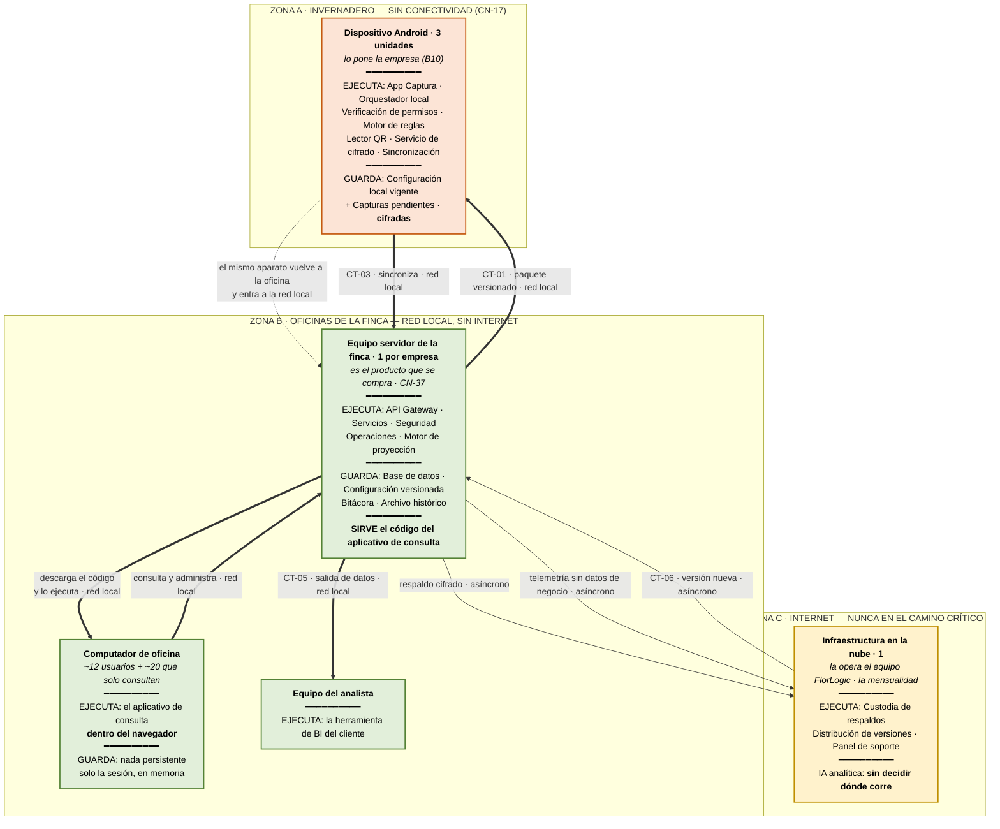

# FlorLogic — Dónde corre y se ejecuta cada componente

> **v1.0 · PROPUESTA DEL EQUIPO, sin validar con el cliente.**
> Complementa a `MODELO_COMPONENTES.md`, `MODELO_N2_NODO_DE_FINCA.md` y `MODELO_N3_Y_RESUMEN.md`:
> aquellos dicen **qué hace** cada componente; este dice **en qué máquina corre**.

## La distinción que ordena todo: «red» son dos cosas

`CN-17`, completa: *«No hay conectividad de datos en el área de cultivo... **sí hay señal en las
oficinas**»*.

| | Existe siempre | Puede faltar |
|---|---|---|
| **En el invernadero** | nada | todo |
| **En las oficinas** | **la red local de la finca** | internet |

**Ningún camino crítico depende de internet.** Todo lo que un usuario hace —capturar, validar,
sincronizar, proyectar, consultar, administrar, exportar— ocurre sobre la red local o sin red
ninguna. Internet solo aparece en cuatro intercambios, y los cuatro son asíncronos.

## El diagrama

## Las cinco máquinas

| | Cuántas | Quién la pone | Zona |
|---|---|---|---|
| **Dispositivo Android** | 3 | La empresa (`B10`) | Invernadero · sin red |
| **Equipo servidor de la finca** | 1 por empresa | Se compra con el sistema (`CN-37`, `CN-02`) | Oficina · red local |
| **Computador de oficina** | ~12 usuarios + ~20 que solo consultan | La empresa, ya los tiene | Oficina · red local |
| **Equipo del analista** | — | La empresa, ya lo tiene | Oficina · red local |
| **Infraestructura en la nube** | 1 | El equipo FlorLogic · es la mensualidad (`E2`) | Internet |

## Dónde se despliega y dónde se ejecuta cada componente

**No son lo mismo.** El caso que más confunde es el aplicativo de consulta: **su código vive en el
servidor de la finca y se ejecuta en el navegador de otra máquina.**

| Componente | Se despliega en | Se ejecuta en | Qué guarda | Si se cae internet |
|---|---|---|---|---|
| App Captura · Orquestador local | Dispositivo | Dispositivo | — | **Funciona igual** |
| Verificación de permisos | Dispositivo | Dispositivo | — | **Funciona igual** (`CN-23`) |
| Motor de reglas · instancia local | Dispositivo | Dispositivo | — | **Funciona igual** (`CN-22`) |
| Lector de identificador físico | Dispositivo | Dispositivo | — | **Funciona igual** |
| Servicio de cifrado local | Dispositivo | Dispositivo | — | **Funciona igual** |
| Servicio de sincronización · cliente | Dispositivo | Dispositivo | Cola de salida | **Funciona igual**: acumula y entrega por red local |
| Configuración local vigente | Dispositivo | — | Catálogo + reglas + credenciales, **cifrado** | **Funciona igual** |
| Almacenamiento de capturas | Dispositivo | — | Capturas pendientes, **cifradas** | **Funciona igual** |
| API Gateway | Servidor de finca | Servidor de finca | — | **Funciona igual** |
| Servicios · ingesta, reglas, proyección, consulta, documentos, salida, avisos, dispositivos | Servidor de finca | Servidor de finca | — | **Funcionan igual** |
| Seguridad · identidad, credenciales, Key Vault, cifrado | Servidor de finca | Servidor de finca | — | **Funciona igual** |
| Base de datos · configuración · bitácora · archivo | Servidor de finca | — | Todo el dato operativo | **Funciona igual** |
| Operaciones · respaldo, observabilidad, empaquetado | Servidor de finca | Servidor de finca | — | Se acumula y sale después |
| **Aplicativo de consulta y sus vistas** | **Servidor de finca** | **Navegador del computador de oficina** | Nada persistente · solo la sesión, en memoria | **Funciona igual** |
| Herramienta de BI del cliente | Equipo del analista | Equipo del analista | — | **Funciona igual**: conecta contra la instalación local (`CT-05`) |
| Custodia de respaldos · versiones · soporte | Nube | Nube | Respaldos **cifrados y opacos** | Se posponen. Sin efecto operativo |
| **IA analítica** | **Sin decidir** | **Sin decidir** | — | **Depende de dónde corra — ver abajo** |

## Tres cosas que el diagrama hace visibles

**1 · El dispositivo cambia de zona.** Es la única máquina que lo hace: captura en el invernadero sin
red y sincroniza en la oficina por red local. Por eso la cola de salida existe, y por eso la ventana
de `≥15 días` de `B1` es tolerable — no son quince días sin conexión, son papeles que aparecen tarde.

**2 · El servidor de la finca hace dos trabajos distintos.** Es el backend **y** es quien sirve el
código del aplicativo de consulta. Esa segunda función es la que hace que la consulta no dependa de
internet: el navegador está a diez metros de la máquina que tiene el dato.

**3 · La nube nunca está en el camino de un usuario.** Los cuatro intercambios con N4 —respaldo,
telemetría, versión nueva y BI— son asíncronos o van contra la instalación local. Si el enlace se cae
una semana, la finca no se entera.

## `[!]` La única pieza que rompe el esquema: la IA analítica

Es **el único componente cuya ubicación no está decidida**, y es el único que un usuario consumiría
en vivo desde la consulta. Eso la vuelve el punto donde la arquitectura puede romperse por dos lados
a la vez:

- **Si corre en la nube**, la consulta pasa a depender de internet. `CN-32` protege la captura
  —*«jamás dependencia de la captura»*— pero **no dice nada de la consulta**, que es lo que usan
  ~32 personas. Y además choca con `CN-28`: un servicio que no puede leer lo que el Key Vault mantiene
  cifrado no puede analizarlo.
- **Si corre en el servidor de la finca**, las dos contradicciones desaparecen a la vez — pero hace
  falta hardware y **encarece la instalación**, que es el número que se le pone al cliente.

Es la decisión 5 de `ADR-021`, abierta desde `C2`. **Mientras no se cierre, la IA
analítica no debería mezclarse en las mismas pantallas de consulta**: o va marcada como *«requiere
conexión»*, o una caída de internet se percibe como *«el sistema no sirve»*.

---

*Vista de despliegue v1.0 · propuesta del equipo, sin validar con el cliente.*
