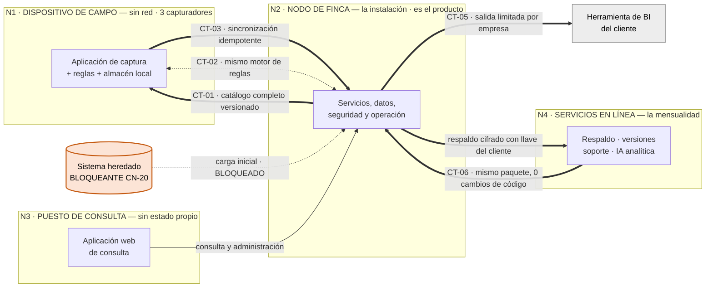
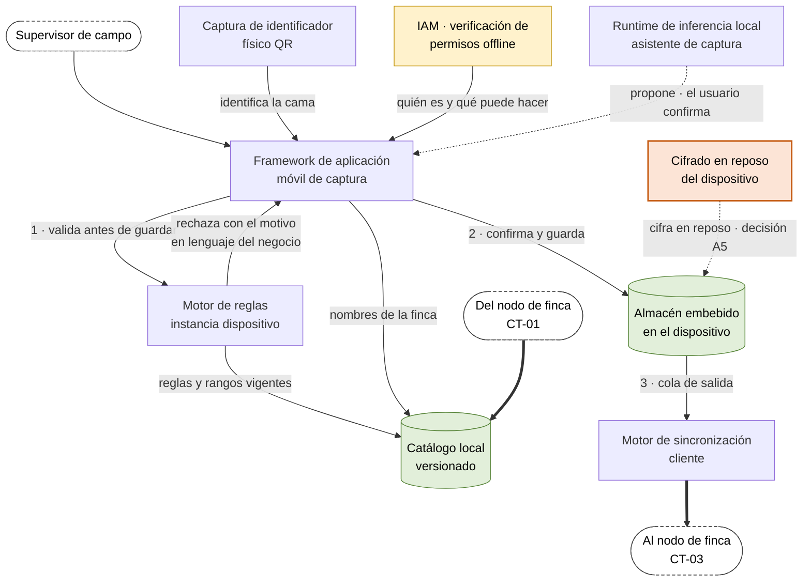
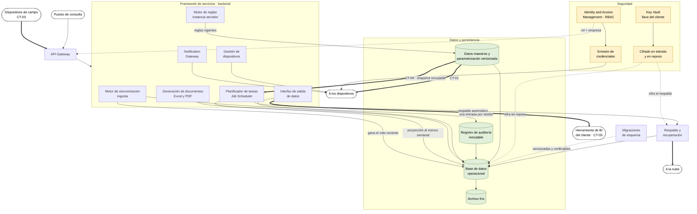
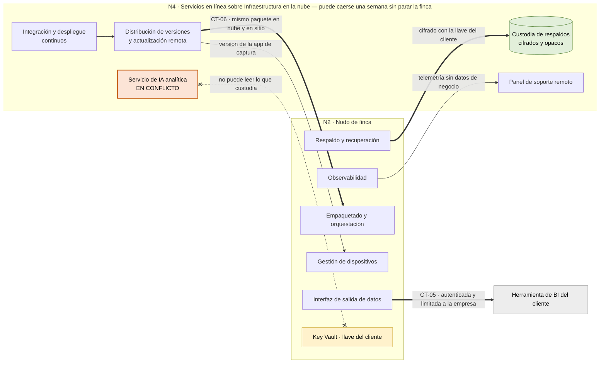
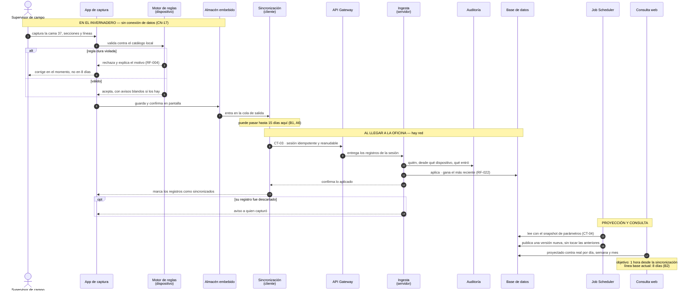

# FlorLogic — Modelo de componentes

> **v1.0 · 31-ago-2026 · PROPUESTA DEL EQUIPO, sin validar con el cliente.**
>
> Las conexiones entre los componentes de `FlorLogic_Bloques_Arquitectonicos.xlsx`, en cinco vistas.
> **Un solo grafo con los 31 bloques y sus aristas no se puede leer** — se parte por nodo, más una
> vista de secuencia que enseña el camino de un dato de punta a punta.
>
> **Qué manda:** `PLAN_DE_CONSTRUCCION.md` para las reglas de partición y los contratos ·
> `DRIVERS_ARQUITECTONICOS.md` para requisitos, restricciones y medidas.

## Los seis contratos

Un contrato es lo que un bloque promete a otro y no puede romper sin avisar. Son lo único que Juan y
Jerónimo tienen que acordar antes de escribir código por separado.

| ID | Entre | Qué fija |
|---|---|---|
| `CT-01` | Datos maestros → catálogo local | Baja **completo** y versionado. Sin catálogo vigente no se captura |
| `CT-02` | Motor de reglas dispositivo ≡ servidor | **El mismo artefacto**, evaluado por la misma implementación. 0% de divergencia (`ESC-57`) |
| `CT-03` | Sincronización cliente → ingesta | Idempotente, reanudable, ventana de 15 días o más, gana el más reciente |
| `CT-04` | Datos maestros → Job Scheduler | El motor lee un **snapshot inmutable**, nunca la tabla viva |
| `CT-05` | Interfaz de salida → exterior | Autenticada y limitada a la empresa. **0 accesos directos a la base** |
| `CT-06` | Distribución de versiones → nodo | **El mismo paquete en nube y en sitio**, 0 cambios de código |

## Convenciones de los diagramas

| Marca | Significado |
|---|---|
| Flecha gruesa `==>` | Cruza la frontera de un nodo. Es donde vive un contrato |
| Flecha punteada `-.->` | Relación de apoyo: cifra, observa, despliega, propone |
| Cilindro verde | Guarda estado |
| Caja amarilla | Bloque de seguridad |
| Caja naranja | **Contradicción o bloqueo sin resolver** |
| Nodo de borde redondo | Frontera: algo que vive en otro diagrama |

---

## D1 · Vista general — los cuatro nodos y los seis contratos

Tres nodos guardan estado; el puesto de consulta no. La regla que ordena todo: **ningún camino
crítico pasa por internet** (`CN-17`, `CN-37`). Si un bloque necesita la nube para funcionar,
está mal ubicado.

---

## D2 · N1 · Dispositivo de campo

El camino del dato hasta la cola de salida. **Valida antes de guardar**, y ese orden es el driver #1:
validar al sincronizar convierte un error de diez segundos en un error de ocho días (`RF-004`, `CN-22`).

`[!]` El cifrado en reposo va en naranja porque es `A5`, una decisión tomada **en contra de una
respuesta escrita del cliente**, y porque con PWA no se puede demostrar documentalmente.

---

## D3 · N2 · Nodo de finca

La instalación: es el producto. Autoridad de todo el dato operativo y opera sin internet.

Dos cosas que el diagrama hace explícitas: el **snapshot inmutable** de `CT-04` —el motor no lee la
tabla viva de parámetros, porque una proyección publicada no puede cambiar por debajo (`CN-27`)—
y que **el Key Vault es lo que hace posible que la nube custodie sin poder leer**.

---

## D4 · N4 · Servicios en línea y consumidores externos

Es la mensualidad. Todo lo de aquí puede caerse una semana sin que la finca deje de operar.

`[!]` El servicio de IA analítica va en naranja y con un enlace tachado hacia el Key Vault: **un
servicio de nube que no puede leer lo que custodia no puede analizarlo.** O corre en el nodo de
finca —y deja de ser servicio de nube, y encarece la instalación— o los datos salen en claro —y
`CN-28` y `CN-03` se debilitan—. Esta contradicción no está registrada en ningún otro archivo
del proyecto.

---

## D5 · El camino de una captura, de punta a punta

La vista que más sirve para discutir con el cliente, porque no habla de componentes sino de lo que
le pasa a un dato suyo. Enseña las tres cosas que el sistema promete: **se corrige en el momento y
no en ocho días**, **puede pasar quince días en la cola sin perderse**, y **la proyección se publica
sin tocar las anteriores**.

---

*Modelo de componentes v1.0 · propuesta del equipo, sin validar con el cliente · 31-ago-2026.*
