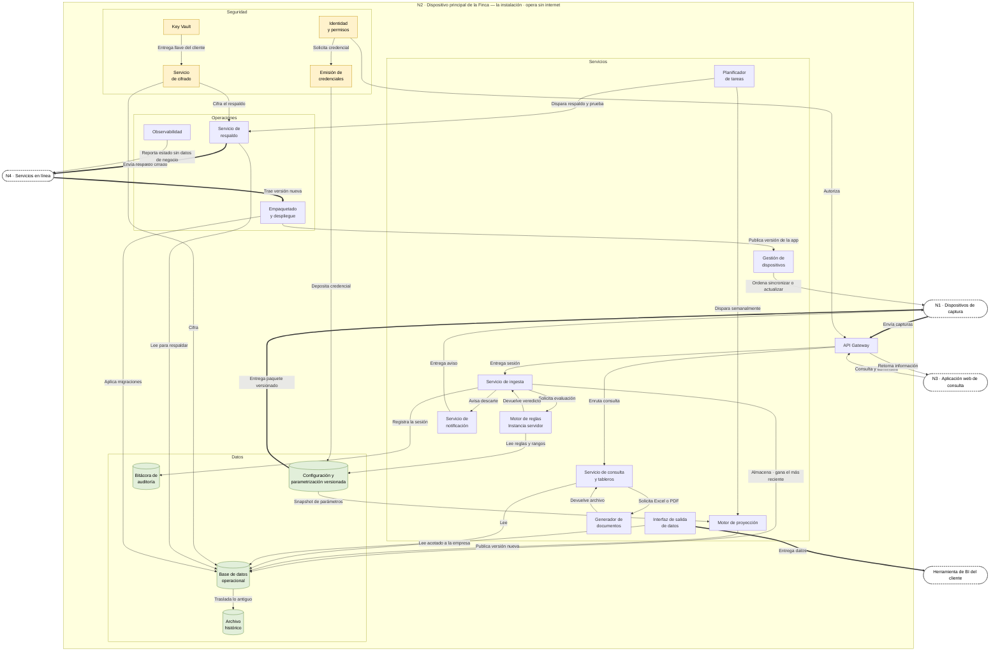

# FlorLogic — N2 · Nodo de finca · componentes y conexiones

> **v1.0 · PROPUESTA DEL EQUIPO, sin validar con el cliente.**
>
> Mismo lenguaje que el diagrama de N1: **verbo en cada arista**, cilindro para lo que guarda
> estado, caja de borde para los nodos vecinos, y **todo retorno dibujado** — no solo el camino de
> ida.
>
> **Qué manda:** `PLAN_DE_CONSTRUCCION.md` (reglas de partición y contratos) ·
> `DRIVERS_ARQUITECTONICOS.md` (requisitos, restricciones y medidas).

## Los cuatro grupos

| Grupo | Qué contiene | Cómo se reconoce |
|---|---|---|
| **Servicios** | La lógica: ingesta, reglas, proyección, consulta, documentos, salida, avisos y dispositivos | Recibe del `API Gateway` y escribe en Datos. **Es el que cambia en cada cambio de negocio** |
| **Datos** | Lo que guarda estado: configuración versionada, base operacional, bitácora y archivo histórico | Solo almacena. **No orquesta nada** |
| **Seguridad** | Identidad, credenciales, llave y cifrado | **Solo emite** hacia los otros tres. Nadie le pide permiso para existir |
| **Operaciones** | Respaldo, observabilidad, empaquetado y despliegue | Es lo que se toca casi nunca, y lo que habla con N4 |

**El `API Gateway` está fuera de los cuatro a propósito:** es la **puerta única** de N2. `ESC-29`
exige 0 accesos directos a la base, y `RF-012` dice *«por ningún canal»* — con dos puertas eso deja
de ser demostrable.

## El diagrama

## Las conexiones, una por una

**Entrada — todo pasa por la puerta única**

| Origen | Verbo | Destino | Por qué |
|---|---|---|---|
| N1 · Dispositivos | Envía capturas | API Gateway | `CT-03`, `RF-003` — idempotente y reanudable |
| N3 · Consulta web | Consulta y administra | API Gateway | `CN-18` doble canal |
| API Gateway | Retorna información | N3 · Consulta web | El retorno, sin él la web no muestra nada |
| Identidad y permisos | Autoriza | API Gateway | `CN-12` — cada permiso contra el par (rol, empresa) |
| API Gateway | Entrega sesión | Servicio de ingesta | Una sesión de sincronización es la unidad de traza (`A1`) |
| API Gateway | Enruta consulta | Servicio de consulta y tableros | — |

**Ingesta y validación — el tramo donde un dato puede perderse sin que nadie se entere**

| Origen | Verbo | Destino | Por qué |
|---|---|---|---|
| Servicio de ingesta | Solicita evaluación | Motor de reglas · servidor | `CN-22` |
| Motor de reglas · servidor | **Devuelve veredicto** | Servicio de ingesta | Las reglas evalúan; **quien guarda es la ingesta** |
| Motor de reglas · servidor | Lee reglas y rangos | Configuración versionada | `CT-02` — mismo artefacto que en el dispositivo, 0% de divergencia (`ESC-57`) |
| Servicio de ingesta | Almacena · gana el más reciente | Base de datos operacional | `RF-022`, `CN-24` — sin mediación humana (`B7`) |
| Servicio de ingesta | Registra la sesión | Bitácora de auditoría | `RF-016` — quién, desde qué dispositivo, qué entró |
| Servicio de ingesta | Avisa descarte | Servicio de notificación | `RF-022` — avisar a quien capturó |

**Proyección — el motor**

| Origen | Verbo | Destino | Por qué |
|---|---|---|---|
| Planificador de tareas | Dispara semanalmente | Motor de proyección | `RF-008` — al menos una vez por semana |
| Configuración versionada | Entrega snapshot de parámetros | Motor de proyección | `CT-04`, `CN-27` — **no lee la tabla viva** |
| Motor de proyección | Publica versión nueva | Base de datos operacional | `RF-008` — conservando la anterior |

**Consulta y salida**

| Origen | Verbo | Destino | Por qué |
|---|---|---|---|
| Servicio de consulta y tableros | Lee | Base de datos operacional | `RF-011`, `RF-018`, `RF-024` |
| Servicio de consulta y tableros | Solicita Excel o PDF | Generador de documentos | `RF-019` |
| Generador de documentos | Devuelve archivo | Servicio de consulta y tableros | El retorno |
| Interfaz de salida de datos | Lee acotado a la empresa | Base de datos operacional | `RF-012` |
| Interfaz de salida de datos | Entrega datos | Herramienta de BI del cliente | `CT-05`, `CN-14` — el cliente dijo «POWER BI» |

**Hacia los dispositivos**

| Origen | Verbo | Destino | Por qué |
|---|---|---|---|
| Configuración versionada | **Entrega paquete versionado** | N1 · Dispositivos | `CT-01` — catálogo **+ reglas + credenciales**, un solo número de versión |
| Servicio de notificación | Entrega aviso | N1 · Dispositivos | Llega en la siguiente sincronización, no al instante |
| Gestión de dispositivos | Ordena sincronizar o actualizar | N1 · Dispositivos | `ESC-25`, `ESC-46` |

**Seguridad — solo salen flechas**

| Origen | Verbo | Destino | Por qué |
|---|---|---|---|
| Identidad y permisos | Solicita credencial | Emisión de credenciales | `RF-014` |
| Emisión de credenciales | Deposita credencial | Configuración versionada | Es lo que hace que el dispositivo autentique sin red (`CN-23`) |
| Key Vault | Entrega llave del cliente | Servicio de cifrado | `CN-28` cerrada por `B4` — **la llave es del cliente** |
| Servicio de cifrado | Cifra | Base de datos operacional | `CN-28`, `CN-03` |
| Servicio de cifrado | Cifra el respaldo | Servicio de respaldo | Lo que permite que N4 custodie sin poder leer |

**Datos y operación**

| Origen | Verbo | Destino | Por qué |
|---|---|---|---|
| Base de datos operacional | Traslada lo antiguo | Archivo histórico | `A3` — 2 años de búsqueda rápida, después demora escalonada |
| Planificador de tareas | Dispara respaldo y prueba | Servicio de respaldo | `ESC-19` — una prueba de restauración registrada |
| Servicio de respaldo | Lee para respaldar | Base de datos operacional | `CN-15` — pérdida CERO |
| Servicio de respaldo | Envía respaldo cifrado | N4 · Servicios en línea | Lo que justifica la mensualidad |
| Observabilidad | Reporta estado sin datos de negocio | N4 · Servicios en línea | `CN-34`, `ESC-50` — 0 accesos a datos de negocio |
| N4 · Servicios en línea | Trae versión nueva | Empaquetado y despliegue | `CT-06` — mismo paquete en nube y en sitio |
| Empaquetado y despliegue | Aplica migraciones | Base de datos operacional | `CN-29` — automatizadas y verificables desde el día uno |
| Empaquetado y despliegue | Publica versión de la app | Gestión de dispositivos | Y de ahí baja a N1 |

## Cinco decisiones que conviene entender antes de redibujarlo

**1 · `Configuración y parametrización versionada` es el espejo de la `Configuración Local` de N1.**
Guarda catálogo, reglas y credenciales, y de aquí sale el paquete de `CT-01` con **un solo número de
versión**. Es lo que impide que un dispositivo valide con reglas v4 contra un catálogo v5, y lo que
hace comprobable el 0% de divergencia de `ESC-57`.
`[!]` La credencial es por persona y por aparato, mientras el catálogo es de la empresa: **el paquete
deja de ser idéntico para todos los dispositivos.** Hay que decidir si se parte en «común + credencial»
o si se acepta que va personalizado.

**2 · Las reglas devuelven el veredicto; la ingesta almacena.** Igual que en N1. Si las reglas
escribieran, habría dos componentes capaces de crear una captura y ninguna forma de saber cuál lo hizo.

**3 · El motor de proyección no lee la tabla viva de parámetros.** Lee un snapshot inmutable
(`CT-04`). Una proyección emitida es la base sobre la que ya se comprometió flor: cambiarle los
parámetros por debajo es alterar el pasado (`CN-27`, y el cliente lo respaldó — *«si no se modifica sí»*).

**4 · Seguridad solo emite.** Nadie le pide permiso a Seguridad para existir: ella autoriza, emite,
entrega llave y cifra. Dibujar flechas entrantes la convertiría en un servicio que alguien puede
olvidarse de llamar.

**5 · Operaciones es el único grupo que habla con N4.** Y por eso todo lo que sale hacia la nube
—respaldo cifrado y telemetría sin datos de negocio— pasa por ahí. Si algún día algo más necesita
salir, esa es la puerta.

## Lo que este diagrama deliberadamente NO tiene

**Un broker de mensajes** — `A10` fijó hasta 10 concurrentes por instalación y aceptó que la
sincronización se degrade bajo carga. **Una caché distribuida** — mismo motivo. **Alta disponibilidad
activa-activa** — `CN-15` tolera 1 hora de fallo. **Un data warehouse** — `DEC-10` acota el BI a seis
reportes sobre la propia base, y `RF-018` exige que día, semana y mes salgan del mismo cálculo.
**Servicio de IA analítica** — vive en N4 y sigue en conflicto con el cifrado.

`[!]` **`BC-26` · Carga inicial e histórico no está dibujado y hace falta.** Está BLOQUEADO por
`CN-20`: nadie ha visto el sistema heredado de ~300 tablas. Es el bloqueante técnico nº 1 y puede
reventar los 7 días de puesta en marcha de `CN-07`.

---

*Modelo de N2 v1.0 · propuesta del equipo, sin validar con el cliente.*
