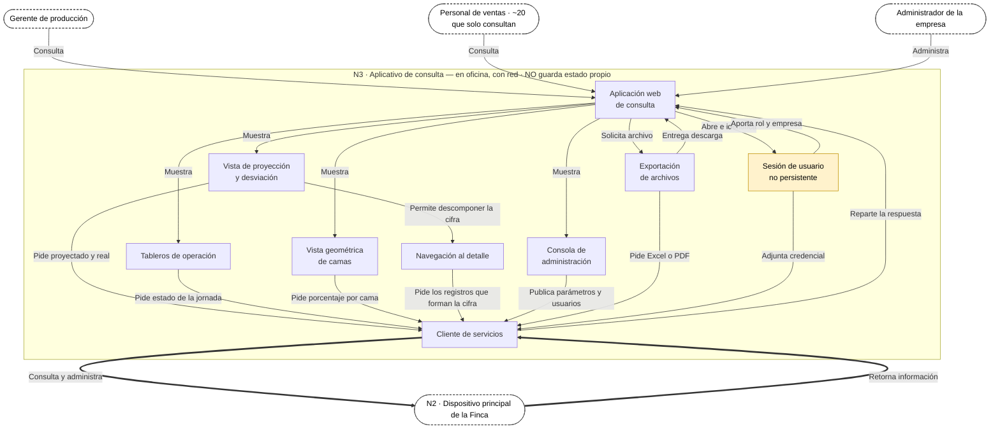

# FlorLogic — Estado del modelo de componentes · y N3 · Aplicativo de consulta

> **v1.0 · PROPUESTA DEL EQUIPO, sin validar con el cliente.**
> Acompaña a `MODELO_COMPONENTES.md` y `MODELO_N2_NODO_DE_FINCA.md`.

---

## Parte 1 · Resumen hasta el momento

### Dónde está el modelo

| Nodo | Estado | Dónde vive |
|---|---|---|
| **N1 · Dispositivo de captura** | **Cerrado**, salvo dos pendientes | Lienzo de Juan |
| **N2 · Nodo de finca** | **Dibujado**, con cinco correcciones abiertas | Lienzo de Juan · `MODELO_N2_NODO_DE_FINCA.md` |
| **N3 · Aplicativo de consulta** | **Nuevo** — parte 2 de este documento | Aquí |
| **N4 · Servicios en línea** | Solo como frontera. Su interior no se ha dibujado | — |

### Las seis convenciones que salieron del proceso

No estaban decididas al empezar: **se ganaron corrigiendo.** Aplican a cualquier nodo que se dibuje
de aquí en adelante.

1. **Verbo en cada arista.** Obliga a que cada flecha signifique algo. Fue lo que destapó que
   «Regula» y «Utiliza» decían cosas que el sistema no hace.
2. **Los retornos se dibujan.** El diagrama contaba muy bien el camino de ida y perdía lo que vuelve —
   y en la captura **el retorno *es* el requisito**: `RF-004` no dice «rechazar», dice rechazar y
   **explicar el motivo**.
3. **Un solo punto de entrada por nodo.** `ESC-29` pide 0 accesos directos a la base y `RF-012` dice
   *«por ningún canal»*: con dos puertas eso deja de ser demostrable.
4. **Quien evalúa no guarda.** Las reglas devuelven un veredicto; quien almacena es el orquestador.
   Si las reglas escribieran, habría dos componentes capaces de crear un registro.
5. **Los almacenes no invocan.** Un almacén es pasivo. Quien lee la cola y decide cuándo enviar es el
   servicio de sincronización, no el almacén.
6. **Seguridad solo emite.** Autoriza, emite credencial, entrega llave y cifra. Dibujarle flechas
   entrantes la convierte en un servicio que alguien puede olvidarse de llamar.

### Los tres cambios de fondo que se ganaron por el camino

**El almacén local se partió en dos.** `Configuración Local reciente` (catálogo + reglas + credenciales,
lo que baja de N2) y `Almacenamiento Dedicado a Capturas` (lo que sube). Ciclos de vida opuestos: uno
se reemplaza entero, el otro se acumula y se vacía. Mientras compartieron caja, el riesgo era borrar
lo que no se debía.

**El paquete versionado.** De N2 no baja «el catálogo»: baja **un paquete con un solo número de
versión** que lleva catálogo, reglas y credenciales. Es lo que impide que un dispositivo valide con
reglas v4 contra un catálogo v5, y lo que hace comprobable el 0% de divergencia de `ESC-57`.
`[!]` **Pendiente:** la credencial es por persona y por aparato mientras el resto es de la empresa —
hay que decidir si se parte en «común + credencial» o si se acepta que el paquete va personalizado.

**`Operaciones` se separó de `Servicios`.** Lo que cambia en cada cambio de negocio quedó aparte de lo
que casi nunca se toca. Y `Operaciones` es el único grupo que habla con N4.

### Lo que sigue abierto, por nodo

**N1** — La fecha de negocio y la detección de reloj alterado (`RF-021`, `CN-25`) quedaron como diseño
detallado, con una decisión de fondo por escribir: **la marca de tiempo existe como mecanismo y no se
expone**. Sin ella, «gana el más reciente» de `RF-022` no se puede calcular; con ella oculta,
la contradicción de §10.4-G tiene salida. `[!]` Esto **matiza `A1`** y hay que anotarlo.

**N2** — Cinco correcciones: la entrada de capturas apunta hacia afuera · `Bitácora de Auditoría` no
tiene ninguna arista (falta `Ingreso de Sincronización → Bitácora`, «Registra la sesión») ·
`Emisión de credenciales` no entrega la credencial a ningún lado · el `Servicio de notificación` no
hace llegar el aviso a N1 · el `Motor de proyección` no lee el snapshot de parámetros (`CT-04`).

**N4** — Sin dibujar. Y con una contradicción sin resolver: la **IA analítica no puede leer lo que el
Key Vault mantiene cifrado con la llave del cliente**. No está registrada en ningún archivo del proyecto.

### Y lo que NO resuelve ningún diagrama

`D3` — de dónde sale el % de productividad por variedad y cómo se reparten los tallos sobre los ~7 días
de corte. `CN-20` — el sistema heredado de ~300 tablas que nadie ha visto. **Los seis escenarios que
contradicen `RF-016`, `RF-017`, `RF-021` y `RF-022`**, y el desacuerdo entre los dos Top 65.
Esos son los bloqueantes reales.

---

## Parte 2 · N3 · Aplicativo de consulta

**Es el canal donde aterriza el valor del proyecto.** El supervisor no sufre los 8 días de latencia:
los sufren planeación y gerencia (`H-26`). Aquí es donde esos 8 días se convierten en 1 hora.

**No guarda estado propio, y eso es deliberado.** Por eso **no lleva un solo cilindro**. La `Sesión de
usuario` es lo único que se parece a estado, y es transitoria: vive en el navegador y muere con la
pestaña. Si alguien le pone una caché local, aparece una tercera copia del dato — y ahí es donde una
copia empieza a divergir de las otras.

**Un solo punto de salida**, igual que N2 tiene un solo punto de entrada: todas las vistas hablan con
el `Cliente de servicios`, y solo él cruza la frontera.

### Las conexiones, una por una

| Origen | Verbo | Destino | Por qué |
|---|---|---|---|
| Gerente de producción | Consulta | Aplicación web | Consume proyección **diaria** (`H-48`) |
| Personal de ventas | Consulta | Aplicación web | ~20 personas que **solo consultan** (`H-30`) |
| Administrador de la empresa | Administra | Aplicación web | El ingeniero de sistemas de la finca (`C9`) |
| Aplicación web | Abre e identifica | Sesión de usuario | Vida corta, a diferencia de la credencial de campo |
| Sesión de usuario | Aporta rol y empresa | Aplicación web | `CN-12` — cada permiso contra el par (rol, empresa) |
| Sesión de usuario | Adjunta credencial | Cliente de servicios | Sin esto N2 no puede autorizar |
| Aplicación web | Muestra | Vista de proyección y desviación | `RF-011`, `RF-018`, `RF-024` |
| Aplicación web | Muestra | Tableros de operación | `B12` — qué está sin sincronizar y avance del día por bloque |
| Aplicación web | Muestra | Vista geométrica de camas | `RFP-03` — **solo en consulta, nunca en captura** (`B11`) |
| Aplicación web | Muestra | Consola de administración | `RF-013`, `RF-017` |
| Vista de proyección y desviación | Permite descomponer la cifra | Navegación al detalle | `ESC-39` — 3 niveles de navegación o menos |
| Aplicación web | Solicita archivo | Exportación de archivos | `RF-019` |
| Exportación de archivos | Entrega descarga | Aplicación web | El retorno |
| Vista de proyección y desviación | Pide proyectado y real | Cliente de servicios | Del mismo cálculo, por día, semana y mes (`RF-018`) |
| Tableros de operación | Pide estado de la jornada | Cliente de servicios | Instrumenta la medida de Rendimiento de `B2` |
| Vista geométrica de camas | Pide porcentaje por cama | Cliente de servicios | `DEC-15` — % de plantas vivas, no solo tallos |
| Navegación al detalle | Pide los registros que forman la cifra | Cliente de servicios | `ESC-39` |
| Consola de administración | Publica parámetros y usuarios | Cliente de servicios | `RF-013` — sin intervención del equipo de desarrollo |
| Exportación de archivos | Pide Excel o PDF | Cliente de servicios | `RF-019`, `CN-38` — **la única vía de auditoría que se construye** |
| Cliente de servicios | Consulta y administra | N2 | Punto de salida único |
| N2 | Retorna información | Cliente de servicios | — |
| Cliente de servicios | Reparte la respuesta | Aplicación web | — |

### Cuatro cosas que decidir sobre N3

**1 · La vida de la sesión aquí NO es la de campo.** En N1 la credencial dura toda la jornada sin red
(`CN-23`); aquí hay red y la sesión puede ser corta. Son dos vidas distintas sobre la misma identidad,
y tratarlas igual rompe una de las dos. `[!]` `ESC-28` propone 15 minutos de inactividad — razonable
**en la oficina**, incompatible con el invernadero.

**2 · La consola de administración vive aquí, no en N2.** `ESC-14` pide administrar **desde un
computador de la finca, sin herramientas técnicas especiales**. Si la administración exigiera entrar
al servidor, ese escenario falla.

**3 · La exportación es más de lo que parece.** `A13` decidió **no** construir ningún formato ni
vía específica para certificaciones: la verificación de cumplimiento se hace a mano con estos mismos
Excel y PDF (`CN-38`). Es decir, `Exportación de archivos` **es el instrumento de auditoría del
producto entero**. `[!]` Verificar que la frontera de empresa se respeta también dentro del archivo
exportado.

**4 · La disponibilidad de N3 no está respaldada por ningún escenario.** El argumento fuerte para
tenerlo como frontera separada sería que la consulta siga viva aunque la captura esté fuera de
servicio. Esa pregunta está en `DRIVERS §8.1` (#38) pero **cayó del Top 65 vigente** y no tiene `ESC`
escrito. Hoy N3 se sostiene por `CN-18` y por dónde cae el valor, **no por un requisito de
disponibilidad propio**.

---

*Resumen y modelo de N3 v1.0 · propuesta del equipo, sin validar con el cliente.*
