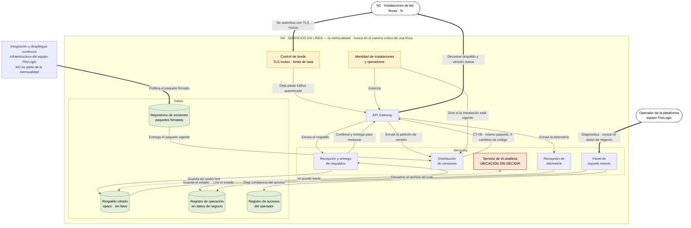

# FlorLogic — N4 · Servicios en línea · componentes y conexiones

> **v1.0 · PROPUESTA DEL EQUIPO, sin validar con el cliente.**
> Mismo lenguaje que N1, N2 y N3: verbo en cada arista, cilindro para lo que guarda estado, caja de
> borde para los vecinos, y los retornos dibujados.

## Lo que gobierna este nodo

**N4 es la mensualidad** (`E2`: 100-200 USD/mes por respaldo, actualización, soporte e IA inicial).
Y tiene una propiedad que ningún otro nodo tiene: **puede caerse una semana entera sin que una finca
se entere.** Si algún componente de aquí resulta estar en el camino de un usuario, está mal ubicado.

La segunda propiedad, y es la que ordena el diseño: **N4 custodia sin poder leer.** `CN-28`, cerrada
por `B4` — la llave la tiene el cliente. `CN-34` y `ESC-50` lo llevan al operador: opera
infraestructura, **0 accesos a datos de negocio en operación normal**.

## El diagrama

## Las conexiones, una por una

| Origen | Verbo | Destino | Por qué |
|---|---|---|---|
| N2 · Instalaciones | Se autentica con TLS mutuo | Control de borde | Es tráfico máquina a máquina entre N instalaciones conocidas |
| Control de borde | Deja pasar tráfico autenticado | API Gateway | Puerta única, igual que en N2 |
| Identidad de instalaciones y operadores | Autoriza | API Gateway | **Identifica instalaciones y operadores, nunca usuarios de una finca** |
| API Gateway | Enruta el respaldo | Recepción y entrega de respaldos | — |
| API Gateway | Enruta la telemetría | Recepción de telemetría | — |
| API Gateway | Enruta la petición de versión | Distribución de versiones | — |
| Recepción y entrega de respaldos | **Guarda sin poder leer** | Respaldo cifrado | `CN-28` · `B4` |
| Respaldo cifrado | Devuelve el archivo tal cual | Recepción y entrega de respaldos | Restaurar es devolver el mismo blob; **descifra la finca**, no la nube |
| Recepción y entrega de respaldos | Confirma y entrega para restaurar | API Gateway | El retorno. `CN-15`: restauración en 1 día o menos |
| **Identidad de instalaciones y operadores** | **Dice si la instalación está vigente** | Distribución de versiones | **Aquí vive *pagas, te actualizas*** (`E2`, `CN-29`) |
| Integración y despliegue continuos | Publica el paquete firmado | Repositorio de versiones | El CI/CD produce; nadie le manda nada |
| Repositorio de versiones | Entrega el paquete vigente | Distribución de versiones | — |
| Distribución de versiones | `CT-06` · mismo paquete, 0 cambios de código | API Gateway | `ESC-16` |
| Recepción de telemetría | Guarda el estado | Registro de operación | **Sin datos de negocio** |
| Panel de soporte remoto | Lee el estado | Registro de operación | `ESC-30`: causa en 4 h o menos en el 80% de los casos, 0 desplazamientos |
| Operador de la plataforma | Diagnostica · nunca ve datos de negocio | Panel de soporte remoto | `CN-34`, `ESC-50` |
| Panel de soporte remoto | **Deja constancia del acceso** | Registro de accesos del operador | `ESC-50`: 100% de los accesos excepcionales registrados |
| API Gateway | Devuelve respaldo y versión nueva | N2 · Instalaciones | El retorno hacia las fincas |
| Servicio de IA analítica | ✗ **no puede leerlo** | Respaldo cifrado | **La contradicción, dibujada** |

## Seis decisiones, y por qué

**1 · El `Backend` se parte en cuatro.** Custodiar respaldos, distribuir versiones, recibir telemetría
y analizar con IA tienen propiedades **opuestas**: una no puede leer nada y otra necesita leerlo todo.
Mientras compartan una sola caja, esa oposición no se ve — y es justo la que hay que decidir.

**2 · `Control de borde` en vez de WAF.** Quien habla con N4 son N instalaciones conocidas y el equipo
FlorLogic: es tráfico máquina a máquina, no una aplicación web pública. Lo que protege ahí es **TLS
mutuo y límite de tasa**, no reglas de aplicación. Y `CN-35` prohíbe licencias que escalen por
instalación. `[!]` Si algún día N4 expone una interfaz pública, el WAF vuelve a la conversación.

**3 · `Identidad → Distribución de versiones` es la arista más importante del nodo.** Es donde vive
literalmente *«pagas, te actualizas»* de `E2`, el mecanismo que hace viable `CN-29` con N
instalaciones dentro de casa de clientes. `[!]` **Y es donde queda escrito el riesgo:** la instalación
que deja de pagar **diverge de versión**, que es exactamente lo que `CN-29` teme. Esa arista es el
sitio donde hay que decidir qué se hace con ella.

**4 · `Registro de accesos del operador` es un componente, no una nota.** `ESC-50` pide **100% de los
accesos excepcionales registrados**. Sin un sitio donde queden, la cláusula contractual de `CN-03` y
`C9` —el acceso de implantación— no tiene respaldo verificable. No estaba en ningún diagrama hasta
ahora.

**5 · El CI/CD queda fuera de la mensualidad.** `E2` la define como soporte, copias e IA inicial. El
CI/CD es infraestructura del equipo para **construir**, no un servicio que el cliente paga. Sigue
siendo necesario —`CN-29` exige migraciones automatizadas y verificables desde el día uno— pero no
pertenece a lo que se factura.

**6 · Restaurar es devolver el mismo archivo.** N4 no descifra: entrega el blob tal cual y **la finca
lo abre con su llave**. Por eso `Respaldo cifrado → Recepción` existe y por eso la custodia puede ser
opaca de verdad.

## `[!]` La contradicción, y por qué la dejo dibujada

El `Servicio de IA analítica` está en el diagrama **con su enlace tachado hacia el respaldo**. No es
adorno: es el estado real de la decisión.

El mismo nodo que custodia respaldos ilegibles alberga un servicio cuya función es analizarlos. Las
dos cosas no caben. Y hay un segundo frente: si la IA se consume desde la consulta, **la consulta
pasa a depender de internet** — `CN-32` protege la captura, no la consulta, que es lo que usan ~32
personas.

**Las dos contradicciones se resuelven con la misma decisión: que la IA analítica corra en el nodo de
la finca.** Deja de ser servicio de nube, pasa a ser producto, y encarece la instalación — que es el
número que se le pone al cliente. Es la decisión 5 de `PLAN_DE_CONSTRUCCION.md §5`, abierta desde
`C2`, y **es la única pieza de todo el modelo cuya ubicación no está decidida.**

---

*Modelo de N4 v1.0 · propuesta del equipo, sin validar con el cliente.*
