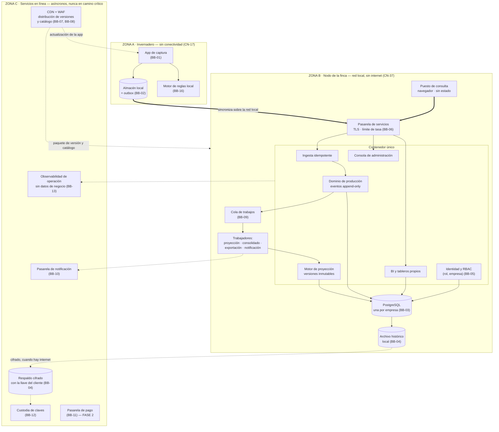
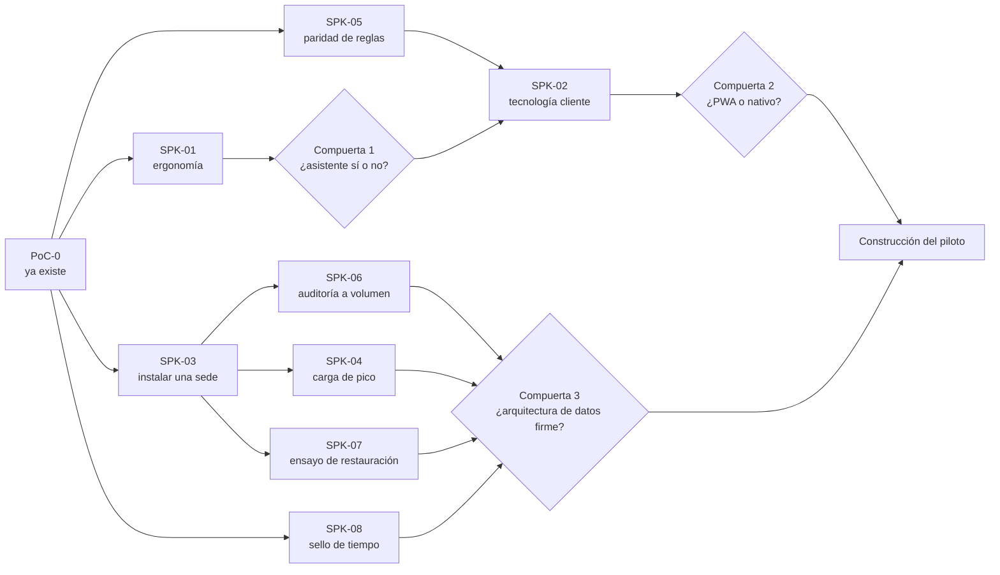

# FlorLogic — Alternativa de solución, ADR y cobertura de escenarios de calidad

**Versión 1.2 · 4-sep-2026 · Juan Pablo Avendaño y Jerónimo Montoya**

**Modelo de entrega sobre el que se razona: local-first (`CN-37`, `B6`).** El sistema se instala en la
infraestructura de cada empresa y opera sin internet sobre su información activa; los servicios en
línea prestan respaldo, sincronización, actualización e IA. `DEC-01` (SaaS multi-tenant) está
derogada.

Documento de arquitectura. Propone **una** alternativa de solución, la justifica con **decisiones de
arquitectura registradas (ADR)**, declara los **bloques de construcción** que la sostienen, documenta
**escenario por escenario** por qué se cumple o no se cumple, y define el **PoC y los spikes** que
deben ejecutarse antes de construir.

---

## 0. Cómo leer este documento

### 0.1 Fuentes

Este documento **no inventa dominio**. Todo lo que afirma sobre el negocio viene de:

Los cuatro artefactos de drivers y el documento que los explica están reunidos en
`Documentacion/Drivers-Arquitectonicos/`. El resto del material está en `Documentacion/Archivo/`.

| Fuente | Qué aporta |
|---|---|
| `Documentacion/Drivers-Arquitectonicos/DRIVERS_ARQUITECTONICOS.md` | **La entrada única a todo lo de abajo**, explicado y con su trazabilidad |
| `Documentacion/Drivers-Arquitectonicos/EscenariosCalidad.xlsx` | Los 65 escenarios priorizados (`ESC-01`…`ESC-65`), el ranking de atributos y la caracterización |
| `Documentacion/Drivers-Arquitectonicos/FuncionalidadesSignificativas.xlsx` | El catálogo vigente de funcionalidades significativas (`RF-001`…`FR-024`), por `DEC-04` |
| `Documentacion/Drivers-Arquitectonicos/RestriccionesTecnicas.xlsx` | Restricciones técnicas impuestas y adoptadas (`CN-10`…`CN-38`) |
| `Documentacion/Drivers-Arquitectonicos/RestriccionesNegocio.xlsx` | Restricciones de negocio (tiempo, presupuesto, legal, proceso, humano) |
| `Documentacion/Archivo/Recopilacion/3_DECISIONES_DE_NEGOCIO_Y_CONTRADICCIONES.md` | **Manda sobre el estado de cualquier decisión de negocio.** Las `DEC-nn`, el índice de los grupos `A`–`E` y **las 18 abiertas del grupo `D`** |
| `Documentacion/Archivo/Recopilacion/3_ANEXO_RONDAS_DE_DECISION.md` | Las 50 entradas cerradas de `A`, `B`, `C` y `E` **íntegras**, con todas sus rondas. Es donde está **el porqué** de una decisión. *Conserva el enunciado original, escrito cuando el modelo era SaaS: eso es registro, no estado* |
| `Documentacion/Archivo/Recopilacion/1_VOZ_DEL_CLIENTE.md` | Hechos del dominio `H-01`…`H-49` y brechas `BR-nn`, con la cita que respalda cada uno |
| `app-captura/` | El prototipo desechable ya construido |

### 0.2 Identificadores nuevos que introduce este documento

| Prefijo | Qué es | Cuántos |
|---|---|---|
| `ALT-n` | Alternativa de solución evaluada | 4 |
| `ADR-nnn` | Decisión de arquitectura registrada | 31 (una deprecada) |
| `BB-nn` | Bloque de construcción (*building block*) | 17 |
| `SPK-nn` | Spike o PoC con criterio de muerte explícito | 8 |

Los IDs son estables y no se reutilizan. Si una decisión se revierte, se marca `REVERTIDA` y se
conserva la fila, igual que en `DECISIONES.md`.

### 0.3 Marcas

- `[!]` — inconsistencia declarada, contradicción abierta o supuesto no verificado. **No se rellena
  con un supuesto plausible.**
- **CUMPLE** / **PARCIAL** / **NO CUMPLE (F1)** / **EN CONFLICTO** — veredicto de cobertura de un
  escenario. Su significado exacto está en §7.1.

### 0.4 Regla de honestidad que rige el documento

Un escenario se marca **CUMPLE** solo si existe un mecanismo arquitectónico concreto que lo produce
**y** la medida es alcanzable sin una medición pendiente. Si la medida depende de un número que
todavía no existe (tiempo de captura, costo por instalación, volumen real), el veredicto es **PARCIAL** y
queda amarrado a un spike. **Declarar cumplido lo que no se ha medido es exactamente el desperdicio
que este documento existe para evitar.**

---

## 1. Los drivers de arquitectura

### 1.1 Ranking de atributos de calidad

Del Mini QAW, hoja `1. Trade-Off-QA`, columna **«Atributos Promediados entre usuario y Arquitectos»**:

| # | Atributo | Peso en el diseño |
|---:|---|---|
| 1 | **Confiabilidad** | Manda sobre todo. 26 de los 65 escenarios son suyos |
| 2 | **Capacidad para ser Auditado** | Es lo que sostiene la meta de llevar el 2% de error a 0% (`H-33`) |
| 3 | **Rendimiento** | Latencia percibida en campo y latencia de negocio (8 días → 1 hora) |
| 4 | **Seguridad** | Secreto empresarial (`CN-03`) entre fincas competidoras |
| 5 | **Experiencia de Usuario** | La adopción de 3 supervisores decide el éxito del piloto |
| 6 | **Disponibilidad** | Mitigada estructuralmente por offline-first (`CN-13`) |
| 7 | **Escalabilidad** | Alta de fincas y de empresas sin reinstalar |
| 8 | **Capacidad para ser Administrado** | Cero solicitudes al desarrollador es una medida repetida en 9 escenarios |
| 9 | **Portabilidad** | Android de gama de entrada; la misma imagen en la finca o en la nube |
| 10 | **Capacidad** | 5 años en línea, crecimiento absorbido |
| 11 | **Capacidad para ser Soportado** | Soporte remoto, finca a horas de distancia |
| 12 | **Interoperatividad** | Puesto 12 en la votación, pero `B5` la revirtió: leer desde una BI externa es necesidad declarada (`CN-10`, «POWER BI»). Bajo local-first sale barata — ver `ADR-013` |
| 13 | **Accesibilidad** | Puesto 13, y ahí está el problema — ver `[!]` abajo |

> `[!]` **Tres rankings que no coinciden, y hay que decirlo.** La hoja `2. Priorización-QA` (suma de
> los tres actores) da un orden distinto: Disponibilidad **2ª** y Capacidad **5ª**, contra 6ª y 10ª en
> el promediado. El bloque «propuestos por usuario» de la hoja 1 pone Auditado **11º**, y el
> promediado lo sube a **2º**, que no es el promedio de ninguna de las dos listas de origen. **El
> promediado no es reproducible desde las listas que lo alimentan.**
>
> **Por qué no bloquea este documento:** los escenarios del Top-65 se ordenaron por el puntaje de los
> actores, no por el ranking de atributos, y los cinco primeros (`ESC-01`…`ESC-05`) son los mismos
> bajo cualquiera de los tres órdenes. La arquitectura que sigue no cambia. **Sí hay que reconciliar
> los tres rankings antes de usarlos para negociar un trade-off con el cliente.**

> `[!]` **Accesibilidad en el puesto 13 sigue siendo `BR-24`.** El cliente definió accesibilidad como
> *«capacidad de ser interpretado por personas con falta de digitalización o analfabetismo»*, que es
> exactamente la premisa del asistente de captura (`DEC-16`, `CN-31`). Ponerla última y a la vez
> repetir *«que sea fácil»* es incoherente. **Este documento no usa el puesto 13 para justificar
> recortes de accesibilidad**, y trata la ergonomía de captura como parte de UX (#5), que sí está
> alto.

### 1.2 Restricciones que cierran el espacio de diseño

Estas cinco no se negocian y **eliminan alternativas por sí solas**:

| ID | Restricción | Qué elimina |
|---|---|---|
| `CN-13` | Offline-first obligatorio: captura, validación, autenticación y sello de tiempo funcionan íntegros en el dispositivo | Elimina cualquier arquitectura donde el servidor esté en el camino crítico de la captura |
| `CN-16` / `DEC-11` | Una base de datos independiente por empresa, esquema común | Elimina tabla compartida con discriminador. Fallback aceptable: esquema por empresa |
| `CN-35` | Costo operativo por empresa acotado; se evitan licencias que escalen por empresa o por usuario | Elimina IdP y BaaS con precio por usuario activo |
| `CN-02` + equipo | ~20.000 USD de construcción, **2 personas**, entrega mayo 2027 | Elimina microservicios, service mesh, data mesh y cualquier cosa que exija equipo de plataforma |
| `CN-03` | Secreto empresarial (art. 260, Decisión 486 CAN) entre fincas competidoras | Obliga a que el aislamiento sea demostrable, no declarativo |
| `CN-37` | Entrega local-first: el sistema se instala en la infraestructura de cada empresa y opera sin internet sobre su información activa | Elimina cualquier alternativa cuyo plano de datos viva solo en la nube, y obliga a que el mismo artefacto corra en casa del cliente |

### 1.3 Las funcionalidades significativas y dónde viven

`DEC-04`: el catálogo vigente es `FuncionalidadesSignificativas.xlsx`. Mapeo a los componentes que
la alternativa propone (los componentes se definen en §3):

| RF | Qué | Componente que lo realiza | Escenarios que lo prueban |
|---|---|---|---|
| `RF-001` | Registrar siembra sin conexión | App de captura + almacén local + motor de reglas local | `ESC-04`, `ESC-26`, `ESC-36`, `ESC-55` |
| `RF-002` | Registrar corte sin conexión, varios por cama | Ídem | `ESC-04`, `ESC-33`, `ESC-55` |
| `RF-003` | Sincronizar sin perder ni duplicar | Outbox del dispositivo + servicio de ingesta idempotente | `ESC-01`, `ESC-34`, `ESC-38` |
| `RF-004` | Impedir evento imposible en el ciclo, offline, explicando | Motor de reglas versionado (mismo motor en ambos lados) | `ESC-02`, `ESC-56`, `ESC-57` |
| `RF-005` | Rechazar tallos > plantas sembradas | Ídem, regla dura del catálogo | `ESC-02` |
| `RF-006` | Calcular tallos proyectados | Motor de proyección | `ESC-05`, `ESC-09` |
| `RF-008` | Regenerar proyección semanal conservando la versión anterior | Motor de proyección + almacén de versiones inmutables | `ESC-05`, `ESC-09`, `ESC-45` |
| `RF-009` | Erradicación / baja parcial con recálculo | Motor de proyección + catálogo de motivos | `ESC-63`, `ESC-10` |
| `RF-011` | Desviación real contra proyectado | Motor de proyección + módulo de BI | `ESC-10`, `ESC-11` |
| `RF-012` | Aislamiento entre empresas por todos los canales | Frontera física de instalación + BD por empresa + RBAC (rol, empresa) + discriminador de empresa desde el día uno | `ESC-29`, `ESC-50`, `ESC-64` |
| `RF-013` | Parametrización por empresa sin desarrollo | Catálogo de parámetros y reglas versionado + consola | `ESC-07`, `ESC-23`, `ESC-24`, `ESC-44`, `ESC-48` |
| `RF-014` | Autenticar y aplicar permisos offline | Credencial offline + RBAC evaluado en el dispositivo | `ESC-49`, `ESC-28`, `ESC-22` |
| `RF-016` | Historia completa mientras la producción está abierta; último valor conocido por campo al cerrarla, más traza por sesión | Registro append-only con horizonte de ciclo (`ADR-004`) | `ESC-08`, `ESC-40`, `ESC-58` |
| `RF-017` | Solo el administrador de la empresa modifica lo sincronizado, con aprobación | Separación de deberes (`ADR-019`) + eventos de corrección | `ESC-06`, `ESC-58` |
| `RF-018` | Proyectado y real agregados por día, semana y mes | Modelo de lectura del BI | `ESC-39`, `ESC-60` |
| `RF-019` | Exportar a Excel y PDF con las restricciones de pantalla | Servicio de exportación asíncrono | `ESC-51`, `ESC-29` |
| `RF-020` | Exigir descarga de la parametrización vigente | Distribución de catálogo versionado | `ESC-65`, `ESC-07` |
| `RF-021` | Marca de tiempo inmutable, bloqueo si el reloj se altera | Sello de tiempo confiable (`ADR-014`) | `ESC-17` |
| `RF-022` | Resolver conflictos por orden cronológico con bitácora | Servicio de ingesta + bitácora | `ESC-34` |
| `FR-023` | Foto estática de parámetros de cálculo | Versionado inmutable de parámetros | `ESC-09`, `ESC-24`, `ESC-45` |
| `FR-024` | Informar la causa de una caída en la proyección | Catálogo de motivos + BI | `ESC-63`, `ESC-10` |

> `[!]` **`RF-001` y `RF-002` siguen redactados sobre «cantidad de esquejes por cama»**, modelo que
> `DEC-14` invalidó (la sección de cama es donde vive el dato, y nada se cuenta por esqueje). La
> arquitectura de este documento asume el modelo de `DEC-14`. **Hay que reescribir los dos requisitos
> antes de construir**; es parte de `BR-N6`.

---

## 2. Alternativas de solución evaluadas

Cuatro alternativas. Se evalúan contra los cinco drivers de §1.2 y contra el ranking de §1.1.

### `ALT-1` · Monolito modular en contenedor, una instalación por empresa, cliente offline-first pesado

**Un solo producto, instalado N veces.** Un despliegue con módulos internos de frontera explícita
(captura/ingesta, dominio de producción, motor de proyección, BI, administración), su base de datos
PostgreSQL, un proceso trabajador para el trabajo asíncrono, y un cliente móvil que es el sistema de
registro temporal de la captura. Ese despliegue corre **en el nodo de la finca**, en las oficinas de
cada empresa, y los servicios en línea —respaldo, distribución de versiones, IA— son una capa
compartida aparte. La misma imagen corre en casa del cliente o en la nube sin cambiar código.

### `ALT-2` · Microservicios con broker, API gateway y orquestador

Servicios separados por capacidad (ingesta, dominio, proyección, BI, identidad), comunicación por
message broker, despliegue orquestado.

### `ALT-3` · Backend-as-a-Service gestionado (Firebase / Supabase u equivalente)

Se compra la sincronización, la identidad y la base de datos. Un proyecto gestionado por empresa.

### `ALT-4` · A medida por finca, con código propio por cliente

Una instalación por cliente, como `ALT-1`, pero **cada una con su propio código**: lo que cada finca
pide se implementa en su copia y se mantiene por separado.

### 2.1 Evaluación

| Criterio | `ALT-1` | `ALT-2` | `ALT-3` | `ALT-4` |
|---|:---:|:---:|:---:|:---:|
| Cabe en 2 personas y ~20.000 USD (`CN-02`) | **Sí** | No | Sí | No |
| Entregable para mayo 2027 (`CN-01`) | **Sí** | No | Sí | Dudoso |
| Aislamiento demostrable por empresa (`CN-03`, `CN-16`) | **Sí** | Sí | Parcial | Sí |
| Costo operativo por empresa acotado (`CN-35`) | **Sí** | No | **No** — precio por usuario activo | No |
| Offline-first íntegro en el dispositivo (`CN-13`) | **Sí** | Sí | Parcial — la sync del BaaS asume su modelo de datos | Sí |
| Migración a N bases automatizable (`CN-29`) | Sí | Sí | Difícil | No aplica |
| Se instala en la infraestructura de cada empresa (`CN-37`, `ESC-16`) | **Sí** | Sí | **No** | Sí |
| **Un solo producto para N instalaciones** (`CN-29`, `RF-013`) | **Sí** | Sí | Sí | **No** |
| Custodia de la clave de respaldo decidible por nosotros (`CN-28`) | **Sí** | Sí | **No** | Sí |
| Riesgo de sobre-ingeniería con arquitectos sin experiencia (restricción humana de negocio) | Bajo | **Alto** | Bajo | Medio |

### 2.2 Alternativa elegida y por qué

**Se elige `ALT-1`.**

`ALT-2` se descarta por una razón que está escrita en las restricciones de negocio: *«decisiones de
arquitectura tomadas por arquitectos sin experiencia medible dentro del sector»*. Microservicios con
dos personas y sin experiencia de operación es la forma más rápida conocida de gastar el presupuesto
en infraestructura en vez de en el dominio. Además `CN-35` prohíbe precisamente el tipo de costo fijo
por servicio que esa opción multiplica.

`ALT-3` es la más tentadora y la que más hay que argumentar, porque **compra gratis buena parte de
`ESC-01`, `ESC-04` y `ESC-38`**. Se descarta por tres cosas concretas, no por prejuicio:

1. **`CN-37`, y es descalificatorio.** Un BaaS gestionado no corre en el nodo de la finca. El plano
   de datos vive en la nube del proveedor, y con eso la operación sin internet —que es la razón por la
   que el cliente pidió servidor propio (`A20`)— deja de existir. Ninguna de las otras dos objeciones
   haría falta si solo estuviera esta.
2. **`CN-35` y `CN-28`.** La mensualidad de servicios es de 100–200 USD por empresa (`E2`), y los
   usuarios por finca son ~12 activos más ~20 que solo consultan (`H-30`): un precio por usuario
   activo se come esa mensualidad entera justo cuando el negocio crece. Y «la clave de respaldo la
   custodiamos nosotros o el cliente» deja de ser una decisión nuestra.
3. **El modelo de sincronización del BaaS no es el nuestro.** `CN-24` exige idempotencia y orden
   cronológico estricto con bitácora consultable, y `ESC-34` exige conservar **ambas** versiones de un
   duplicado. La resolución «último que escribe gana» de la mayoría de los BaaS es lo contrario.

   > `[!]` **Queda una puerta abierta, y es estrecha.** Los servicios en línea —respaldo,
   > distribución de versiones, IA— sí viven en la nube y ahí un componente gestionado puede salir
   > más barato que operarlo nosotros. `SPK-03` mide ese costo. **Lo que nunca vuelve a la mesa es el
   > plano de datos de la finca**, que es lo que `CN-37` fija.

`ALT-4` es la que más se parece a la elegida y por eso hay que decir con precisión en qué se
diferencia: **no es dónde se instala —eso lo hacen las dos— sino cuántos productos hay.** `CN-37` pide
una instalación por empresa; no pide un código por empresa. Con `ALT-4`, la novena finca es el noveno
proyecto: cada corrección se aplica nueve veces, `CN-29` deja de tener sentido porque ya no existe un
esquema común que migrar, y `RF-013` —parametrizar sin intervención del equipo de desarrollo— se
vuelve imposible por construcción, porque parametrizar *es* desarrollo. Con dos personas eso no se
sostiene más allá del segundo cliente. **La diferencia que se compra en `ALT-1` es que lo que varía
entre fincas son datos —catálogo, reglas, parámetros— y no código** (`C4`·`C6`, `CN-36`).

---

## 3. La alternativa de solución, en detalle

### 3.1 Idea rectora

> **El dispositivo es el sistema de registro mientras hay jornada; el servidor es el sistema de
> registro cuando hay red.** Todo lo demás se deriva de ahí.

Esa frase es la traducción de `CN-13` a arquitectura, y es lo que hace que `ESC-59` (caída del
servicio central durante la jornada) se resuelva **sin alta disponibilidad cara**: una caída se
convierte en retraso, no en parada. Es también el motivo por el que la Disponibilidad puede estar en
el puesto 6 sin que eso sea negligencia.

Bajo local-first esa frase se cumple dos veces. El dispositivo no depende del nodo de la finca
mientras hay jornada, y el nodo de la finca no depende de internet para nada de lo que un usuario
hace: capturar, validar, sincronizar, proyectar, consultar, administrar y exportar ocurren sobre la
red local o sin red ninguna (`CN-17`). Internet solo aparece en intercambios asíncronos —respaldo,
actualización, IA—, y ninguno está en un camino crítico.

### 3.2 Vista de contenedores

Tres zonas, y la frontera que importa es la de internet: **todo lo que un usuario hace cabe dentro de
las dos primeras.**

> **Lo que la línea punteada significa aquí.** Las cuatro flechas que cruzan a la zona C son las
> únicas que tocan internet, y las cuatro toleran estar caídas: un respaldo se reintenta, una versión
> se descarga más tarde, la telemetría se acumula, una notificación espera. **Ninguna captura, ninguna
> validación, ninguna proyección y ninguna consulta pasa por ahí.**

### 3.3 Los cinco mecanismos que hacen el trabajo pesado

Casi toda la cobertura de escenarios sale de cinco mecanismos. Vale la pena nombrarlos antes de la
tabla, porque en §7 se repiten sesenta y cinco veces.

**M1 · Outbox idempotente con identificador generado en el dispositivo.**
Cada captura nace con un UUID v7 generado localmente y entra a una cola persistente. El servidor
aplica por identificador: reenviar es gratis, perder no ocurre porque nada se borra del outbox hasta
que el servidor confirma. Resuelve la familia `ESC-01`, `ESC-04`, `ESC-11`, `ESC-18`, `ESC-34`,
`ESC-38`, `ESC-59`.

**M2 · Registro append-only con horizonte de ciclo de producción.**
Nada se sobrescribe mientras la producción está abierta: una corrección es un evento que referencia al
anterior y lleva su autor, y por eso se puede deshacer. Al cerrar la producción el estado se consolida
en el último valor por campo, **sin que nada se mueva ni se borre** (`ADR-022`). La bitácora no es una
tabla de auditoría paralela: **es el modelo de datos**. Resuelve la familia `ESC-08`, `ESC-12`,
`ESC-34`, `ESC-39`, `ESC-40`, `ESC-58`, `ESC-62`, y es lo que hace posible la meta de `H-33`
(2% → 0%). Ver `ADR-020` §1 para el porqué del horizonte.

**M3 · Catálogo de reglas y parámetros versionado, interpretado en runtime.**
Rangos, ciclos, densidades, grados, motivos, nomenclatura y reglas duras viven en un artefacto
versionado (`reglas.vN.json`, `catalogo.vN.json`), no en el código. El mismo artefacto lo interpreta
el dispositivo y el servidor. Resuelve la familia «cero despliegues»: `ESC-07`, `ESC-23`, `ESC-24`,
`ESC-44`, `ESC-48`, `ESC-56`, `ESC-57`, `ESC-65`.

**M4 · Proyecciones inmutables con foto de parámetros.**
Una proyección publicada guarda con qué corte de datos y qué versión de parámetros se calculó, y no
se recalcula sola. La desviación siempre se mide contra la versión vigente en su momento. Resuelve
`ESC-05`, `ESC-09`, `ESC-10`, `ESC-24`, `ESC-45`.

**M5 · Aislamiento por empresa en tres capas.**
La primera capa es el **despliegue**: bajo local-first cada empresa tiene su propia instalación y su
propia base, y no existe una máquina desde la que se vean dos empresas. La segunda es la *connection
factory*, que abre únicamente la base de esa empresa. La tercera es el RBAC evaluado contra el par
(rol, empresa), nunca contra el rol solo. Las tres juntas hacen el aislamiento **demostrable**, que es
lo que pide `CN-03`, y las tres siguen haciendo falta aunque la primera parezca suficiente: la capa
compartida de servicios en línea —respaldo, BI exportado, IA— no tiene frontera física, y ahí el
aislamiento se sostiene con el cifrado con la llave del cliente (`B4`·`C5`) y con el **discriminador
de empresa en toda consulta desde el día uno, con una prueba automatizada que falle si falta** (`E3`).
Resuelve `ESC-29`, `ESC-50`, `ESC-64`, y es el control de `RF-012`.

---

## 4. Bloques de construcción

Lo que sigue es el catálogo de *building blocks*: piezas de soporte que la solución consume y no
construye. La columna **Fase 1** es lo que se usa en el piloto; **Fase 2** es a dónde migra cuando
haya varias instalaciones en operación y la mensualidad de servicios esté en marcha (`E2`). La última
columna es la parte que más importa: **por qué no algo más grande**.

| ID | Bloque | Fase 1 (piloto) | Fase 2 (N instalaciones) | Escenarios que sostiene | Por qué no más |
|---|---|---|---|---|---|
| `BB-01` | **Cliente de captura** | PWA offline-first (ya existe en `app-captura/`) | Decidido por `SPK-02`: PWA, Flutter o Kotlin | `ESC-04`, `ESC-15`, `ESC-25`, `ESC-26`, `ESC-27`, `ESC-32`, `ESC-37`, `ESC-47` | Comprometer el stack del producto hoy es adivinar. `ADR-008` fija los disparadores |
| `BB-02` | **Almacén local en dispositivo** | IndexedDB vía Dexie | SQLite (+ SQLCipher si `SPK-02` obliga) | `ESC-01`, `ESC-11`, `ESC-18`, `ESC-35`, `ESC-36`, `ESC-55` | Un almacén cifrado **demostrable ante el cliente** no cabe en web: es el disparador 2 de `SPK-02` |
| `BB-03` | **Base de datos** | PostgreSQL en el nodo de la finca, **una instalación por empresa**, esquema común | Ídem, instalada y migrada por automatización sobre las N sedes | `ESC-21`, `ESC-41`, `ESC-50`, `ESC-52`, `ESC-64` | `CN-16` prohíbe tabla compartida con discriminador, y bajo local-first la frontera ya es física. Lo que no se negocia es el **esquema común**: sin él, `RF-013` y `CN-29` caen |
| `BB-04` | **Archivo histórico y respaldo** | Almacén local en el nodo para el histórico, más bucket cifrado en línea para los respaldos | Ídem, con clases de acceso y ciclo de vida por empresa | `ESC-03`, `ESC-19`, `ESC-42`, `ESC-43` | Es lo que hace sublineal el costo del histórico (`ESC-43`) sin borrar nada. El respaldo sale cifrado con la llave del cliente (`B4`) |
| `BB-05` | **Proveedor de identidad** | **Propio**: usuarios y roles en la BD de la empresa + credencial offline | Reevaluar IdP autohospedado (Keycloak) si crece el número de instalaciones | `ESC-13`, `ESC-22`, `ESC-28`, `ESC-49` | `CN-35`: un IdP gestionado que cobra por usuario activo rompe el margen. `CN-23` exige evaluación offline, que un IdP externo no da |
| `BB-06` | **Pasarela de servicios** | Proxy inverso con TLS y límite de tasa **dentro de la red de la finca** | Ídem, más el borde de los servicios en línea | `ESC-29`, `ESC-38`, `ESC-50`, `ESC-61` | No hace falta un gateway de producto: es una función, no una plataforma. Bajo local-first no enruta entre empresas, porque no hay dos empresas en la misma máquina |
| `BB-07` | **CDN** | Distribución del paquete de versión, de la app y de los artefactos de catálogo hacia cada instalación | Ídem, con firma | `ESC-25`, `ESC-32`, `ESC-65` | Barato y necesario: `ESC-25` exige actualizar sin recoger dispositivos, y `E2` vendió actualización en línea a quien paga la mensualidad |
| `BB-08` | **WAF** | Reglas gestionadas del proveedor de CDN | Ídem + reglas propias | `ESC-50`, `ESC-61` | La única superficie pública son los servicios en línea; el plano de datos no está expuesto. Un WAF gestionado basta |
| `BB-09` | **Message broker / cola** | **Cola sobre PostgreSQL** (`SELECT … FOR UPDATE SKIP LOCK`) | Broker dedicado **solo si `SPK-04` lo exige** | `ESC-05`, `ESC-33`, `ESC-38`, `ESC-51`, `ESC-60`, `ESC-61` | Con 3 dispositivos y una jornada de registros, un broker es infraestructura que hay que operar sin carga que lo justifique |
| `BB-10` | **Pasarela de notificación** | Correo transaccional + notificación push | Ídem + canal que el cliente prefiera | `ESC-20`, `ESC-35`, `ESC-46`, `ESC-53` | Ningún escenario pide multicanal ni plantillas |
| `BB-11` | **Pasarela de pago** | **No se construye** | PayU / equivalente, para la mensualidad de servicios | *Ninguno de los 65* | `CN-11` está `EN DUDA` y bloqueada por `CN-05`. **Ningún escenario del Top-65 la exige** → fuera del piloto sin discusión |
| `BB-12` | **Custodia de claves (KMS)** | Necesario desde el día 1 para los respaldos | Ídem | `ESC-03`, `ESC-19`, `ESC-50` | `CN-28` sigue `EN DUDA`: clave del operador contra clave por empresa. Ver `ADR-012` |
| `BB-13` | **Observabilidad** | Registro de operación, telemetría de sincronización y estado de dispositivos | Ídem + alertas | `ESC-20`, `ESC-30`, `ESC-31`, `ESC-53` | **Restricción de diseño: la telemetría no puede contener datos de negocio** (`ESC-30`, `CN-34`) |
| `BB-14` | **Contenedores** | Imagen única + Compose | Misma imagen, orquestación mínima | `ESC-16`, `ESC-52`, `ESC-59` | Kubernetes con dos personas es costo de operación sin beneficio medible |
| `BB-15` | **Migraciones de esquema** | Herramienta de migración + orquestador sobre las N bases, **desde el andamiaje inicial** | Ídem, con verificación por base | `ESC-21`, `ESC-52`, `ESC-16` | `CN-29` lo dice literal: sin esto desde el día 1, «esquema común» deja de ser cierto |
| `BB-16` | **Distribución de reglas y catálogo** | Artefacto versionado servido por CDN, con verificación de integridad | Ídem, firmado | `ESC-07`, `ESC-23`, `ESC-24`, `ESC-44`, `ESC-57`, `ESC-65` | Es lo que convierte «cero despliegues» de aspiración en mecanismo |
| `BB-17` | **Data mesh / data warehouse** | **NO SE ADOPTA** | Reevaluar solo si aparecen equipos de dominio separados | — | Data mesh es una respuesta organizacional a muchos dominios y muchos equipos. Aquí hay **un** dominio y **dos** personas. Adoptarlo sería el desperdicio arquetípico que este documento evita |

> **Sobre `BB-17`, que es la respuesta a una pregunta del enunciado.** Data mesh, service mesh, event
> streaming y almacén analítico separado se evaluaron y **se descartan explícitamente para la fase 1**.
> El BI se construye sobre **modelos de lectura en la misma base de la empresa** (`ADR-010`), porque
> el volumen de una finca —~1.525 camas, 3 capturadores, registros diarios— cabe holgadamente en
> PostgreSQL con índices y vistas materializadas, y porque un almacén separado duplicaría el problema
> de aislamiento de `RF-012` en un segundo lugar. Bajo local-first hay un motivo más: el almacén
> tendría que vivir en la nube, y con él se iría a la nube el dato de negocio que `CN-37` mantiene en
> la finca.

---

## 5. Registro de decisiones de arquitectura (ADR)

Formato corto y uniforme: **contexto → decisión → alternativas → consecuencias → escenarios**. Cada
ADR declara su estado. `PROPUESTA` significa que la toma el equipo en este documento y todavía no se
ha validado contra medición o contra el cliente.

---

### `ADR-001` · Monolito modular en contenedor, no microservicios

**Estado:** PROPUESTA · **Deriva de:** `CN-02`, `CN-35`, restricción humana de negocio

**Contexto.** Dos personas, ~20.000 USD, entrega en mayo 2027, y una restricción de negocio que dice
en voz alta que los arquitectos no tienen experiencia medible en el sector.

**Decisión.** Un despliegue único con módulos de frontera explícita (ingesta, dominio, proyección,
BI, administración, identidad), más un proceso trabajador para lo asíncrono. Las fronteras se
respetan en el código —módulos que solo se hablan por interfaces declaradas— para que partirlos más
adelante sea posible sin reescribir.

**Alternativas.** `ALT-2` microservicios: descartada por costo de operación y por riesgo de
sobre-ingeniería. Monolito sin módulos: descartado porque el BI y la proyección tienen ciclos de
cambio distintos del dominio.

**Consecuencias.** Un solo artefacto que desplegar, migrar y respaldar → `ESC-16` y `ESC-52` salen
casi gratis, y bajo local-first eso importa el doble: lo que se instala en la novena finca es la misma
imagen que en la primera, y una corrección se publica una vez. A cambio, **escalar es escalar todo
junto**: si `SPK-04` muestra que el pico supera lo que aguanta un proceso en el hardware del nodo, hay
que separar primero el trabajador de proyección. Eso ya está previsto y no exige rediseño.

**Escenarios:** `ESC-16`, `ESC-52`, `ESC-59`, `ESC-61`, `ESC-64`

---

### `ADR-002` · El dispositivo es el sistema de registro durante la jornada; outbox idempotente con UUID v7

**Estado:** PROPUESTA · **Ratificada y precisada por `ADR-027`** · **Deriva de:** `CN-13`, `CN-17`,
`CN-24`, `DEC-12`

**Contexto.** No hay conectividad en el área de cultivo y la tolerancia de pérdida de información es
**cero**, sin excepción.

**Decisión.** Cada captura se confirma **localmente** y nace con un identificador UUID v7 generado en
el dispositivo. Entra a un outbox persistente y no se borra hasta que el servidor confirma su
aplicación. El servidor aplica por identificador: recibir dos veces el mismo evento es una operación
sin efecto. La sincronización es un detalle de transporte, nunca una precondición de la captura.

**Alternativas.** Identificador asignado por el servidor: descartado, obliga a red para crear un
registro. Sincronización con «último que escribe gana»: descartado, contradice `ESC-34` y `CN-24`.

**Consecuencias.** `ESC-01`, `ESC-04`, `ESC-11`, `ESC-18` y `ESC-59` se resuelven con el mismo
mecanismo. El costo es que el dispositivo tiene estado valioso: **si se pierde el dispositivo antes de
sincronizar, se pierden datos** — que es exactamente el residuo honesto de `ESC-54` (ver §7.4).

**Escenarios:** `ESC-01`, `ESC-04`, `ESC-11`, `ESC-18`, `ESC-34`, `ESC-36`, `ESC-38`, `ESC-54`, `ESC-59`

---

### `ADR-003` · Aislamiento por empresa en tres capas

**Estado:** PROPUESTA · **Deriva de:** `CN-03`, `CN-16`, `CN-12`, `DEC-11`, `RF-012`

**Contexto.** Los clientes son fincas que compiten entre sí y la ley trata la información como
secreto empresarial. `RF-012` dice «por ningún canal».

**Decisión.** Tres capas, todas obligatorias: (1) la **frontera de despliegue** —cada empresa tiene
su instalación y su base en su propia infraestructura, y no existe una máquina desde la que se vean
dos empresas—; (2) *connection factory* que abre **únicamente** la base de datos de esa empresa; (3)
RBAC evaluado contra el par (rol, empresa). La frontera de empresa es la única frontera de visibilidad
del sistema (`DEC-07` quitó los precios, así que dentro de una empresa no hay dato restringido por
rol).

**Por qué siguen haciendo falta las tres si la primera parece bastar.** Porque la capa de servicios en
línea no tiene frontera física: respaldos, distribución de versiones e IA son compartidos. Ahí el
aislamiento lo sostienen el cifrado con la llave del cliente (`B4`·`C5`) y el **discriminador de
empresa en toda consulta desde el día uno, con una prueba automatizada que falle si falta** (`E3`).
Cuesta lo mismo hoy y convierte un futuro despliegue compartido en un despliegue, no en una
reescritura.

**Alternativas.** Filtro por columna `empresa_id` como **única** defensa: descartado por `CN-16` — una
consulta mal escrita rompe la promesa y no hay forma de demostrar que no ocurre. Esquema por empresa
dentro de una base común: aceptado solo como fallback si `SPK-03` muestra que una instalación por
empresa no es viable en costo o en tiempo de puesta en marcha.

**Consecuencias.** Restaurar un cliente sin tocar a los demás es trivial (`ESC-50`, `RFP-08`). El
costo es `CN-29`, y bajo local-first **empeora**: cada migración se ejecuta en N sedes, dentro de casa
del cliente, sin acceso directo. Eso hace de `BB-15` una pieza del andamiaje inicial, no una tarea
posterior.

> `[!]` **Alcance que se olvida fácil:** el aislamiento aplica también a la IA analítica, a sus
> prompts y a cualquier índice o caché construido sobre los datos (`DEC-16`). Es el punto más fácil de
> romper sin darse cuenta.

**Escenarios:** `ESC-29`, `ESC-50`, `ESC-52`, `ESC-64`

---

### `ADR-004` · Registro append-only con horizonte de ciclo de producción

**Estado:** PROPUESTA, resuelta su disputa por `ADR-020` §1 · **Deriva de:** `RF-016`, `RF-017`,
`H-33`, `A11`, `DEC-14`, atributo #2 (Auditabilidad)

**Contexto.** Auditabilidad es el segundo atributo del ranking y la meta declarada es llevar el 2% de
error de captura a 0%. Ese 2% hoy **no está visualizado en ninguna parte** (`H-33`).

**Decisión.** Los hechos de producción —siembra, corte, baja, erradicación, corrección— se guardan
como **eventos inmutables** con empresa, autor, dispositivo, sello de captura, sello de sincronización
y versión de reglas. Corregir no actualiza: emite un evento de corrección que referencia al original.
El estado consultable es un **modelo de lectura** derivado de los eventos.

**Y el registro tiene horizonte: el ciclo de producción** (`ADR-020` §1). Mientras la producción está
abierta se conserva la cadena completa de correcciones, y por eso se puede **devolver** una corrección
al valor anterior. Cuando el administrador cierra la producción como actividad terminada, el estado se
consolida en el último valor conocido por campo. **Las correcciones intermedias no se van a ninguna
parte:** `ADR-022` conserva la información completa durante cinco años. El cierre es una frontera
semántica —esta producción dejó de cambiar—, no un movimiento de datos.

**Al capturador no se le pide nada.** Ni motivo escrito ni autorización: `B8` quitó el primero y
`A11`/`C9` la segunda. La autoría viaja en el evento porque ya está ahí, no porque alguien la teclee.
Esa es la diferencia entre auditar y hacer trabajar al usuario, y es lo que el cliente rechazaba.

**Alternativas.** Tabla mutable + tabla de auditoría paralela: descartada porque la auditoría deja de
ser verdad en cuanto alguien escribe directo en la tabla principal — y `ESC-40` exige que **ni el
operador de la plataforma** pueda alterar la bitácora.

**Consecuencias.** `ESC-08`, `ESC-12`, `ESC-34`, `ESC-39`, `ESC-58` y `ESC-62` salen del mismo
mecanismo. El costo es que las consultas de tablero no se hacen sobre los eventos sino sobre modelos
de lectura, lo que añade una pieza (ver `ADR-010`) y un modo de fallo nuevo: el modelo de lectura puede
quedar atrasado. `ESC-60` acota ese atraso a 1 hora.

**El horizonte de ciclo es lo que hace este diseño asequible.** Un registro append-only sin horizonte
crece para siempre y obliga a particionar y materializar desde el día uno; con el cierre de producción
como frontera, el almacén caliente solo carga con los ciclos vivos. **El cierre es, además, el momento
natural para materializar**: cuando una producción se cierra, sus agregados ya no cambian nunca.

**Escenarios:** `ESC-08`, `ESC-12`, `ESC-16`, `ESC-33`, `ESC-39`, `ESC-40`, `ESC-58`, `ESC-62`, `ESC-63`

---

### `ADR-005` · Proyecciones y parámetros versionados de forma inmutable

**Estado:** PROPUESTA · **Deriva de:** `CN-27`, `FR-023`, `RF-008`, `DEC-12`

**Contexto.** La proyección se regenera semanalmente y la desviación real-contra-proyectado es la
métrica con la que el sistema demuestra que sirve (`RF-011`). Si los parámetros cambian bajo una
proyección ya emitida, la desviación deja de significar algo.

**Decisión.** Cada proyección publicada guarda: corte de datos, versión de parámetros, versión del
motor y fecha de cálculo. Nunca se recalcula sobre sí misma. Un cambio de parámetro crea una versión
nueva que aplica **solo hacia adelante**. La desviación se calcula siempre contra la versión que
estaba vigente en el momento del cierre del ciclo.

**Consecuencias.** El almacenamiento crece de forma lineal y predecible (regeneración semanal × N
camas). Hay que fijar **política de retención de versiones**, que hoy no existe.

> **Pendiente cerrado por `ADR-029`.** Una versión publicada se conserva mientras exista un evento o
> una proyección que la referencie —cinco años bajo `ADR-022`—, y los borradores no publicados se
> descartan a los 90 días. Y **la versión de parámetros deja de ser un eje propio**: pasa a ser una
> sección del paquete de configuración de la empresa.

**Escenarios:** `ESC-05`, `ESC-09`, `ESC-10`, `ESC-24`, `ESC-45`

---

### `ADR-006` · Motor de reglas dirigido por datos, con la misma especificación en cliente y servidor

**Estado:** PROPUESTA · **Deriva de:** `CN-22`, `CN-26`, `RF-004`, `RF-005`, `RF-013`, `RF-020`

**Contexto.** `ESC-07` exige cambiar una regla **sin publicar una versión de la aplicación**.
`ESC-57` exige que el servidor **no vuelva a rechazar** lo que el dispositivo aceptó con la misma
versión de reglas. `ESC-56` exige que el motivo del rechazo esté en lenguaje de negocio.

**Decisión.** Las reglas duras y blandas viven en un artefacto versionado (`reglas.vN.json`) que
incluye **el mensaje de negocio de cada rechazo**, no un código de error. El artefacto se distribuye
por `BB-16`. Cliente y servidor interpretan la **misma especificación**.

**El punto delicado, dicho ahora:** dos motores que interpretan el mismo JSON pueden divergir. La
respuesta no es confiar: es una **suite de casos dorados** —entrada, versión de reglas, veredicto
esperado— que corre en integración continua contra **ambas** implementaciones y falla la construcción
si difieren en un solo caso. Sin esa suite, `ESC-57` es una promesa, no un mecanismo. Eso es lo que
mide `SPK-05`.

**Alternativas.** Reglas en el código: descartada, viola `ESC-07` y `ESC-23`. Validar solo en el
servidor: descartada, convierte un error de 10 segundos en un error de 8 días (`CN-22`).

**Escenarios:** `ESC-02`, `ESC-07`, `ESC-23`, `ESC-24`, `ESC-44`, `ESC-48`, `ESC-56`, `ESC-57`, `ESC-63`, `ESC-65`

---

### `ADR-007` · Identidad propia con credencial offline de vigencia acotada

**Estado:** PROPUESTA · **Deriva de:** `CN-23`, `CN-12`, `CN-35`, `RF-014`, `BR-N5`

**Contexto.** `CN-23` exige autenticar y evaluar permisos **en el dispositivo, sin conexión, durante
toda la jornada**. `ESC-49` exige identidad individual en dispositivos compartidos. `ESC-28` exige
cierre de sesión a los 15 minutos de inactividad. `CN-35` prohíbe pagar por usuario activo.

**Decisión.** Identidad propia. Al sincronizar, el dispositivo recibe una **credencial firmada** con
el usuario, sus permisos (rol, empresa) y una vigencia acotada. Offline, el dispositivo verifica la
firma y evalúa permisos localmente. Dentro de la credencial vigente, el desbloqueo del usuario
individual se hace con un factor local corto (PIN o biometría), de modo que **cerrar por inactividad
no exige red** — reabrir es volver a desbloquear, no volver a autenticarse contra el servidor.

**Alternativas.** IdP gestionado (Auth0, Cognito): descartado por `CN-35` y porque no evalúa
permisos offline. Sesión offline sin caducidad: descartado, `ESC-28` no se cumpliría.

> `[!]` **`BR-N5` sigue sin preguntarse al cliente:** cuánto dura la ventana de sesión offline y qué
> pasa si se pierde el dispositivo. La vigencia de la credencial es exactamente ese número.
> **Propuesta del equipo, sujeta a confirmación: vigencia de 24 horas**, coherente con `ESC-04`
> (jornada de 8 h o más) y con el margen de una jornada que pide `ESC-35`.

**Escenarios:** `ESC-13`, `ESC-22`, `ESC-28`, `ESC-49`

---

### `ADR-008` · La tecnología del cliente móvil se decide con `SPK-02`, no ahora

**Estado:** PROPUESTA · **Deriva de:** `CN-18`, `CN-21`, `CN-28`, `B1`

**Contexto.** Ya existe una PWA funcionando en `app-captura/`. La PWA tiene tres límites conocidos y
documentados: iOS desaloja IndexedDB tras ~7 días sin abrir, no hay sincronización en segundo plano
en iOS, y el cifrado en reposo no es **demostrable** ante el cliente. Y hay una brecha abierta:
`CN-21` dice que **no se sabe qué celulares tienen los 3 capturadores**.

**Decisión.** **Aplazar deliberadamente.** El PoC usa la PWA que ya existe. El producto deja de poder
ser PWA si se cumple **cualquiera** de estos tres disparadores, que `SPK-02` mide:

1. La ventana offline real es de **una jornada o más** sin abrir la app (`CN-17` sugiere que sí).
2. El cifrado en reposo debe ser **demostrable documentalmente** ante el cliente (`ESC-50`, `CN-28`).
3. **iOS es real** y no una respuesta de cortesía.

Si se dispara alguno → Flutter, o Kotlin + Room si iOS se cae. **Lo que sobrevive en cualquier caso:
el modelo de datos, el catálogo de reglas y el contrato de sincronización.** Solo se bota la piel.

**Por qué esto no es indecisión.** Decidir hoy sería adivinar sobre tres datos que no tenemos, y el
error caro no es elegir mal: es elegir temprano y descubrirlo en marzo de 2027.

**Escenarios:** `ESC-04`, `ESC-25`, `ESC-28`, `ESC-32`, `ESC-46`, `ESC-54`

---

### `ADR-009` · Cola sobre la base de datos antes que message broker

**Estado:** PROPUESTA · **Deriva de:** `CN-35`, `CN-02`, `H-29`, `H-41`

**Contexto.** Hay trabajo asíncrono real: recálculo de proyección (`ESC-05`), consolidado de jornada
(`ESC-33`), exportación (`ESC-51`), notificaciones (`ESC-20`). Pero la carga es de **3 dispositivos**
capturando una jornada, con pico de +60%.

**Decisión.** Cola de trabajos **en PostgreSQL**, con toma de trabajo por bloqueo con salto de filas
bloqueadas. Un broker dedicado se adopta **solo si `SPK-04` demuestra** que la cola sobre base de datos
no sostiene el pico de una finca en temporada (`CN-30`).

**Por qué.** Un broker es una pieza más que operar, respaldar y monitorear **en cada instalación**,
para un volumen que hoy nadie ha medido y que la aritmética disponible sugiere pequeño. Bajo
local-first el argumento se refuerza: `CN-30` recalculó el pico y sigue siendo simultáneo de
calendario —+60% en registros, +30–40% en personal— pero **se reparte sobre las ~10 personas de una
instalación, no sobre las ~200 de una plataforma compartida**. La carga que tiene que aguantar un nodo
es la de una finca. El disparador existe igual porque el número no está medido, no porque se sospeche
que falta.

**Escenarios:** `ESC-05`, `ESC-33`, `ESC-38`, `ESC-51`, `ESC-60`, `ESC-61`

---

### `ADR-010` · BI propio sobre modelos de lectura en la misma base de la empresa

**Estado:** PROPUESTA · **Deriva de:** `DEC-10`, `CN-14`, `CN-10`, `RF-018`

**Contexto.** `CN-14` pide BI propio **y además** lectura desde herramientas externas, con los seis
reportes que la finca ya consume como línea base (`DEC-10`). `ADR-004` puso los hechos en eventos, que
no se consultan bien desde un tablero.

**Decisión.** Modelos de lectura (tablas y vistas materializadas) derivados de los eventos, **dentro
de la misma base de datos de la empresa**. Se refrescan por el trabajador tras cada sincronización.
Sin almacén analítico separado, sin `BB-17`. Esos mismos modelos de lectura son los que expone
`ADR-013` a la herramienta de análisis del cliente: se construyen una vez y sirven a los dos usos.

**Por qué no un almacén separado.** Duplicaría el problema de aislamiento de `RF-012` en un segundo
lugar, y el volumen de una finca no lo justifica. Cuando lo justifique, el mecanismo de refresco ya
existe y apuntarlo a otro destino es un cambio local.

> `[!]` **El alcance del BI sigue sin acotar** (`CN-14`). «Lo que el negocio considere importante» no
> es una lista. La línea base son los seis reportes de `DEC-10` y **nada más** entra a fase 1 sin
> negociarlo.

**Escenarios:** `ESC-12`, `ESC-39`, `ESC-41`, `ESC-51`, `ESC-60`, `ESC-62`

---

### `ADR-011` · Retención escalonada por capas — **DEPRECADA, sustituida por `ADR-022`**

**Estado:** **DEPRECADA (4-sep-2026)** · **La sustituye:** `ADR-022`

**Qué decidía.** Cuatro capas de retención en las que el detalle se degradaba con la edad sin borrar
nunca el hecho de producción: todo mientras la producción está abierta · consolidado más correcciones
archivadas cuando es reciente · consolidado en frío cuando es histórica · solo el resultado agregado
cuando es antigua. Los cortes iban como parámetro del catálogo por empresa.

**Por qué se deprecó, y no porque estuviera mal.** El razonamiento se mantiene y es a donde el sistema
va a volver; lo que falla es el **momento**. Construir hoy una degradación por capas es diseñar contra
un volumen que todavía no existe: el sistema arranca vacío, no con cinco años de historia. Y peor,
para decidir qué grano se suelta y cuándo hace falta saber **qué se consulta de verdad**, y eso solo se
sabe operando. `ADR-022` conserva la información completa y difiere la escalada con un disparador
explícito.

**Se conserva esta entrada** porque su análisis de capas es el punto de partida de la revisión que
`ADR-022` programa, no un descarte.

---

### `ADR-012` · Cifrado con clave por empresa, y una copia de custodia fuera de línea

**Estado:** **CERRADA (4-sep-2026, decisión de Juan)** · **Deriva de:** `CN-28`, `DEC-09`, `DEC-11`, `CN-03`, `B4`, `C5`

**Contexto.** `DEC-09` promete que el operador de la plataforma tiene acceso de infraestructura, no
funcional. Pero **un respaldo contiene los datos de la empresa**: la promesa solo es real si la clave del
respaldo no la puede usar el operador para leer contenido de negocio.

**La base.** Cifrado en tránsito y en reposo, respaldos cifrados siempre, y **toda** operación
excepcional sobre datos de una empresa registrada y autorizada.

**Las dos opciones que se evaluaron, y por qué ninguna servía sola:**

| Opción | Gana | Pierde |
|---|---|---|
| **Clave única del operador** | Restauración instantánea y sin fricción; soporte simple | «No accedemos a sus datos» queda como promesa organizativa, no como propiedad demostrable → `ESC-50` degradado de forma permanente |
| **Clave por empresa, y solo del cliente** | Aislamiento demostrable | El cliente participa en cada restauración. Y sobre todo: **si pierde su nodo pierde la clave, y con ella el respaldo entero** |

#### La decisión: clave por empresa, con copia de custodia fuera de línea

**Se toma la clave por empresa, y además el equipo conserva una copia de custodia de cada clave en
soporte físico fuera de línea.** No es la clave única del operador con otro nombre: la clave sigue
siendo de la empresa y el uso normal no la toca. Lo que se añade es un último recurso.

**El modo de fallo que esto resuelve, y que hasta ahora el documento no cubría.** Bajo local-first el
dato vivo está en el nodo de la finca. Si esa máquina se pierde —incendio, robo, disco muerto,
cualquier cosa— el respaldo en la nube es lo único que queda. **Y si la clave vivía solo en esa misma
máquina, el respaldo es un archivo cifrado que nadie puede abrir: el cliente pierde su información
entera teniendo el respaldo delante.** Es el fallo más caro posible del modelo de entrega y no tenía
respuesta. La copia de custodia es esa respuesta.

**Cómo se custodia.** Fuera de línea, en soporte físico —una memoria USB sellada o equivalente—, nunca
en un sistema conectado, con **dos ejemplares en ubicaciones separadas** para que la custodia no sea a
su vez un punto único de fallo, bajo **doble control** —ningún ingeniero solo puede sacarla— y con
registro físico de cada acceso.

**Cuándo se puede usar, y solo entonces.** Ante una excepción declarada: pérdida del nodo de la finca
o restauración que el cliente solicita y no puede completar por sí mismo. Todo uso queda **registrado
y autorizado**, y **se notifica automáticamente al administrador de la empresa**. Va a la cláusula
contractual, no solo al código: el cliente firma sabiendo que la copia existe, para qué existe y qué
lo dispara. **Guardar la copia sin decírselo sería exactamente la desconfianza que `A20` desmintió.**

> `[!]` **El residuo, dicho sin adornos.** Con una copia de custodia en nuestras manos, «no accedemos a
> su información» deja de ser una imposibilidad criptográfica y pasa a ser una **barrera física y de
> procedimiento**: dos ejemplares sellados, doble control, registro y notificación. Es mucho más
> fuerte que la clave única del operador —que permite leer cualquier respaldo en cualquier momento sin
> que nadie se entere— pero **no es lo mismo que no poder**. La medida de `ESC-50` está escrita sobre
> accesos («0 en operación normal, 100% de los excepcionales registrados y autorizados») y con este
> diseño se cumple; la afirmación absoluta *«es imposible que los veamos»* **no se puede hacer, y no se
> hace.**

**Lo que le queda a `SPK-07`.** Deja de decidir y pasa a medir: cuánto tarda de verdad una restauración
completa desde la copia de custodia, y a escribir el procedimiento físico de acceso. Dos días.

**Escenarios:** `ESC-03`, `ESC-19`, `ESC-50`

---

### `ADR-013` · Interoperabilidad por exportación y por lectura directa desde la BI del cliente

**Estado:** PROPUESTA · **Deriva de:** `CN-10`, `CN-14`, `RF-019`, `B5`

**Contexto.** El cliente declaró que necesita leer su información desde una herramienta de análisis
externa, con la nota literal **«POWER BI»**. `ESC-29` pide conectar esa herramienta; `ESC-51` pide
exportar reportes.

**Decisión.** Dos caminos, y ninguno es una API pública:

1. **Exportación** autenticada a Excel y PDF, generada de forma asíncrona, con las mismas
   restricciones de rol que rigen en pantalla y respetando la frontera de empresa también en el
   archivo.
2. **Conexión de solo lectura contra los modelos de lectura de `ADR-010`**, en la propia base de la
   empresa, con un usuario dedicado sin permiso de escritura y limitado a las vistas publicadas —
   nunca a las tablas de eventos.

**Por qué esto sale casi gratis bajo local-first.** La base está en la red de la finca y la
herramienta de análisis del cliente también. No hace falta exponer nada a internet, ni operar una
API, ni pagar tráfico: la interoperabilidad que en un modelo de nube habría sido un componente nuevo
aquí es un usuario de base de datos y un conjunto de vistas.

**Lo que sigue fuera.** Una API pública para terceros, escritura desde fuera, y cualquier integración
con la app de plagas (`CN-19`). Eso es fase 2 y entra como requisito nuevo, no como deuda.

**Escenarios:** `ESC-29`, `ESC-51`

---

### `ADR-014` · Sello de tiempo confiable: marcar y exigir confirmación, **no bloquear**

**Estado:** PROPUESTA · **Deriva de:** `CN-25`, `RF-021`, `ESC-17`

**Contexto.** Los ciclos fenológicos son sensibles a desfases de fecha, y un reloj corrido contamina
la proyección sin dejar rastro.

> `[!]` **Contradicción en las fuentes, y hay que resolverla.** `CN-25` y `RF-021` dicen que el
> sistema **bloquea el registro** si detecta alteración manual del reloj. `ESC-17` —que es el
> escenario de calidad acordado— dice que el sistema **marca el registro y exige confirmación o
> corrección antes de aceptarlo**. No es lo mismo. El propio `CN-25` ya advertía en su plan de acción
> que *«un bloqueo sin salida es peor que el desfase»*.

**Decisión.** Se sigue el escenario, no el requisito: **detectar, marcar, exigir confirmación
explícita, sincronizar el registro con la marca de sospecha y con ambos sellos** (el del dispositivo y
el del servidor al ingresar). El servidor no descarta nunca en silencio. Un bloqueo duro en pleno
campo, sin nadie a quien preguntar, es una parada de jornada — y la jornada es lo que `CN-13` protege.

**Consecuencia.** Hay que **reescribir `RF-021` y `CN-25`** para que digan «marca y exige
confirmación», no «bloquea». Mientras no se reescriban, el escenario está `EN CONFLICTO` con el
catálogo.

> **Refinada por `ADR-031` el 4-sep-2026.** Marcar y no bloquear deja abierta una pregunta que este
> ADR no vio: si el reloj puede estar mal y aun así el registro entra, **`RF-022` —que decide el
> estado por «el capturado más recientemente»— queda a merced de ese reloj.** `ADR-031` convierte los
> «ambos sellos» de aquí en tres, y añade el desfase medido por sesión. **No cambia nada de lo
> decidido aquí.**

**Escenarios:** `ESC-17`

---

### `ADR-015` · Actualización de la aplicación y del catálogo, sin recoger dispositivos

**Estado:** PROPUESTA · **Deriva de:** `ESC-25`, `ESC-65`, `CN-26`, `RF-020`

**Contexto.** `ESC-25` exige actualizar el 100% de los dispositivos en una jornada tras reconectar,
**sin perder registros pendientes** y **sin recoger ningún dispositivo físicamente**.

**Decisión.** Dos canales separados y con reglas distintas:

- **Catálogo y reglas** (`BB-16`): se descargan y verifican antes de permitir la captura (`RF-020`).
  Si falta algo, **aviso bloqueante antes de salir al cultivo**, nunca en medio del campo (`ESC-65`).
- **Aplicación** (`BB-07`): se actualiza al reconectar. La actualización **nunca** toca el outbox: si
  hay pendientes, se sincronizan primero y se migra el almacén local con la versión nueva.

**Por qué importa para `ADR-008`.** La PWA cumple `ESC-25` de forma natural. Una app nativa exige
tienda o gestión de dispositivos, que añade una pieza y un costo. **Es un argumento a favor de la PWA
que hay que poner en la balanza de `SPK-02`, no ignorarlo.**

**Escenarios:** `ESC-07`, `ESC-25`, `ESC-65`

---

### `ADR-016` · Despliegue portable: la misma imagen en nube o en sitio

**Estado:** PROPUESTA · **Deriva de:** `CN-37`, `CN-07`, `ESC-16`

**Contexto.** `CN-37` fija que el sistema se instala en la infraestructura de cada empresa. `ESC-16`
pide que eso ocurra **sin cambios de código**, con puesta en marcha en ≤7 días.

**Decisión.** Un artefacto de contenedor y una definición de infraestructura declarativa. Todo lo
específico del entorno vive en configuración, nunca en el código. **El mismo artefacto corre en el
nodo de una finca, en el de otra y en la nube.**

**Por qué la portabilidad importa aunque el destino normal sea la finca.** No es para tener abierta la
opción de la nube: es disciplina de diseño. Un artefacto que solo sabe correr en un entorno acumula
supuestos sobre ese entorno —rutas, credenciales, servicios que siempre están— y esos supuestos son
justo los que rompen la instalación número nueve. Además es lo que permite montar un entorno de
pruebas idéntico al de producción sin pedirle hardware a nadie.

**Lo que no compromete.** El tiempo de puesta en marcha de ≤7 días no está medido; lo mide `SPK-03`.

**Escenarios:** `ESC-16`, `ESC-52`

---

### `ADR-017` · Lo que deliberadamente no se construye

**Estado:** PROPUESTA · **Deriva de:** `CN-02`, `CN-35`, `CN-37`, `DEC-02`

Una decisión de arquitectura también es lo que se decide **no** hacer. Cada línea tiene su disparador
de reapertura:

| No se construye en fase 1 | Se reabre cuando |
|---|---|
| Microservicios, service mesh | Haya más de un equipo de dominio |
| Data mesh, almacén analítico separado (`BB-17`) | El BI de una empresa no quepa en su base con índices |
| Message broker dedicado (`BB-09` fase 2) | `SPK-04` muestre que la cola sobre BD no sostiene el pico |
| API pública de escritura / integración con terceros | Fase 2, como requisito nuevo — no como deuda. La **lectura** ya la resuelve `ADR-013` |
| Pasarela de pago (`BB-11`) | Se cierre `CN-05` y arranque el cobro de la mensualidad de servicios (`E2`) |
| Alta disponibilidad activo-activo | La tolerancia de fallo baje de la hora que fijó `DEC-12` |
| **Recuperación de datos de un dispositivo perdido o roto** (reparación, clonado, forense) | Nunca previsto. **Sale más barato recapturar** una jornada que recuperar un teléfono, y es un costo conocido frente a uno incierto — `ADR-025` |
| **Degradación del histórico por capas** (`ADR-011`, deprecada) | `SPK-06` no responda con volumen completo, `SPK-03` muestre que el almacenamiento se come la mensualidad, o pasen 5 años. **Lo que ocurra primero** — `ADR-022` |
| Plantillas de captura configurables (`RFP-07`) | Después del piloto — `DEC-16` ya lo dejó fuera |
| Reemplazo o integración de la app de plagas | Fase 2 — `DEC-13`, `CN-19` |
| IA analítica en la nube | Se acote su alcance; hoy «proponer estrategias» no es estimable (`CN-32`) |

---

### `ADR-018` · El asistente de captura no se compromete hasta medirlo

**Estado:** PROPUESTA · **Deriva de:** `DEC-16`, `CN-31`, `BR-N1`, `BR-24`, `PR-01`

**Contexto.** `DEC-16` reintrodujo un asistente de captura offline. Su confianza está **en disputa**:
la sesión 3 registró que la IA embebida es decisión de desarrolladores, no requisito del cliente, y no
hay cita textual que la pida. A la vez, `ESC-26` pide ≤10 toques y ≤60 s por cama, y `ESC-27` pide
identificar la cama en ≤3 s. Y son **solo 3 personas** capturando registros muy repetitivos (`H-29`).

**Decisión.** El asistente **no entra al alcance comprometido**. Se construyen dos variantes de
formulario en el PoC —rejilla igual al papel y una-cama-a-la-vez con escaneo— y se **cronometran con
una persona real de campo** (`SPK-01`). El asistente solo se compromete si el formulario optimizado
**no alcanza** las medidas de `ESC-26` y `ESC-27`.

Rige `PR-01` sin excepción: **el asistente propone, el sistema valida, el usuario confirma. Nunca
escritura silenciosa.**

**Por qué es la decisión de menor desperdicio del documento.** Si el formulario alcanza las medidas,
se ahorra la pieza más cara y más riesgosa del sistema —reconocimiento restringido offline en gama de
entrada, contra un vocabulario técnico que ya destrozó la transcripción de las propias reuniones— y
se ahorra sin discusión, con un número sobre la mesa.

**Escenarios:** `ESC-26`, `ESC-27`, `ESC-15`, `ESC-37`

---

### `ADR-019` · Separación de deberes: administrar el sistema ≠ autorizar correcciones de producción

**Estado:** PROPUESTA · **Deriva de:** `ESC-06`, `RF-017`, `CN-12`, `C9`

> `[!]` **Contradicción real entre el escenario y el catálogo, y esta ADR existe para resolverla.**
> `ESC-06` (rank 6, puntaje máximo del actor Administrador) dice: *«un administrador de la empresa —el
> ingeniero de sistemas de la finca— intenta modificar un registro de siembra, corte o baja ya
> capturado → el sistema **rechaza** la modificación»*, con medida *«separación de deberes verificable
> en la matriz de permisos»*. `RF-017` dice lo contrario: que el registro sincronizado **solo** lo
> modifica el administrador de la empresa.

**Decisión.** El «administrador de la empresa» se parte en dos capacidades que **nunca coinciden en el
mismo usuario**:

| Capacidad | Quién | Qué puede |
|---|---|---|
| **Administración técnica** | Ingeniero de sistemas de la finca | Usuarios, permisos, parámetros, catálogo, estado del sistema. **No puede tocar un registro de producción** |
| **Autorización de correcciones** | Administrador de producción | Autoriza la corrección de un registro sincronizado. La corrección se aplica como evento nuevo (`ADR-004`), nunca como sobrescritura |

Un intento de modificación por la capacidad técnica **se rechaza y se registra** — el intento también
queda en la bitácora, que es lo que `ESC-06` mide.

**Consecuencias.** Resuelve `ESC-06` y `ESC-58` juntos, y hace de la matriz de permisos un artefacto
verificable en vez de una declaración. **Obliga a reescribir `RF-017`** para que diga «administrador
de producción» donde hoy dice «administrador de la empresa».

**Escenarios:** `ESC-06`, `ESC-58`, `ESC-13`, `ESC-22`

---

### `ADR-020` · Los requisitos y escenarios que se reescriben antes de construir

**Estado:** **§1 y §5 CERRADOS (4-sep-2026, decisión de Juan). §2, §3 y §4 pendientes — son
redacción, no decisión** · **Deriva de:** `RF-016`, `RF-017`, `RF-021`, `RF-022`, `CN-25`, `DEC-14`,
`A11`, `A15`, `A1`, `B5`, `B7`, `B8`, `C9`

**Por qué esta entrada existe.** El catálogo de requisitos y el libro de escenarios se escribieron en
momentos distintos, y las rondas 3 a 5 de decisiones movieron el suelo de los dos. Cruzarlos con esta
arquitectura deja una lista concreta de cosas mal escritas. **Se registran aquí, y no como tareas
sueltas, porque cada una cambia algo que ya está decidido en otro ADR**; una lista de pendientes en un
acta se pierde, un ADR no.

---

#### 1. ¿Se conserva el valor anterior a una corrección? — **CERRADO el 4-sep-2026**

Había dos respuestas escritas, cada una en un documento vigente, y daban modelos de datos distintos:
`RF-016` —reescrito por `B8`, `A15` y `A1`, con el cliente diciendo **«SOLO LA CORREGIDA»**— decía que
**no** se conserva el valor anterior ni se exige motivo; `ADR-004` decía que **nada se sobrescribe** y
que cada corrección carga motivo y autorización.

**La decisión de Juan resuelve las dos: la retención de correcciones se ata al ciclo de producción, no
al tiempo.**

| Mientras la producción está **abierta** | Desde que la producción se **cierra** |
|---|---|
| El almacén guarda **todas** las modificaciones de los campos de esa producción | El estado de esa producción es el **último valor conocido por campo** |
| Se puede corregir, **devolver una corrección** al valor anterior, o impedirla antes de que entre | Las correcciones intermedias **dejan de ser necesarias** y se consolidan |
| Nada se pierde: es cuando se detecta y se arregla el error | Lo que queda es el resultado, más la traza por sesión de sincronización |

**El cierre lo hace el administrador**, declarando la actividad productiva terminada —*«siembra de
hortalizas de tres meses: finalizada, cortada, erradicada»*—, es decir, cualquier ciclo que haya
acabado con un producto. **Es un evento del dominio con autor y fecha**, y es lo que vuelve inmutable
el estado de esa producción. Encaja con el cierre de periodo que `A11` ya había decidido y con el
ciclo de la cama de `DEC-14`.

**Por qué esto no es un punto medio de compromiso, sino la respuesta correcta.** Las dos posturas
tenían razón sobre horizontes distintos y nadie lo había separado. El cliente rechazaba arrastrar
correcciones **en la historia larga**, que es la que consulta; la auditabilidad hace falta **mientras
el dato todavía se está formando**, que es cuando alguien se equivoca y hay que volver atrás. Atar la
retención al ciclo le da a cada uno su horizonte. Y de paso **el límite de retención deja de ser una
cifra discutible —¿2 años? ¿5?— y pasa a ser un hecho del negocio**: la producción está cerrada o no
lo está.

**Lo que cambia por esta decisión:**

- **`ADR-004` deja de estar en disputa** y se reescribe como append-only **con horizonte de ciclo**.
  `M2` igual.
- **`RF-016` se reescribe** separando lo que hoy mezcla: qué se guarda mientras el ciclo vive, qué
  sobrevive al cierre, y qué se le exige al capturador —que sigue siendo **nada**: ni motivo escrito
  ni autorización, porque `B8`, `A11` y `C9` no se tocan.
- **`ESC-34` se resuelve.** Conservar ambas versiones de un duplicado deja de contradecir a `RF-022`:
  ambas se guardan mientras el ciclo está abierto, y `RF-022` decide cuál **es el estado**, no cuál se
  almacena. La mediación humana sigue sin hacer falta.
- **El almacén caliente encoge mucho.** Solo carga con los ciclos abiertos más los valores
  consolidados, no con cinco años de correcciones. Alivia a `ESC-12`, `ESC-41`, `ESC-43` y `ESC-62`, y
  hace más barato lo que `SPK-06` tiene que probar.

**Se conserva todo (decisión de Juan, 4-sep).** Al cerrar, las correcciones **no se archivan ni se
purgan: se quedan.** `ADR-022` decidió conservar la información completa de cada producción durante
cinco años, sin degradar el grano, y volver sobre la forma de almacenarla cuando haya volumen real.

**Entonces, ¿qué hace el cierre hoy?** Marca la **frontera semántica**: dice que esa producción dejó
de cambiar, consolida su estado como el último valor conocido por campo, y a partir de ahí la
corrección deja de ser una operación normal. **No mueve un solo byte.** Se construye igual porque es
sobre esa frontera sobre la que operará la escalada de `ADR-022` cuando llegue, y porque inventarla
después, sobre datos ya escritos, es mucho más caro.

---

#### 2. Requisitos que se reescriben, con la decisión que los obliga

| Artefacto | Qué hay que cambiar | Por qué, y quién lo obliga |
|---|---|---|
| **`RF-017`** | Partirlo: administración técnica (usuarios, parámetros, catálogo) ≠ autorización de correcciones de producción | `ADR-019`. Sin esto la matriz de permisos no se puede construir porque no se sabe qué debe decir. `ESC-06` está EN CONFLICTO por ello |
| **`RF-021`** y **`CN-25`** | Pasar de **bloquear** ante reloj alterado a **marcar y exigir confirmación** | `ADR-014`. Un bloqueo sin salida en pleno campo es peor que el desfase, y el propio `CN-25` ya lo advertía. `ESC-17` está EN CONFLICTO por ello |
| **`RF-001`** y **`RF-002`** | Reescribirlos sobre **secciones de cama**; hoy siguen redactados sobre «cantidad de esquejes por cama» | `DEC-14`: la sección de cama es donde vive el dato y nada se cuenta por esqueje. La arquitectura de este documento ya asume el modelo de `DEC-14` |
| **`RF-016`** en §1.3 de este documento | Su fila describe *«conservar … y valor anterior»*, que es la redacción **anterior** a `B8` | Corregido en esta versión. La fila ya no promete lo que `RF-016` retiró |

---

#### 3. Escenarios cuya redacción va contra una decisión vigente

| Escenario | Lo que pide | Contra qué va | Qué hacer |
|---|---|---|---|
| `ESC-08` | «conserva el valor original y el motivo» | `B8` quitó el motivo escrito | **El valor original ya se cumple** por §1. Quitar «y el motivo» del escenario |
| `ESC-58` | «100% de las correcciones con autor, motivo y autorización» | `B8` quitó el motivo escrito, `A11`/`C9` la aprobación registrada | **Autor e historia ya se cumplen** por §1. Quitar «motivo y autorización» del escenario |
| `ESC-34` | «conserva ambas versiones y pide resolución antes de consolidar» | `RF-022` reescrito por `B7`: resolución automática, gana el más reciente | **Resuelto por §1:** ambas se guardan con el ciclo abierto; `RF-022` decide el estado, no el almacenamiento. Solo sobra «pide resolución» |
| `ESC-17` | «marca el registro y exige confirmación» | Coincide con `ADR-014`; los que están mal son `RF-021` y `CN-25` | Ver punto 2 |
| `ESC-16` | Observación: «contradice la decisión vigente de SaaS multi-tenant» | `DEC-01` está derogada | **Resuelto.** Limpiar la observación en el libro |
| `ESC-46` | «orden ejecutada ≤5 min desde que hay conexión» | `ADR-025` fija sincronización **diaria** oportunista, no de minutos | Quitar el «≤5 min» y redactar sobre la cadencia diaria |
| `ESC-54` | «0 registros perdidos» con el dispositivo inaccesible | `ADR-025` decide **recapturar en vez de recuperar** | Cambiar la medida a **pérdida acotada a ≤1 jornada de un capturador + lista de camas a rehacer**, que sí se puede cumplir |
| `ESC-29` | Observación: «la decisión vigente excluye integrarse con Power BI» | `B5` derogó `DEC-06`, `CN-10` y `CN-33`; el cliente pidió Power BI por su nombre | **Resuelto** por `ADR-013`. Limpiar la observación |

---

#### 4. Medidas que no salen de ninguna fuente

La necesidad de cada escenario sí está en el Top 65; **el número con el que se mide, en estos casos,
no está en las medidas firmes ni sale de un escalón respondido.** La regla del proyecto es explícita:
*un escenario sin medida se marca `PENDIENTE`; no se completa con un número inventado.*

| Escenario | Número puesto | De dónde debería salir |
|---|---|---|
| `ESC-26` | 10 toques · 60 s por cama · 15 min/día | De ningún sitio. La pregunta del Top 65 es «reducir al mínimo los toques», sin cifra |
| `ESC-28` | cierre de sesión a los 15 min de inactividad | La pregunta existe («que la sesión se cierre sola»), el número no |
| `ESC-36` · `ESC-37` | 200 ms · 300 ms | «sin espera perceptible», sin cifra |
| `ESC-15` | contraste 4,5:1 · 48 dp | «legible bajo el sol directo», sin cifra |
| `ESC-21` · `ESC-61` | 20% de degradación máxima | Sin cifra en ninguna fuente |
| `ESC-12` | 5 segundos sobre 5 años | `A3` fijó **2 años** de búsqueda rápida y demora escalonada después |

`[!]` **`ESC-26` es el más delicado**, y toca directamente a `SPK-01`: fija un tope de segundos por
cama cuando `B2` cerró que el cliente **no** pide velocidad de captura —dijo que no a los cinco
escalones— y que Rendimiento se mide en **latencia de captura a proyección**, no en segundos por cama.
`SPK-01` mide esos segundos igual, porque son lo que decide si el asistente entra; pero **el número no
se le compromete al cliente hasta que él lo pida**.
`[!]` **`ESC-28` tensiona `CN-23`**, que exige sesión válida durante toda la jornada; quince minutos de
inactividad en pleno invernadero es justo lo contrario. Es parte de `BR-N5`.

---

#### 5. Cuál de los dos «Top 65» manda — **CERRADO el 4-sep-2026**

**21 de las 65 preguntas diferían** entre la lista del libro de escenarios y la del documento de
drivers. No era un error de copia: el Top 65 se rehízo en el libro después del 26-ago, añadiendo como
criterio *«evidencia textual directa del cliente»*.

**Manda la del libro** (`Documentacion/Drivers-Arquitectonicos/EscenariosCalidad.xlsx`), por la regla
que fijó Juan: **vale la versión más actualizada, la última guardada en el repositorio.** Es además
contra la que están escritos los 65 escenarios, así que es la que tiene el trabajo hecho.

**Lo que hay que hacer con la consecuencia.** De esa lista salió *«¿se necesita saber quién capturó
cada dato?»*, que era la pregunta con la que `A1` justificó la traza por sesión y el sustento
declarado de `RF-016`. **`RF-016` no se queda sin sustento: pasa a apoyarse en la decisión del punto
1**, que fija por qué se guarda cada cosa y hasta cuándo. Al reescribirlo hay que cambiarle también la
justificación, no solo el texto. **`DRIVERS §8.1` deja de ser fuente del Top 65** y hay que anotarlo
ahí, o alguien volverá a cruzarlas dentro de un mes.

---

**Consecuencia de conjunto.** Los puntos 1 y 5, que eran los que bloqueaban el modelo de datos, están
cerrados. **Lo que queda —§2, §3 y §4— es trabajo de redacción sobre decisiones ya tomadas**, se puede
hacer esta semana y no depende de nadie. La tanda de construcción del dominio arranca en cuanto se
cierren las cinco de `ADR-021`.

**Escenarios:** `ESC-06`, `ESC-08`, `ESC-12`, `ESC-17`, `ESC-26`, `ESC-28`, `ESC-34`, `ESC-39`,
`ESC-40`, `ESC-58`, `ESC-62`

---

### `ADR-021` · Las decisiones que hay que tomar antes de la primera tabla del dominio

**Estado:** **CERRADA el 4-sep-2026 — las cinco tienen ya un ADR propio.** Se conserva porque es donde
está el razonamiento de por qué iban juntas y de qué pasa si se tocan tarde · **Deriva de:** `CN-36`,
`CN-20`, `CN-02`, `C2`, `C4`, `C6`, `A1`, `A14`, `CT-01`..`CT-04`

**Por qué van juntas.** Las cinco son del equipo, no del cliente, y **las cinco encarecen enormemente
si se toman después de tener instalaciones desplegadas en casa de clientes**: cambiarlas más tarde no
es refactorizar, es migrar N sedes. Se agrupan en un solo ADR porque se condicionan entre ellas —la
primera manda sobre la forma del almacén, y la tercera sobre qué significa la traza de `ADR-020` §1.

| # | Decisión | Por qué ahora | Estado |
|---:|---|---|---|
| **1** | ~~Cómo se representa «campo capturado» para que sea DATO y no COLUMNA~~ | `CN-36`, la restricción de arquitectura más importante del trabajo de depuración | **CERRADA el 4-sep-2026 → `ADR-024`** |
| **2** | ~~Cómo se identifica un registro para que la sincronización sea idempotente~~ | Sin identidad estable no hay «entregar exactamente una vez» | **CERRADA el 4-sep-2026 → `ADR-027`**, y su precisión abrió `ADR-031` |
| **3** | ~~Qué es exactamente una sesión de sincronización~~ | Es la **unidad de traza** del sistema (`A1`); sin ella `RF-016` y `RF-017` quedan sin sujeto | **CERRADA el 4-sep-2026 → `ADR-028`** |
| **4** | ~~¿Tres versionados o uno para catálogo, reglas y parámetros?~~ | `ESC-44` pedía para el catálogo el trato inmutable que ya tenían los parámetros | **CERRADA el 4-sep-2026 → `ADR-029`**: uno solo, y el código como eje aparte |
| **5** | ~~Dónde corre el modelo de IA: nodo de la finca o dispositivo~~ | Afectaba **al precio de instalación**, que es el número que se le pone al cliente | **CERRADA el 4-sep-2026 → `ADR-030`**: infiere en el dispositivo, entrena en el nodo |

**Consecuencia estructural de la decisión 1, que ya está fijada aunque su forma no.** Plantilla común
amplia de la que cada empresa **activa** el subconjunto que usa (`A14`, `RF-013`) — el ejemplo es del
cliente: *«la plantilla tiene 20 columnas; yo solo uso 5»*. Y las tres agrupaciones —densidad por m²,
número de líneas, unidades por tallo— conviven como **parámetros**, no como tres modelos (`C6`).

#### Dos decisiones de tecnología que dependen de estas, y no de un spike

`ADR-008` ya fija cómo se decide la tecnología del cliente móvil. Faltan dos, y su disparador no es un
spike sino una de las decisiones de arriba:

- **Qué es, físicamente, el nodo de la finca** — servidor que la empresa ya tiene, equipo que se
  entrega dentro de los ~20.000 USD, o máquina virtual en la infraestructura del cliente. **Sigue
  abierta, y ahora con un solo bloqueo:** `ADR-030` le quitó el condicionante de la IA —el nodo no
  lleva hardware de inferencia—, así que **queda solo `CN-20`**: hasta no ver el sistema heredado de
  ~300 tablas no se sabe con qué convive. **La contesta el cliente.**
- **La forma del almacén** — **RESUELTA en `ADR-024` §3**: relacional para estructura, catálogo y
  traza, con `JSONB` **solo para el valor**. Lo que queda es elegir el motor concreto, y eso lo
  deciden `SPK-04` y `SPK-06` con números medidos, no este ADR.

**Escenarios:** `ESC-07`, `ESC-23`, `ESC-24`, `ESC-44`, `ESC-48`, `ESC-52`, `ESC-65`

---

### `ADR-022` · Se conserva toda la información de cada producción durante 5 años; la escalada se difiere

**Estado:** PROPUESTA (decisión de Juan, 4-sep-2026) · **Sustituye a:** `ADR-011` ·
**Deriva de:** `ESC-41`, `ESC-42`, `ESC-43`, `A3`, `A12`, `CN-02`, `ADR-020` §1

**Contexto.** `ESC-41` pide 5 años consultables en línea, `ESC-42` acepta demora para lo anterior y
`ESC-43` exige costo sublineal sin eliminar nada. La respuesta natural es degradar el grano con la
edad —era `ADR-011`— pero esa respuesta exige saber **cuánto** hay y **qué se consulta**, y hoy no se
sabe ninguna de las dos cosas.

**Decisión.** **Se conserva absolutamente toda la información de cada producción, sin degradar el
grano, durante cinco años.** Cada modificación de cada campo, con su autor y su sesión, de las
producciones abiertas y de las cerradas por igual. **No se construye ninguna política de capas en
fase 1.**

**Los cinco años no son una promesa de borrar: son el plazo para decidir.** Dentro de esa ventana el
sistema habrá acumulado volumen real y trazas de uso reales, y **con esos números se cambia la forma
de almacenar**. La escalada vuelve entonces, informada, que es como debía haber vuelto siempre.

**Por qué diferir es lo correcto aquí.** Es literalmente el principio de §6.1: *el desperdicio caro no
es construir mal, es construir bien lo que no había que construir.* Una política de degradación
construida ahora se calibraría con cifras inventadas —los mismos números sin fuente que `ADR-020` §4
manda marcar `PENDIENTE`— y habría que rehacerla en cuanto llegara el primer dato real.

> **El estímulo de los escenarios es real y no se está negando.** El histórico **va** a crecer y el
> costo **va** a apretar; `ESC-41`, `ESC-42` y `ESC-43` tienen razón. Lo que se difiere es la
> solución, no el problema, y por eso lleva disparador y fecha en vez de quedar en «ya veremos».

#### El dimensionamiento que respalda esta decisión

`ADR-011` se deprecó diciendo que «nadie sabe cuánto hay». Ya se puede acotar por órdenes de magnitud.
Y al acotarlo aparece una distinción que **no es de tamaño sino de arquitectura**: el sistema tiene dos
volúmenes que crecen de forma completamente distinta.

**A · El conjunto vivo — acotado por la geografía, no por el tiempo.**

Una producción está viva desde que se siembra hasta que se cierra. **Una finca no puede tener más
producciones simultáneas que secciones de cama tiene**, y eso es un techo físico: ~1.525 camas en la
finca real (`H-01`..`H-03`), del orden de **2.000 producciones simultáneas**. Ese número **no crece con
los años**: crece solo si la finca compra tierra.

| | Cifra |
|---|---|
| Producciones simultáneas, caso real | ~2.000 |
| Producciones simultáneas, techo absurdo a propósito | **10.000** — cinco veces la finca real |
| Tamaño de una producción, techo generoso | **5 MB** — lo realista está entre 0,2 y 2 MB |
| **Conjunto vivo en el caso absurdo** | **~50 GB** |

**Esto es lo que hace que la captura nunca se degrade.** El camino crítico —capturar, validar,
sincronizar— solo toca producciones vivas, y ese conjunto está acotado por cuántas camas hay, no por
cuánto lleva funcionando la instalación. Una finca con ocho años de operación captura exactamente igual
de rápido que el primer día. **Es una propiedad del dominio, y vale más que cualquier optimización.**

**B · La acumulación — esta sí crece con el tiempo.**

Con ~2.000 simultáneas y ciclos de unos tres meses, una finca rota unas cuatro veces al año:
**~8.000 producciones al año, ~40.000 en cinco años.** A los tamaños realistas son **40–80 GB**; con el
techo de 5 MB, ~200 GB.

Contado por abajo para cruzarlo: una cama tocada unas treinta veces en su ciclo, con del orden de
veinte campos por visita, da ~600 eventos por producción a ~300 bytes. Eso son **~24 millones de
eventos por finca en cinco años** y, con índices y modelos de lectura, **del orden de 20–25 GB por
instalación**. Las dos estimaciones se cruzan.

> **Y bajo local-first ese volumen no se suma entre fincas.** Cada empresa tiene su instalación y su
> base (`ADR-003`), así que lo que hay que dimensionar es **una finca sobre una máquina**, nunca el
> total de la cartera. Veinte fincas no son un terabyte en un sitio: son veinte nodos de unas decenas
> de gigabytes. A la nube solo viaja el respaldo cifrado, y también por empresa.

**Conclusión: el almacenamiento no es la restricción, ni en A ni en B.** Decenas de gigabytes por
instalación caben en el disco más modesto que pueda tener un nodo de finca, y eso es lo que permite
conservarlo todo cinco años sin discutirlo.

> `[!]` **Dónde se movió el riesgo, que es lo que este cálculo enseña de verdad.** El conjunto vivo
> está acotado y nunca aprieta; **la acumulación no está acotada y es la única que puede apretar** — no
> por espacio, sino por tiempo de consulta. Veinticuatro millones de eventos en una tabla son
> manejables en PostgreSQL, **pero no gratis**: exigen índices pensados, y probablemente particionado
> y modelos de lectura materializados. Este cálculo **despeja `ESC-43`** (costo sublineal) y **no
> despeja** a `ESC-12` (≤5 s), `ESC-41` (≤10 s) ni `ESC-62`, que es lo que prueba `SPK-06`.

> `[!]` **Consecuencia de diseño que sale de la distinción A/B, y hay que aprovecharla.** Separar el
> conjunto vivo de la acumulación no es solo contabilidad: es la partición natural del almacén. El
> cierre de producción de `ADR-020` §1 es exactamente la frontera entre los dos, y **es el punto donde
> particionar y materializar cuesta cero**, porque desde ahí los datos de esa producción ya no cambian.
> Si `SPK-06` aprieta, esta es la primera palanca, antes que cualquier degradación de grano.

> `[!]` **Lo único que rompería el cálculo: adjuntos.** Todo lo anterior cuenta datos de captura. Si
> alguna vez entran **fotos** —de la plantilla física, de una plaga, de una inspección— el orden de
> magnitud cambia por completo: una sola imagen pesa más que una producción entera de datos. **Hoy no
> hay ningún requisito que las pida**, y antes de aceptar uno hay que rehacer este dimensionamiento.

#### Lo único que hay que construir hoy para que esto sea posible después

Diferir solo es barato si la costura queda hecha. Tres cosas, y las tres son baratas ahora y caras
más tarde:

1. **El cierre de producción de `ADR-020` §1 se construye igual**, aunque hoy no dispare ningún
   movimiento de datos. Es la **frontera semántica** que dice cuándo una producción dejó de cambiar, y
   es sobre esa frontera sobre la que la escalada futura va a operar. Sin ella habría que inventarla
   después sobre datos ya escritos.
2. **La política de retención es dato del catálogo versionado por empresa, no código** (`M3`,
   `CN-36`, `RF-013`). Hoy su valor es «conservarlo todo». Introducir capas más adelante debe ser
   **publicar una versión del catálogo**, nunca migrar N instalaciones en casa de clientes.
3. **La medición de volumen y de uso empieza el primer día.** Cuánto ocupa una producción cerrada y
   qué antigüedad tiene lo que la gente consulta de verdad. Sin esas dos series, dentro de cinco años
   se volverá a decidir a ciegas.

#### Lo que esta decisión cuesta, dicho sin adornos

**Hace más difíciles los escenarios de capacidad, no más fáciles.** Sin degradación, el histórico
crece con el detalle completo, así que **`ESC-43` —costo sublineal— pierde su mecanismo principal** y
queda sostenido solo por la clase de almacenamiento de `BB-04`. Y el volumen caliente que `SPK-06`
tiene que probar es mayor que bajo `ADR-011`: **`SPK-06` pasa a ser más importante, no menos**, y sus
cifras son la primera señal de si cinco años era el plazo correcto.

**Disparador de reapertura.** Cualquiera de estos tres, **lo que ocurra primero**:

1. **`SPK-06` muestra que el volumen completo no responde** en los tiempos de `ESC-12`, `ESC-41` y
   `ESC-62`. **Es el disparador probable**, porque el dimensionamiento de arriba descarta el espacio
   pero no la latencia.
2. **`SPK-03` muestra que el almacenamiento se come la mensualidad** de `E2`. Poco probable a la vista
   de las cifras, salvo que entren adjuntos.
3. **Se cumplen cinco años de operación**, con las series de volumen y uso ya recogidas.

La revisión arranca desde el análisis de capas de `ADR-011`, que por eso se conserva.

**Escenarios:** `ESC-12`, `ESC-21`, `ESC-41`, `ESC-42`, `ESC-43`, `ESC-62`

---

### `ADR-023` · La consulta del histórico se resuelve por agregación y carga progresiva, no degradando el dato

**Estado:** PROPUESTA (decisión de Juan, 4-sep-2026) · **Deriva de:** `ESC-12`, `ESC-41`, `ESC-62`,
`ADR-010`, `ADR-022`, `RF-018`

**Contexto.** `ADR-022` decidió conservar toda la información cinco años, y el dimensionamiento mostró
que el problema no es el espacio sino **el tiempo de consulta sobre la acumulación**: unos 24 millones
de eventos por instalación. `ESC-12` pide ≤5 s, `ESC-41` ≤10 s y `ESC-62` ≤10 s. Hace falta una
respuesta que no sea soltar detalle, porque soltar detalle es justo lo que `ADR-022` difirió.

**Decisión. Dos mecanismos, y el orden importa.**

**1 · Agregación previa — el que de verdad quita trabajo.**
La consulta del histórico no recorre eventos: lee **modelos de lectura agregados** por los niveles que
el negocio ya usa —empresa, finca, bloque, nave, cama, sección, producción, periodo— construidos por
el trabajador tras cada sincronización (`ADR-010`). Sobre una producción cerrada esos agregados **no
vuelven a cambiar nunca**, así que se calculan una vez, en el cierre, y se leen para siempre. Es la
palanca que el dimensionamiento ya señalaba: **el cierre de producción es el punto donde materializar
cuesta cero.**

**2 · Carga progresiva por categoría — el que quita espera percibida.**
La consulta se sirve en el orden en que el usuario navega, no de una vez. Primero lo general de la
finca, que es lo que necesita para orientarse; y **mientras lee la pantalla y decide a dónde ir**, se
traen las categorías que va pidiendo: proyección, actividades, cortes, correcciones. Cada categoría es
una petición propia contra su agregado.

**Por qué encaja con este dominio y no es una técnica genérica pegada encima.** La consulta del
histórico **es exploratoria por naturaleza**: nadie pide «la producción entera», pide bajar de finca a
bloque a cama y mirar una cosa. La navegación del negocio ya *es* la partición natural de los datos, y
por eso segmentar por categoría no obliga a inventar una estructura: se usa la que `DEC-14` y el
catálogo ya definen.

**Y hay un ahorro real, no solo percibido:** lo que el usuario nunca abre, no se calcula nunca. En una
consulta exploratoria eso es la mayor parte de la pantalla.

> **Matiz de local-first que cambia qué se optimiza.** El puesto de consulta habla con el nodo de la
> finca por la **red local** (`CN-17`), no por internet. Aquí la carga progresiva **no sirve para
> esconder latencia de red** —no la hay— sino para **no computar lo que nadie pidió**. Es una
> diferencia práctica: no hay que perseguir el número de peticiones, hay que perseguir el trabajo por
> petición.

**Consecuencias, y la disciplina que hay que imponerse.**

- **Cada segmento tiene que ser rápido por sí solo.** Partir una consulta lenta en cinco no la arregla:
  mueve la espera. La carga progresiva solo funciona **encima** del mecanismo 1; sin agregados
  previos, no aporta nada.
- **Prohibido segmentar por fila.** Una petición por categoría, no una por cama ni por sección. La
  carga progresiva mal hecha multiplica las consultas y sale peor que la consulta única. Es el modo
  de fallo clásico de esta técnica y hay que vigilarlo en revisión de código.
- **El estado de carga es visible.** Si una categoría tarda, se dice; nunca una pantalla que parece
  completa y no lo está — eso rompería la confianza en el dato, que es el driver #1.

> `[!]` **Las medidas de los escenarios están escritas sobre la consulta, no sobre la pantalla.**
> `ESC-12` dice «≤5 s para 5 años» sin distinguir si son cinco segundos hasta ver algo o hasta tener
> todo. **Con carga progresiva las dos cosas dejan de ser lo mismo**, y el escenario hay que
> precisarlo: la medida útil es **el tiempo hasta la respuesta que el usuario pidió**, no hasta que
> termine de cargar lo que no miró. Va a la lista de `ADR-020` §3.

**Lo que esto NO resuelve.** Una consulta que de verdad tenga que recorrer los cinco años —una
exportación completa, una auditoría de lote— sigue siendo pesada. Para esas está el trabajo asíncrono
que avisa y entrega (`ESC-42`, `ESC-51`), que ya está decidido. **La carga progresiva es para explorar,
no para extraer.**

**Escenarios:** `ESC-12`, `ESC-39`, `ESC-41`, `ESC-51`, `ESC-62`

---

### `ADR-024` · El campo capturado es un evento; la cama es la unidad de captura

**Estado:** PROPUESTA (decisión de Juan, 4-sep-2026) · **Cierra:** `ADR-021` #1 · **Deriva de:**
`CN-36`, `C4`, `C6`, `A14`, `A15`, `A1`, `DEC-14`, `RF-013`, `RF-016`, `ADR-004`, `ADR-020` §1

**Contexto.** `CN-36` —*los campos capturados son datos, no columnas*— es la restricción de
arquitectura más importante que salió de la depuración, y `C4` la dejó sin respuesta. Bajo local-first
su consecuencia es dura: si añadir un tipo de labor o de medición exigiera una columna, exigiría
**migrar el esquema en N instalaciones dentro de casa de clientes**. Y `A15` empuja en la misma
dirección: pide *el último valor conocido por campo, con la fecha en que se capturó*. **Un campo con
fecha propia no puede ser una columna.**

**Decisión.**

**1 · Cada anotación es una fila.** La unidad es la tupla completa:

> `(producción · sección · campo · valor · autor · sello de captura · dispositivo · sesión de sincronización · versión de catálogo · corrige_a)`

Añadir una anotación nueva es insertar una fila en el catálogo de campos. Nunca una migración.

**2 · La estructura y el catálogo son relacionales.** El árbol geográfico —finca, bloque, nave, cama,
sección—, más variedad y subvariedad, grado, labor, motivo y unidad. El **lote** no es un nivel del
árbol: es una **agrupación transversal** de secciones sembradas juntas, y por eso `ESC-62` puede pedir
la historia de un lote *«sembrado en varias camas y secciones»*. Y el **catálogo de campos**, con su
tabla de activación por empresa: es la plantilla amplia de `A14` de la que cada una usa su subconjunto
—*«la plantilla tiene 20 columnas; yo solo uso 5»*—.

**3 · El valor va en `JSONB`, y solo el valor.** Un campo puede ser un número, un texto, una fecha o
una estructura pequeña sin tocar el esquema. La flexibilidad se concentra donde hace falta y el resto
del modelo conserva claves, integridad referencial y **un esquema común verificable**, que es lo que
`CN-16` y `CN-29` exigen para poder migrar N sedes.

**4 · La unidad de captura es la CAMA; el dato aterriza en la SECCIÓN.** Son dos cosas distintas y
confundirlas fue el error que este ADR corrige. El capturador **anota una cama completa de una
sentada** —es lo que `SPK-01` tiene que cronometrar—; si esa cama está dividida, ese único acto
produce datos para sus dos secciones. `DEC-14` sigue en pie: la sección es donde vive el dato, pero
**nadie captura «una sección»**.

**5 · Lo que se pide para una cama es un conjunto definido, no una lista de columnas.** El catálogo
agrupa los campos que van juntos para una situación. El capturador abre la cama y ve **solo lo que
tiene que mirar**: contar tallos, calcular a ojo, contar líneas. El resto viene puesto por defecto.

**6 · Al cerrar la producción, un documento consolidado.** El estado final por campo, con sus
secciones, fechas y lote, materializado como un documento por producción. No vuelve a cambiar nunca y
alimenta los agregados de `ADR-023`.

**Dos propiedades de cada campo, en el catálogo.**

| Propiedad | Qué dice | Por qué |
|---|---|---|
| **Niveles admisibles** | Dónde se puede anotar ese campo: sección, cama, bloque, lote | El nivel **no es del tipo de dato, es del hecho**: una fumigación se hace sobre un lote un día y sobre una cama al siguiente, porque así ocurrió el trabajo. Fijarlo obligaría al capturador a mentir |
| **Propagación** | `se_hereda` o `no_se_reparte` | **Coberturas** («se fumigó el lote») se heredan: cada cama del lote quedó fumigada, y preguntar por una tiene respuesta exacta. **Cantidades** («500 tallos del lote») **no se reparten**: nadie sabe cuántos dio la cama 12, y el sistema responde *«no consta a ese nivel»* en vez de dividir |

Las dos son datos versionados, no código. **Valores por defecto para arrancar:** las cantidades no se
reparten, las coberturas se heredan.

**La validación va antes del evento.** El valor se comprueba **en el dispositivo, sin red, antes de
existir como hecho**: lo que no pasa no llega a ser un evento. Es `ESC-02` literal —100% de lo fuera
de rango rechazado en el dispositivo, en <1 s, cero al servidor—. Hacen falta **dos clases de regla**:
**límites estáticos** (tipo, unidad, rango, obligatoriedad) y **reglas de coherencia**, que leen otros
campos de la misma producción: `tallos ≤ plantas sembradas` (`RF-005`), un corte anterior a la
siembra, una erradicación sobre algo ya erradicado (`RF-004`). El evento guarda **con qué versión de
catálogo se validó**, porque `ESC-44` exige que un grado nuevo no reinterprete la historia.

> **Consecuencia que no se ve a primera vista:** las reglas de coherencia obligan a que **el estado
> consolidado por campo esté materializado también en el dispositivo**. Sin él, el motor local no
> puede comprobar nada que dependa de otro campo, y `CN-13` exige que valide sin red.

**Sobre las copias denormalizadas.** Copiar el camino —`bloque_id`, `cama_id`— dentro del evento o del
modelo de lectura es legítimo y recomendable para acelerar los agregados de `ADR-023`. Pero es una
**copia**: si discrepa de la jerarquía, gana la jerarquía y la copia se reconstruye. Nunca al revés. Y
se reconstruye desde **la versión de catálogo que el evento referencia**, no desde la jerarquía
actual, para que la historia conserve los nombres que tenía cuando ocurrió.

**Alternativas.**

| Descartada | Por qué |
|---|---|
| **Una columna por campo** | Es lo que `CN-36` prohíbe. Cada labor nueva sería una migración en casa de N clientes |
| **Motor documental para todo** | `ESC-62` pide recorrer la jerarquía; los agregados de `ADR-023` cortan a través de producciones; y sin esquema, «esquema común» deja de ser verificable — no se puede migrar lo que no se puede describir. Además sería un segundo motor que operar en el nodo de cada finca |
| **Documento anidado por producción como unidad viva** | Se rompe en la sincronización: el outbox manda **eventos** idempotentes por UUID (`M1`), no documentos que haya que fusionar — el «último que escribe gana» por el que se descartó `ALT-3`. Y dos supervisores en la misma cama el mismo día (`BR-N4`, `ESC-34`) escribirían sobre el mismo documento |

**Consecuencias.** Esta forma es **EAV** y su mala fama es merecida. Lo que se paga: **la base de datos
deja de validar tipos** —los valida el motor de reglas, y lo que lo hace seguro es `SPK-05`, porque
`ESC-57` pide 0% de divergencia—; **una pantalla de veinte campos es un pivote de veinte filas**, por
lo que los modelos de lectura de `ADR-010` y `ADR-023` **no son opcionales** y ninguna pantalla se
construye sobre la tabla de eventos; y **las filas se multiplican por el número de campos por visita**,
de donde salen los ~24 millones ya dimensionados en `ADR-022`. A cambio, la concurrencia sale gratis,
la sincronización sigue siendo inserción idempotente, y el modelo mapea igual sobre IndexedDB hoy y
sobre SQLite si `SPK-02` obliga a cambiar de cliente.

> `[!]` **La unidad de producción se da por supuesta.** Este ADR asume **producción = un ciclo sobre
> una sección**, con el lote como agrupación transversal. La aritmética cuadra —1.525 camas con el 17%
> divididas dan ~1.800 secciones, contra las ~2.000 simultáneas estimadas— pero **es una coincidencia
> numérica, no una confirmación.**

> `[!]` **La granularidad de captura es un intercambio del cliente, no un detalle técnico.** El nivel
> al que se anota decide el nivel al que se puede responder: si los cortes se anotan por lote, la
> desviación por cama de `RF-011` deja de ser calculable; si se quieren por cama, alguien camina cama
> por cama y eso es tiempo del capturador. **Va con `D1`**, la sesión sobre el proceso de captura que
> nunca se hizo. Lo que sí es nuestro es que el sistema **no finja**: repartir un total de lote entre
> sus camas sería el 2% de error de `H-33`, pero invisible y con aspecto de dato bueno.

> `[!]` **El contenido del catálogo de campos no está, y no bloquea.** Cuáles son las ~20 columnas
> comunes de `A14` depende de `D7`, `D8` y `D9`, que siguen con el cliente. **Esa es la propiedad que
> se compra aquí:** se construye la maquinaria y las columnas entran después como filas.

**Escenarios:** `ESC-02`, `ESC-07`, `ESC-08`, `ESC-23`, `ESC-24`, `ESC-34`, `ESC-44`, `ESC-48`,
`ESC-56`, `ESC-57`, `ESC-62`, `ESC-65`

---

### `ADR-025` · Sincronización diaria, y ante pérdida de dispositivo se recaptura en vez de recuperar

**Estado:** PROPUESTA (decisión de Juan, 4-sep-2026) · **Deriva de:** `ADR-002`, `CN-13`, `CN-17`,
`ESC-46`, `ESC-54`, `H-29`

**Contexto.** `ADR-002` puso el sistema de registro en el dispositivo durante la jornada. Eso deja dos
preguntas abiertas: con qué frecuencia sale la información, y qué se hace cuando un teléfono se pierde
o se rompe con capturas dentro.

**Decisión.**

**1 · La sincronización apunta a diaria.** Oportunista cuando hay red, y el capturador puede forzarla
cuando quiera. **No se persiguen los cinco minutos** que pide `ESC-46`.

**2 · El recordatorio escala con la antigüedad.** Si lo pendiente envejece, la aplicación insiste —de
aviso, a estorbo, a impedir continuar con normalidad—. **El umbral es una decisión de negocio, no de
interfaz**, y va al cliente junto a `BR-N5`.

**3 · No se construye recuperación de dispositivo.** Ni reparación, ni clonado, ni forense. **Sale más
barato volver a capturar**: recapturar una jornada de un capturador cuesta menos que recuperar un
teléfono, y sobre todo es un **costo conocido** frente a uno incierto. Entra en `ADR-017`.

**4 · Y a cambio sí se construye la lista de camas a rehacer.** El servidor sabe qué esperaba de ese
dispositivo (`ADR-026`), así que puede entregar exactamente qué hay que volver a caminar. Eso convierte
una pérdida difusa en una **orden de trabajo**.

> `[!]` **El recordatorio no es un adorno: es lo que sostiene toda la estrategia.** *«Sale más barato
> recapturar»* **solo es cierto si el dato es reciente.** A un día, se vuelve a caminar la cama y se
> recuenta. A quince, no: nadie recuenta unos tallos cortados hace diez días y ya despachados. **Si el
> aviso falla o se ignora, el plan de respaldo desaparece con él**, y por eso tiene que endurecerse
> hasta bloquear.

> `[!]` **No todos los datos se recapturan igual.** Una siembra o una erradicación se reconstruyen
> mirando la cama. **Un corte no**: es perecedero, se fue con los tallos. Conviene tenerlo presente al
> fijar el umbral del bloqueo.

**Consecuencias.** `ESC-46` y `ESC-54` **hay que renegociarlos** — ver `ADR-020` §3. `ESC-54` pide
«0 registros perdidos», que con esta decisión es inalcanzable y debe pasar a **pérdida acotada a ≤1
jornada de un capturador, más la lista de camas a rehacer**, que sí se puede cumplir y medir. Y
`ESC-46` pierde su «≤5 min desde que hay conexión».

**Efecto lateral que conviene aprovechar:** al no perseguir la sincronización en segundo plano, **se
descarga uno de los tres disparadores de `SPK-02`** —el de iOS— y la PWA gana viabilidad. `ADR-008`
sigue decidiendo con los otros dos.

**Escenarios:** `ESC-38`, `ESC-46`, `ESC-47`, `ESC-54`, `ESC-59`

---

### `ADR-026` · La asignación es el denominador: observabilidad de lo que falta capturar

**Estado:** PROPUESTA (decisión de Juan, 4-sep-2026) · **Deriva de:** `B12`, `RF-020`, `ESC-31`,
`ESC-33`, `ESC-47`, `CN-34`, `ADR-015`, `ADR-025`

**Contexto.** `B12` ya decidió construir el tablero de **qué está sin sincronizar** —fue idea del
propio cliente en la primera sesión, aunque después respondiera que no— y `ESC-33` ya dice que *«el
contraste camas esperadas contra capturadas sale del catálogo más los eventos»*. Faltaba nombrar de
dónde sale lo *esperado*.

**Decisión. La asignación que viaja en el catálogo es el denominador.** El paquete que baja al
dispositivo (`RF-020`, `BB-16`) ya tiene que decirle qué bloques y camas le tocan. **Lo esperado menos
lo recibido es lo que falta**, por dispositivo y por cama. No hace falta telemetría del teléfono: la
ausencia de reporte **es** la señal, que es exactamente el razonamiento de `ESC-31`.

**La misma consulta sirve para tres cosas:** el avance de la jornada, el aviso de lo que lleva mucho
sin sincronizar (`ADR-025`), y la lista de camas a rehacer cuando se pierde un dispositivo.

**Dos planos de observabilidad, y no se pueden mezclar.**

| Plano | Quién | Qué ve |
|---|---|---|
| **De la empresa** | El administrador de la finca | Su finca con identificadores: qué camas faltan, de qué dispositivo, desde cuándo. Es su información |
| **De la plataforma** | El operador (equipo FlorLogic) | Solo salud y conteos. `CN-34` y `ESC-30` prohíben datos de negocio en la telemetría, y una lista de camas con sus cifras lo es |

Construir uno solo rompería `ESC-30` sin que nadie se diera cuenta.

**Dos condiciones sin las cuales esto se vuelve ruido, y el ruido lo mata.**

**La asignación va acotada en el tiempo.** No «la cama 12 es de este dispositivo», sino «la cama 12 le
toca a este dispositivo en la jornada del 4». Sin fecha no se distingue una cama que falta de una que
todavía no tocaba.

**Y tiene que poder cerrarse una cama como «visitada sin novedad».** Si pasar por una cama y no
encontrar nada que anotar cuenta como falta, el tablero avisa en falso todos los días y **deja de
mirarse en dos semanas** — y con él se cae el plan de recuperación de `ADR-025`. Es un toque, es
barato, pero **cambia el flujo de captura y por tanto lo que `SPK-01` cronometra**.

**Escenarios:** `ESC-20`, `ESC-30`, `ESC-31`, `ESC-33`, `ESC-47`, `ESC-53`, `ESC-54`

---

### `ADR-027` · La identidad del registro es un UUID v7 del dispositivo; la clave del hecho va aparte

**Estado:** PROPUESTA (4-sep-2026) · **Cierra:** `ADR-021` #2 · **Precisado el 4-sep-2026 contra el
código de `PoC-0`** · **Deriva de:** `ADR-002`, `ADR-024`, `ADR-025`, `ADR-028`, `ADR-031`, `CN-13`,
`CN-17`, `CN-24`, `BR-N4`, `RF-022`, `ESC-34`

**Contexto.** `ADR-002` propuso UUID v7 generado en el dispositivo y `PoC-0` ya lo usa, pero **nadie lo
había ratificado**. Y `ADR-024` cambió el tamaño de la pregunta: el registro dejó de ser «una captura»
y pasó a ser **un evento por campo**, con `corrige_a` apuntando a otro evento. La identidad ya no solo
cierra la sincronización: sostiene la cadena de correcciones y la consolidación del cierre.

**La distinción que faltaba, y que es el fondo del asunto.** Se le estaban pidiendo dos cosas distintas
al mismo identificador:

| | **Identidad del evento** | **Clave del hecho** |
|---|---|---|
| Responde | ¿Es este el mismo **envío**? | ¿Es este el mismo **dato del mundo**? |
| Sirve para | Idempotencia de `M1`, `corrige_a`, traza | Duplicados y resolución de `RF-022` |
| Forma | Opaca, técnica, irrepetible | `(producción · sección · campo · jornada)` |
| Si dos coinciden | Es un reenvío: no se aplica dos veces | Son dos anotaciones del mismo hecho: decide `ADR-031` |

Confundirlas es lo que hace que `BR-N4` —dos personas en la misma cama el mismo día— parezca un
problema de sincronización cuando es un problema de negocio. **Dos supervisores anotando la misma
sección el mismo día producen dos eventos legítimos: dos identidades, una sola clave de hecho.** El
transporte entrega los dos; `RF-022` decide cuál **es** el estado.

---

#### 1 · La identidad del evento

**Es un UUID v7 generado en el dispositivo**, al confirmar la captura, sin red. Es inmutable, no se
reutiliza nunca, y es la **única** clave de idempotencia de la sincronización.

**Es opaco.** Lleva un sello de tiempo dentro por construcción, pero **ese sello no tiene autoridad
sobre nada**: sale del reloj del dispositivo, del que `CN-25` y `ADR-014` desconfían por decisión.
**Nunca se ordena, filtra ni audita por el contenido del UUID.** Lo que ordena está en `ADR-031`.

**Se elige v7 sobre v4 por localidad de escritura, y por nada más.** Los ~24 millones de filas
anexadas que dimensiona `ADR-022`, sobre un índice primario aleatorio, fragmentan el árbol y ensucian
la caché de un nodo de finca modesto; un identificador ordenado en el tiempo inserta al final.

> **Y aquí hay una consecuencia que hay que decir en voz alta, porque parece una contradicción y no lo
> es.** Si el reloj del dispositivo está mal, sus UUID v7 se insertan en medio del índice en vez de al
> final, y **se pierde parte del beneficio de rendimiento**. Eso es todo lo que pasa: **una
> degradación física, nunca un error de resultado**, precisamente porque nada lee ese sello. Elegir v7
> por rendimiento y prohibir leerlo por semántica es coherente — lo incoherente sería lo contrario.

**Se almacena como `uuid` nativo del motor, 16 bytes. Nunca como texto.** Sobre el volumen de
`ADR-022`, guardar el identificador como cadena de 36 caracteres son ~20 bytes de más por fila en la
tabla y otro tanto en cada índice que lo referencie — y `corrige_a` lo referencia.

**La unicidad exigida es dentro de la instalación de la empresa.** Bajo local-first no hay espacio
compartido entre empresas (`ADR-003`); la unicidad global es una propiedad regalada, no un requisito.

---

#### 2 · Qué significa exactamente «idempotente» — los tres casos, y son tres

Es la parte que estaba dicha de forma demasiado corta, y de la que depende que un error de programa no
pase inadvertido:

| Llega… | Qué es | Qué hace el servidor |
|---|---|---|
| **Mismo id, mismo contenido** | Un **reenvío**. Es lo normal: el outbox no borra nada hasta que el servidor confirma | **Operación sin efecto.** Se cuenta en la sesión nueva, pero **no reescribe el `sesion_sync_id` del evento** (`ADR-028` §3): la procedencia es la de la primera sesión que lo aplicó |
| **Mismo id, contenido distinto** | **No es un reenvío: es corrupción, o un identificador reutilizado por error de programa** | **Se rechaza, se registra y se alerta. Nunca se sobrescribe.** Es la única forma de que un fallo así se vea; si se aplicara el último, quedaría un dato mal con aspecto de bueno |
| **Id nuevo, misma clave de hecho** | **Dos anotaciones del mismo hecho.** Es `BR-N4` y es `ESC-34` | **Entran las dos.** `RF-022` decide cuál es el estado, con el orden de `ADR-031`. Ninguna se descarta mientras el ciclo esté abierto (`ADR-020` §1) |

**La tercera fila es la que cierra `ESC-34` sin mediación humana**, y la segunda es la que impide
confundir un fallo con un reintento. Tratar las tres como una sola es el error que este apartado evita.

---

#### 3 · La clave de hecho

**Se declara en el catálogo, no en el código.** Cada campo declara qué tupla lo identifica como hecho
—por defecto `(producción · sección · campo · jornada)`—, y es un dato versionado más (`ADR-029`).

**No es una columna nueva.** Se compone de columnas que el evento ya tiene, así que es **un índice**,
no un concepto añadido: `CN-36` prohíbe que agregar un campo toque el esquema, y esto no lo toca.

**Lo que deliberadamente NO incluye, y es la parte que importa:**

- **Ni el autor ni el dispositivo.** Si los incluyera, dos personas anotando la misma sección el mismo
  día serían **dos hechos distintos**, `RF-022` no tendría nada que resolver y `BR-N4` **desaparecería
  del radar en vez de resolverse**. La coincidencia tiene que poder ocurrir para que el sistema la vea.
- **Ni la versión de configuración.** Redefinir un grado no convierte lo anotado en otro hecho
  (`ESC-44`).

**Una corrección comparte la clave de hecho de lo que corrige.** Toda la cadena de `corrige_a`
pertenece al mismo hecho; si no coincidieran, es un error de programa, no una corrección.

---

#### 4 · La cadena de `corrige_a`, y las cuatro cosas que hay que decidir con ella

1. **Apunta al id de otro evento del mismo hecho**, y puede ser de **otro dispositivo y de otra
   sesión**. No hay nada que coordinar para corregir: se corrige lo que se ve.
2. **La cadena puede bifurcarse, y no se impide.** Dos personas corrigiendo el mismo evento son dos
   anotaciones legítimas. **El estado lo decide la regla de `RF-022`, no la forma del grafo.**
   Impedir la bifurcación exigiría coordinación entre dispositivos, que es exactamente lo que no hay
   sin red (`CN-13`).
3. **Un `corrige_a` puede llegar antes que su objetivo**, porque son dos dispositivos y dos sesiones.
   **El evento se acepta igual.** Se marca como referencia pendiente y se reconcilia cuando el
   objetivo llegue. **No se rechaza por referencia colgante**: rechazar sería perder un dato que
   existe, y la tolerancia de pérdida es cero (`CN-24`).
4. **Si el objetivo no llega nunca** —el dispositivo se perdió (`ADR-025`)— la corrección **se queda,
   marcada**, y aparece en la lista de camas a rehacer. No se borra: es información de que alguien vio
   algo que corregir.

---

#### 5 · La identidad del dispositivo, y su consecutivo

**El dispositivo se da de alta una vez en la instalación de la empresa**, con la credencial de
`ADR-007`, y desde entonces **su identidad es un dato del servidor, no algo que el dispositivo se
inventa**. Es lo que hace que la asignación de `ADR-026` tenga sujeto.

**Cada evento lleva `dispositivo` y un consecutivo propio de ese dispositivo:** entero, **monótono,
persistente, arranca en 1, no se reutiliza y no se reinicia nunca.** Es barato y convierte *«no llegó
nada»* en *«llegó hasta el 412 y falta el 413»*: distingue **el dispositivo no ha sincronizado** de
**el dispositivo sincronizó y se perdió algo**, y afina la lista de camas a rehacer de `ADR-025` §4.
**Un hueco es una señal, no un error.**

**Y es el orden en que se drena el outbox** —no el UUID, no el sello de captura—: es lo único monótono
que **no depende del reloj**. Si alguien cambia la hora del teléfono a mitad de jornada, el consecutivo
no se inmuta. Ver `ADR-031` §5.

> `[!]` **Si un dispositivo aparece con identidad desconocida, sus eventos NO se rechazan** —serían
> datos perdidos, y eso es `CN-24`—: **se aceptan marcados**, y el dispositivo sale en el plano de la
> empresa de `ADR-026` como no registrado. Rechazar por no reconocer es convertir un problema de
> administración en pérdida de información.

---

**Alternativas.**

| Descartada | Por qué |
|---|---|
| **Identificador asignado por el servidor** | Obliga a red para crear un registro. `CN-13` lo prohíbe; ya descartada en `ADR-002` |
| **Clave natural compuesta como identidad** | Se rompe con `BR-N4` —dos anotaciones legítimas colisionan— y con el renombrado de la jerarquía. Sigue siendo útil, pero como **clave de hecho**, no como identidad |
| **ULID** | Mismas propiedades; pierde el tipo nativo del motor, la herramienta y el estándar. Sin ventaja que lo compense |
| **UUID v4** | Correcto y más simple, pero paga la fragmentación sobre el volumen de `ADR-022` |
| **Meter el autor en la clave de hecho** para que no haya conflictos | Los conflictos no desaparecerían: **dejarían de verse.** Es el 2% invisible de `H-33`, con otro disfraz |

---

**Consecuencias — y aquí hay que corregir lo que este ADR decía al escribirse.** Se afirmó que
*«`PoC-0` no cambia»*. **Es falso.** Al leer el código, el prototipo contradice tres decisiones
vigentes:

| Qué hace `PoC-0` hoy | Contra qué va | Qué hay que hacer |
|---|---|---|
| **Ordena la bandeja por el contenido del UUID** (`msDelUuid`, y `sort` por `id`), con el comentario *«UUID v7 = orden cronológico»* | §1 de este ADR: el identificador es opaco | Ordenar por el **consecutivo del dispositivo** (§5). El cambio es de una línea y quita una dependencia del reloj |
| **La clave de hecho está quemada en el código y es de cama**: `registroServidorDe(camaId, fecha)` | §3 de este ADR y `ADR-024` §4 — **el dato aterriza en la sección**, no en la cama | Llevarla al catálogo y bajarla a sección |
| **Resuelve el choque con mediación humana** —*«se dejan las dos y decide una persona; nunca gana la más reciente sola»*— | **`DEC-05`, derogada por `B7`.** `RF-022` es automático y gana el más reciente | Reemplazar por la resolución automática de `ADR-031` |
| **La identidad del dispositivo vive en `localStorage`** y en modo privado **genera una nueva cada vez** | §5 de este ADR y el denominador de `ADR-026` | Alta del dispositivo contra el servidor. Sirvió para la demo; no sirve para producción |

**Lo que sí queda ratificado de `PoC-0`:** la generación de UUID v7 en el dispositivo, con su contador
de 12 bits para las colisiones dentro del mismo milisegundo —que es exactamente lo que pasa al guardar
una cama entera de un tirón (`ADR-024` §4)—, y el outbox que no borra hasta que el servidor confirma.

> `[!]` **Qué es «la jornada» de la clave de hecho depende de `D1`.** El día natural, el turno o la
> visita son respuestas distintas y la elige el proceso de captura, que nunca se trabajó. Se construye
> con **día natural** por defecto y se cambia **por dato del catálogo, no por código**.

**Escenarios:** `ESC-01`, `ESC-04`, `ESC-11`, `ESC-18`, `ESC-34`, `ESC-36`, `ESC-38`, `ESC-54`, `ESC-59`

---

### `ADR-028` · La sesión de sincronización es del transporte, no de la captura

**Estado:** PROPUESTA (4-sep-2026) · **Cierra:** `ADR-021` #3 · **Deriva de:** `A1`, `RF-016`,
`RF-017`, `ADR-002`, `ADR-007`, `ADR-020` §1, `ADR-024`, `ADR-025`, `ADR-026`, `CN-13`, `CN-25`

**Contexto.** `A1` decidió que **la trazabilidad es por sesión de sincronización, no por dato**, y sobre
esa frase descansan `RF-016`, la traza que sobrevive al cierre en `ADR-020` §1 y la novena posición de
la tupla de `ADR-024`. Nadie había dicho qué es una sesión — y sin sujeto, la frase no se puede
implementar ni auditar.

**El error que hay que evitar antes de definirla.** *«Trazabilidad por sesión»* se lee fácil como *«no
se sabe quién capturó cada dato»*, y es falso: `ADR-024` pone **autor y sello de captura en cada
evento**. Lo que la sesión aporta no es la autoría, es **cuándo entró el dato al sistema y bajo qué
configuración**. Son dos ejes y hacen falta los dos:

| Eje | Qué fija | Dónde vive |
|---|---|---|
| **Cuándo ocurrió el hecho** | Autor, dispositivo, `sello de captura` | En el evento (`ADR-024`) |
| **Cuándo entró al sistema** | Reloj del servidor, versión de configuración, resultado | En la sesión (este ADR) |

**Decisión. Una sesión de sincronización es un intercambio completo entre un dispositivo y el servidor
de la empresa.** Es una entidad del servidor, con:

- **identificador propio**, creado por el servidor al abrirse el intercambio;
- **dispositivo** y **usuario autenticado** con la credencial de `ADR-007`;
- **inicio y fin en reloj del servidor** — la única marca de tiempo con autoridad del sistema,
  precisamente porque `CN-25` no confía en la del dispositivo;
- **el desfase medido** entre el reloj del dispositivo y el del servidor, que se le devuelve al
  dispositivo para que lo lleve en sus capturas siguientes (`ADR-031` §2). **Es la resta de dos marcas
  que la sesión ya tiene**, así que no cuesta nada — y sin ella `RF-022` la decide el teléfono con el
  reloj más adelantado;
- **versión de configuración** que el dispositivo declara traer, y la que se le entrega (`ADR-029`);
- **conteos**: eventos recibidos, aplicados, rechazados y reenviados sin efecto;
- **resultado**: `completada`, `parcial` o `fallida`.

**Cinco precisiones, que es donde estaba el problema.**

**1 · La sesión es del intercambio, no del día ni de la petición.** Una jornada puede repartirse en
varias sesiones, y una sesión puede traer varios días de eventos acumulados. Las peticiones que
compongan un mismo intercambio comparten sesión.

**2 · Es bidireccional.** En el mismo intercambio suben eventos y bajan configuración y asignación
(`RF-020`, `BB-16`). Registrar **qué bajó** es lo que permite responder *«con qué catálogo estaba
operando ese teléfono»* sin tener que preguntarle al teléfono.

**3 · El evento se sella con la primera sesión que lo aplicó, y ese sello no cambia.** Un reenvío
idempotente (`ADR-027`) se cuenta en la sesión nueva pero no reescribe la procedencia del evento. Sin
esta regla, reintentar una sincronización reescribiría la historia.

**4 · Ninguna sesión queda abierta.** Un intercambio interrumpido se cierra como `parcial` por
vencimiento, con lo que alcanzó a aplicar. Una traza con sesiones abiertas para siempre no es una traza.

**5 · La sesión no es la unidad de retención.** Lo que decide qué se conserva y qué se consolida es **el
ciclo de producción** (`ADR-020` §1). La sesión es lo que sobrevive al cierre **como traza**, y nada más.

**Lo que se apoya en esta definición.** La ausencia de sesión reciente de un dispositivo **es** la señal
de `ADR-026` —por eso no hace falta telemetría del teléfono—; el escalado del recordatorio de `ADR-025`
se mide contra la última sesión completada; y `RF-016` y `RF-017` recuperan su sujeto.

**Alternativas.**

| Descartada | Por qué |
|---|---|
| **Sesión = jornada de captura** | Confunde el hecho con su transporte y deja sin nombre el caso normal: sincronizar tres veces en un día |
| **Sesión = una petición al servidor** | Miles de sesiones sin significado; hace ilegible la traza que `A1` pidió |
| **Sin sesión: solo sello de recepción por evento** | Es justo lo que `A1` rechazó, y pierde la versión de configuración, que es lo que hace reproducible una validación |

**Consecuencias.** Aparece una tabla de sesiones que crece con `dispositivos × sincronizaciones × días`
—despreciable frente a los eventos—. Y **la sesión pasa a ser lo que se le enseña al auditor**:
`ESC-58` se satisface con autor en el evento e historia por sesión, **sin motivo escrito ni
autorización** (`B8`, `A11`, `C9`).

> `[!]` **La ventana de sesión del usuario es otra cosa y sigue abierta.** `ESC-28` («cierre a los 15
> min de inactividad») y `CN-23` («sesión válida toda la jornada») hablan de la **sesión de trabajo del
> capturador**, no de esta. Van con `BR-N5` y con `ADR-020` §4. **Que compartan la palabra no las
> convierte en lo mismo**, y mezclarlas es exactamente cómo se cuela una contradicción nueva.

**Escenarios:** `ESC-06`, `ESC-13`, `ESC-22`, `ESC-31`, `ESC-33`, `ESC-38`, `ESC-47`, `ESC-58`, `ESC-59`

---

### `ADR-029` · Un solo versionado: el paquete de configuración de la empresa

**Estado:** PROPUESTA (4-sep-2026) · **Cierra:** `ADR-021` #4 · **Deriva de:** `ESC-44`, `ADR-005`,
`ADR-006`, `ADR-015`, `ADR-024`, `BB-16`, `RF-013`, `RF-020`, `CN-27`

**Contexto.** `ADR-005` versiona parámetros, `ADR-006` versiona reglas, y `ADR-024` obliga al evento a
guardar **con qué versión de catálogo se validó**. Tres versionados independientes — y `ESC-44` —*un
grado nuevo no reinterpreta la historia*— pidiendo para el catálogo el mismo trato inmutable que ya
tenían los parámetros.

**Decisión. Uno solo.** Catálogo, reglas y parámetros se publican juntos como **un paquete de
configuración de la empresa**: inmutable, con un único número de versión, distribuido como un solo
artefacto por `BB-16`.

**Cuatro razones, en orden de peso.**

1. **Reproducir una validación con tres versiones exige acertar la terna, y fallar es silencioso.** Con
   una sola referencia en el evento, reproducir es exacto o es imposible; nunca «casi».
2. **Las reglas no pueden versionarse aparte del catálogo al que apuntan.** Una regla que habla del
   grado *nacional* pierde sentido si el catálogo avanza sin ella, y esa referencia colgada es
   indetectable hasta que alguien captura en campo.
3. **`SPK-05` se vuelve verificable.** Comprobar que dos motores coinciden sobre **una** versión es una
   suite de casos dorados; sobre una terna es un espacio combinatorio que nadie va a cubrir.
4. **La distribución se reduce a un artefacto, una comprobación de integridad y un «disponible en ≤1
   ciclo de sincronización»** — que es literalmente la medida de `ESC-44`.

**Lo que NO entra en el paquete.**

| Fuera | Por qué |
|---|---|
| **Versión de la aplicación y del motor** | Es código; la distribuye `ADR-015` y ya iba aparte en `ADR-005`. El eje de datos y el de código **se cruzan en el evento, no se fusionan** |
| **La asignación de camas y dispositivos** | Es dato de operación diaria (`ADR-026`): cambia todos los días y no puede arrastrar una versión de configuración cada vez. Viaja en el mismo intercambio (`ADR-028`), en otro sobre |

**Entonces la respuesta a la pregunta original es: dos ejes, no tres ni uno.** Configuración —dato, por
empresa, inmutable— y aplicación —código—. **El catálogo nunca fue un tercer eje**: era una parte del
primero a la que nadie le había dado el mismo trato.

**Tres consecuencias operativas.**

- **El número de versión es por empresa.** La `v43` de una empresa no tiene ninguna relación con la
  `v43` de otra (`ADR-003`). Es coherente con local-first y evita el peor error posible: creer que dos
  instalaciones con el mismo número tienen la misma configuración.
- **El paquete lleva manifiesto de cambios por sección.** Cambiar un parámetro sube toda la versión —es
  el costo honesto de esta decisión— y sin manifiesto la consola diría *«todo cambió»* cada vez. Con
  él dice *«v43: solo parámetros»*.
- **Se cierra el pendiente de retención de `ADR-005`.** Una versión publicada se conserva **mientras
  exista un evento o una proyección que la referencie**, que bajo `ADR-022` son cinco años; los
  borradores no publicados se descartan a los 90 días. Deja de ser una propuesta suelta: se deduce.

**Alternativas.**

| Descartada | Por qué |
|---|---|
| **Tres versionados independientes** | Los cuatro puntos de arriba. Es lo que hay hoy, y es lo que `ESC-44` estaba señalando sin nombrarlo |
| **Un versionado único que incluya el código** | Obligaría a publicar configuración para desplegar una corrección de software, y al revés. `ADR-015` existe para no hacer eso |
| **Versionar campo por campo del catálogo** | Máxima precisión y máxima superficie de error: el evento tendría que guardar `N` referencias |

**Consecuencias.** `ESC-44` sigue **CUMPLE**, ahora por un mecanismo y no por una coincidencia entre
tres versionados. `ADR-005` y `ADR-006` se reescriben apoyándose en el paquete en vez de definir cada
uno el suyo. Y `ADR-024` guarda **una** referencia por evento, que es lo que hace barata la
reconstrucción de los nombres históricos.

**Escenarios:** `ESC-05`, `ESC-07`, `ESC-09`, `ESC-10`, `ESC-23`, `ESC-24`, `ESC-44`, `ESC-45`,
`ESC-48`, `ESC-57`, `ESC-65`

---

### `ADR-030` · La IA infiere en el dispositivo y se entrena en el nodo; el nodo no lleva hardware de IA

**Estado:** PROPUESTA (4-sep-2026) · **Cierra:** `ADR-021` #5 · **Deriva de:** `C2`, `CN-31`, `CN-13`,
`CN-17`, `CN-02`, `E2`, `B2`, `C8`, `DEC-16`, `ADR-018`, `ADR-024`, `ADR-029`

**Contexto.** `C2` devolvió la IA al alcance como **asistente de captura entrenado en el entorno del
propio cliente**, y dejó explícita la pregunta que faltaba: *«se entrena dentro de su propio entorno de
trabajo»* admite el **nodo de la finca** —hace falta hardware, y encarece toda instalación— o el
**dispositivo** —modelo pequeño, alcance limitado—. **Es la única de las cuatro decisiones que mueve el
número que se le pone al cliente** (`CN-02`, `E2`).

**Lo que decide la pregunta, y casi no hace falta más.** `CN-13`: **en el área de cultivo no hay
conectividad.** Un modelo alojado en el nodo de la finca está inalcanzable exactamente en el momento en
que el asistente serviría para algo. **Un asistente de captura que solo funciona con red no es un
asistente de captura.**

**Decisión.**

**1 · La inferencia corre en el dispositivo**, sin red, al lado del motor de reglas de `ADR-006`.

**2 · El nodo de la finca no lleva hardware de inferencia.** Su especificación sigue siendo la que mide
`SPK-04`. **El precio de instalación no se mueve por esta decisión** — que era exactamente lo que había
que resolver.

**3 · El entrenamiento sí ocurre en el nodo**, que es el único sitio con toda la información de la
empresa. Es trabajo por lotes y fuera de jornada, no inferencia interactiva: no exige máquina especial.

**4 · Lo que el entrenamiento produce es un artefacto de personalización versionado** —vocabulario de
la finca, valores frecuentes por campo y por sección, prioridades— y **viaja como una sección más del
paquete de configuración de `ADR-029`**. Así *«entrenada en el entorno del cliente»* se cumple
literalmente, sin inventar un segundo canal de distribución ni un segundo versionado.

**5 · La forma no cambia.** `CN-31` y `PR-01` siguen mandando: vocabulario restringido al catálogo de
la finca, **propone, el sistema valida, el usuario confirma, nunca escritura silenciosa**. La voz es
transcripción a un campo, sin almacenar audio y sin interpretación de lenguaje natural.

**Por qué además es lo correcto, y no solo lo barato.**

- **El aislamiento sigue siendo físico.** El artefacto se calcula con datos de una empresa, dentro de
  su instalación, y solo baja a los dispositivos de esa empresa. La advertencia de `DEC-16` —que la IA
  no arrastre contexto entre empresas— se cumple **por construcción, no por política**.
- **El sustrato ya está construido.** `ADR-024` obliga a materializar el estado consolidado por campo
  **en el dispositivo** para que las reglas de coherencia validen sin red. Lo que el asistente necesita
  para sugerir es eso mismo.
- **Encaja con `B2` y con `C8`.** El cliente no pidió velocidad de captura: la justificación del
  asistente es **calidad del dato**. Sugerir sobre el vocabulario de la finca ataca el valor mal
  escrito, que es la parte del error que no desaparece sola al quitar la transcripción de papel.

**Alternativas.**

| Descartada | Por qué |
|---|---|
| **Inferencia en el nodo de la finca** | `CN-13`: inalcanzable en el invernadero. Y añade hardware a **cada** instalación, contra `CN-02` y contra el precio de `B6` |
| **Inferencia en los servicios en línea** | Peor: suma la dependencia de internet que `CN-17` rechaza y pone datos de una empresa en infraestructura compartida. *«Por ningún canal»* incluye la IA de `C2` |
| **Modelo general entrenado con datos de varias fincas** | Rompe el aislamiento, que es el argumento comercial del producto. No se evalúa siquiera |

**Consecuencias.**

- **Aparece un presupuesto de dispositivo** —tamaño del artefacto y tiempo de inferencia— que hoy no
  está medido y que **entra en `SPK-02`** junto a los tres disparadores que ya evalúa. Un teléfono viejo
  que no lo aguante no tumba el producto: tumba el asistente en ese teléfono.
- **`ADR-018` no se toca.** Este ADR decide **dónde correría**, para poder cotizar la instalación. **Si
  entra o no sigue dependiendo de la compuerta 1 y de lo que mida `SPK-01`.**
- **Se despeja uno de los dos disparadores de «qué es físicamente el nodo de la finca»**: ya no depende
  de la IA. **Queda bloqueado solo por `CN-20`** —el sistema heredado de ~300 tablas—, y esa la
  contesta el cliente.

> `[!]` **La prioridad sigue siendo baja, y conviene que se note.** El asistente y la voz se acordaron
> como valor agregado —*que sea posible vende mejor el producto, aunque acabe sin usarse*—. Está en la
> lista de §6.5, y **nada de esa lista se construye antes de la compuerta 3.**

**Escenarios:** `ESC-15`, `ESC-26`, `ESC-27`, `ESC-32`, `ESC-37`, `ESC-56`

---

### `ADR-031` · El tiempo del sistema: sello crudo, sello normalizado y un orden determinista

**Estado:** PROPUESTA (decisión de Juan, 4-sep-2026) · **Refina, no contradice, a `ADR-014`** ·
**Deriva de:** `RF-022`, `CN-24`, `CN-25`, `ADR-014`, `ADR-027`, `ADR-028`, `ESC-17`, `ESC-34`, `H-33`

**Contexto — la contradicción que nadie había nombrado.** Tres decisiones, cada una razonable por
separado:

- **`RF-022` y `CN-24`**: el conflicto se resuelve **automáticamente, por orden cronológico estricto:
  gana el capturado más recientemente**. Sin mediación humana (`B7` derogó `DEC-05`).
- **`CN-25` y `ESC-17`**: el reloj del dispositivo **puede estar desviado**, y hay que detectar
  desviaciones mayores a 5 minutos en el 100% de los casos.
- **`ADR-014`**: ante desviación **se marca y se exige confirmación, no se bloquea**, porque un bloqueo
  sin salida en pleno invernadero para la jornada, y la jornada es lo que `CN-13` protege.

**Cruzadas dan esto:** el único origen de *«cuándo se capturó»* es el reloj del dispositivo · se sabe
que puede estar mal · y se decidió dejarlo pasar, marcado. Luego **el dispositivo con el reloj
adelantado gana todos los conflictos, siempre y en silencio**, y el resultado tiene aspecto de dato
bueno. Es exactamente la clase de error invisible que `H-33` quiere que **desaparezca**, no que se
disfrace — y es peor que el error que sustituye, porque el de transcripción al menos se veía.

**Y falta un segundo problema, más callado.** *«Gana el más reciente»* no dice qué pasa cuando dos
eventos empatan —el mismo milisegundo, que ocurre al guardar una cama entera de un tirón—. Sin
desempate estable, **reconstruir el modelo de lectura dos veces puede dar dos estados distintos**, y
nadie lo notaría hasta que un número no cuadre meses después.

---

**Decisión.**

#### 1 · Tres tiempos, y no se mezclan nunca

| Tiempo | De dónde sale | Para qué sirve | ¿Se modifica? |
|---|---|---|---|
| **Sello de captura (crudo)** | Reloj del dispositivo, tal cual lo puso | **Auditoría**: es lo que el dispositivo creía que era la hora | **Nunca** |
| **Sello normalizado** | Crudo **+ desfase conocido** | **Es el que ordena `RF-022`** | Se calcula al ingresar; se recalcula solo si aparece un desfase mejor |
| **Tiempo de la sesión** | Reloj del **servidor** (`ADR-028`) | Cuándo **entró al sistema** | Nunca |

**El tiempo de la sesión no sirve para `RF-022`**, y conviene decirlo porque es la trampa fácil: un
dispositivo que sincroniza un día tarde le ganaría a otro que sincronizó al momento, lo cual invierte
la regla que el cliente respaldó.

#### 2 · El desfase se mide en cada sesión y viaja con el evento

Cada sesión de sincronización **mide el desfase** entre el reloj del dispositivo y el del servidor —el
servidor ya pone su marca (`ADR-028`), así que la resta es gratis— y **se lo devuelve al dispositivo**,
que lo guarda.

Al capturar, el evento **lleva el desfase que el dispositivo conocía en ese momento**, de su última
sesión. Al ingresar, el servidor calcula `sello_normalizado = sello_crudo + desfase_declarado` y
**registra qué desfase usó y cuál midió en esta sesión**.

**Un dispositivo que nunca ha sincronizado no tiene desfase conocido:** sus eventos entran con desfase
**cero y marcados**. Es honesto y es visible.

#### 3 · La diferencia entre los dos desfases es el disparador de la marca de `ESC-17`

Si el desfase que el dispositivo declaró al capturar y el que se mide al entregar **difieren más que el
umbral**, significa que **el reloj se movió entre la captura y la entrega**. El evento se marca y se
exige confirmación — que es lo que `ESC-17` ya pedía, ahora **con un disparador concreto y medible** en
vez de con una intención.

#### 4 · El orden de `RF-022` es determinista, y esa es la propiedad que importa

El estado de un hecho lo decide, en este orden:

> **1.** mayor **sello normalizado** · **2.** en empate, el **identificador del evento** (`ADR-027`)

**El identificador como desempate no significa nada, y da exactamente igual que no signifique nada.**
Lo que hace falta es que **reconstruir el estado desde los mismos eventos dé siempre el mismo
resultado** — en el nodo, en el dispositivo (`ADR-024` obliga a materializarlo allí para las reglas de
coherencia) y en una restauración desde la copia de custodia (`ADR-012`). Un desempate arbitrario pero
**estable** garantiza eso; no tener desempate no lo garantiza.

#### 5 · El outbox se drena por el consecutivo del dispositivo

Ni por el sello, ni por el contenido del UUID. **Es lo único monótono que no depende del reloj**
(`ADR-027` §5): si alguien cambia la hora del teléfono a mitad de jornada, el consecutivo no se inmuta,
y el orden en que salieron las cosas del dispositivo se conserva intacto.

#### 6 · Lo que esto NO arregla, dicho ahora y no dentro de un año

**El desfase se mide al sincronizar.** Si el reloj cambió **entre** la captura y la entrega, el desfase
aplicado es una **estimación**. Por eso:

- **El sello normalizado es mejor que el crudo. No es la verdad.**
- **El crudo se conserva siempre**, sin tocar, porque es lo que permite rehacer el cálculo el día que
  se sepa más.
- **La marca de `ESC-17` sigue haciendo falta**, y por eso el punto 3 la dispara.

Esto no convierte el tiempo en un dato confiable: **convierte un sesgo invisible en un sesgo medido y
visible**, que es todo lo que se puede hacer sin bloquear al capturador en el campo.

---

**Alternativas.**

| Descartada | Por qué |
|---|---|
| **Ordenar por llegada al servidor** | Es el único reloj confiable y no cuesta nada, pero **invierte la regla del cliente**: quien sincroniza tarde le gana a quien sincronizó al momento |
| **Bloquear la captura con el reloj desviado** | Contradice `ADR-014` y `CN-25`, que ya decidieron marcar y no bloquear: un bloqueo sin salida en pleno invernadero es peor que el desfase |
| **Dejar `RF-022` tal cual y aceptar el sesgo** | Cumple la letra y deja **un error invisible con aspecto de dato bueno** — lo contrario de `H-33` |
| **Sincronizar el reloj del dispositivo por la fuerza** | El sistema operativo del teléfono no siempre lo permite sin red ni sin permisos, y modificar el reloj del usuario es invasivo. Además **borraría la evidencia**: el sello crudo dejaría de contar lo que pasó |
| **Un tercero de tiempo confiable en línea** | `CN-17` y `CN-13`: en el cultivo no hay red, y es justo cuando se captura |

---

**Consecuencias.**

- **`ADR-014` se refina, no se contradice.** Ya pedía sincronizar el registro *«con ambos sellos»*.
  Ahora son **tres**, y el tercero —el normalizado— es el que decide. La marca de sospecha sigue
  intacta y gana un disparador.
- **`RF-022` no se reescribe.** Sigue diciendo lo mismo: automático, gana el más reciente, sin
  mediación. **Lo que este ADR precisa es qué reloj cuenta como «más reciente»**, que era lo que
  faltaba. No hay que llevárselo al cliente.
- **`SPK-08` gana una segunda pregunta**, y es la que más vale: además de *«¿se detecta una desviación
  >5 min sin bloquear?»*, **¿cuánto se desvían de verdad los relojes de los teléfonos entre sesiones?**
  Ese número dice si el umbral del punto 3 es razonable o si sobra.
- **El evento crece en dos campos** —desfase declarado y sello normalizado— y la sesión en uno más
  —desfase medido—. Sobre el volumen de `ADR-022` es despreciable, y sin ellos `RF-022` es una lotería.
- **`PoC-0` no implementa nada de esto**: resuelve el choque con mediación humana, que es `DEC-05`
  derogada. Ver la tabla de `ADR-027`.

> `[!]` **El umbral del punto 3 está sin fijar, y no se inventa.** `ESC-17` habla de 5 minutos para
> **detectar la desviación**; que ese mismo número sirva para **disparar la marca por movimiento del
> reloj** es plausible y **no está verificado**. Sale de `SPK-08`. Hasta entonces, `PENDIENTE`.

**Escenarios:** `ESC-01`, `ESC-11`, `ESC-17`, `ESC-34`, `ESC-38`, `ESC-54`, `ESC-59`

---

## 6. Prueba de concepto y spikes

### 6.1 El principio: fallar rápido, fallar barato

El proyecto tiene un presupuesto de ~20.000 USD, dos personas y una fecha. **El desperdicio caro no
es construir mal: es construir bien lo que no había que construir.** Cada spike de esta sección
existe para matar una hipótesis antes de que cueste, y cada uno tiene:

- una **pregunta** que responde,
- un **plazo tope** en días-persona,
- un **criterio de muerte** explícito — qué resultado nos hace abandonar el camino,
- los **escenarios que desbloquea**,
- y qué **sobrevive** aunque el spike falle.

### 6.2 `PoC-0` — el prototipo que ya existe

**No se construye de nuevo.** `app-captura/` ya es una PWA offline-first funcionando, con almacén
local, motor de reglas leyendo `reglas.v1.json`, escaneo, outbox y semilla con los bloques y camas
Nació **desechable a propósito**: lo que sobrevive de él es el modelo
de datos, el catálogo de reglas, el contrato de sincronización y **los números que mida**.

Los ocho spikes que siguen **se montan encima de `PoC-0`**, no al lado. Eso es lo que los hace
baratos.

### 6.3 Los ocho spikes

| ID | Pregunta que responde | Días | Criterio de muerte (qué nos hace cambiar de camino) | Desbloquea |
|---|---|---:|---|---|
| **`SPK-01`** | ¿Un formulario optimizado alcanza ≤10 toques y ≤60 s por cama, o hace falta el asistente? | 3 | **Si el formulario alcanza las medidas → el asistente de captura se cancela.** Si queda >30% por encima → se justifica el asistente y entra al alcance con costo declarado | `ESC-26`, `ESC-27`, `ESC-15`, `ESC-37`; cierra `BR-N1`, `BR-24`, `ADR-018` |
| **`SPK-02`** | ¿La ventana offline real es de una jornada o más? ¿El cifrado debe ser demostrable? ¿iOS es real? **¿Y cabe en el dispositivo el artefacto de inferencia de `ADR-030`?** | 5 | **Si se dispara cualquiera de los tres → el cliente deja de ser PWA** y se reconstruye la piel en Flutter/Kotlin conservando modelo, reglas y contrato de sync | `ESC-04`, `ESC-25`, `ESC-28`, `ESC-32`, `ESC-46`, `ESC-54`; cierra `CN-21`, `ADR-008` |
| **`SPK-03`** | ¿Cuánto cuesta y cuánto tarda **instalar y migrar una sede**, sin acceso directo a la máquina? | 3 | **Si la puesta en marcha supera los 7 días de `ESC-16`, o si migrar el esquema en una sede exige presencia física → hay que rediseñar `BB-15` antes de construir**, no después. Si el costo mensual de los servicios en línea por empresa supera el 25% de la mensualidad de `E2`, se recorta el alcance de esos servicios | `ESC-16`, `ESC-21`, `ESC-43`, `ESC-52`; cierra `CN-16`, `CN-29`, `CN-35`, `ADR-003`, `ADR-016` |
| **`SPK-04`** | ¿La cola sobre PostgreSQL sostiene el pico de temporada de **una finca**, sobre el hardware que se le va a vender al cliente? | 3 | **Si la sincronización de jornada supera 30 min o la proyección supera 1 h bajo carga sintética de +60% → entra `BB-09` como broker dedicado, o sube el hardware del nodo** — y en ese caso cambia el precio de la instalación | `ESC-05`, `ESC-38`, `ESC-60`, `ESC-61`; cierra `CN-30`, `ADR-009` |
| **`SPK-05`** | ¿Dos motores de reglas sobre la misma especificación dan el mismo veredicto siempre? | 2 | **Si aparece una sola divergencia sin causa identificada → un único motor** (validación de servidor replicada por el mismo binario, o WebAssembly compartido) | `ESC-02`, `ESC-07`, `ESC-56`, `ESC-57`; cierra `ADR-006` |
| **`SPK-06`** | Con volumen realista y **sin degradar el dato**, ¿responde cada segmento de `ADR-023` en su tiempo: la historia de una cama en ≤5 s y la de un lote en ≤10 s? | 3 | **Si un segmento agregado no responde en tiempo → particionar por cierre de producción y materializar más agresivamente.** Si ni así responde, **es el disparador de reapertura de `ADR-022`**: la escalada deja de poder esperar cinco años | `ESC-12`, `ESC-39`, `ESC-40`, `ESC-41`, `ESC-62`; cierra `ADR-004`, `ADR-010`, `ADR-023`, y vigila `ADR-022` |
| **`SPK-07`** | ¿Cuánto tarda de verdad restaurar una empresa desde cero usando la copia de custodia, con su nodo perdido? | 2 | **Si la restauración completa supera el día que promete `DEC-12` → hay que precocinar la imagen del nodo y guardar el respaldo en un formato listo para montar**, no solo en frío | `ESC-03`, `ESC-19`; escribe el procedimiento físico de acceso a la custodia |
| **`SPK-08`** | ¿Se detecta una desviación de reloj >5 min sin bloquear al usuario en pleno campo? **¿Y cuánto se desvían de verdad los relojes entre sesiones?** (`ADR-031` §3) | 2 | **Si la detección tiene falsos positivos que bloquean captura legítima → se degrada a marca informativa** y `ESC-17` se renegocia con el cliente | `ESC-17`; cierra `CN-25`, `ADR-014` |
| | **Total** | **23** | ≈ 3 semanas con dos personas trabajando en paralelo | |

### 6.4 Orden y compuertas de decisión

**Compuerta 1 — al terminar `SPK-01`.** Decide si el asistente de captura entra o se cancela. Es la
decisión que más presupuesto mueve del documento.

**Compuerta 2 — al terminar `SPK-02`.** Decide el stack del cliente. Antes de esta compuerta **no se
escribe una línea de código de producto para móvil**.

**Compuerta 3 — al terminar `SPK-03`, `SPK-04`, `SPK-06`, `SPK-07`, `SPK-08`.** Congela la
arquitectura de datos: aislamiento, cola, retención, cifrado y sello de tiempo. Después de esta
compuerta, cambiar cualquiera de las cinco cuesta reescribir.

### 6.5 Qué **no** se construye durante los spikes

Repetido aquí a propósito, porque es donde se fuga el presupuesto: autenticación real y RBAC completo,
aprovisionamiento automatizado de N sedes, backend definitivo, migraciones a N bases, motor de
proyección (faltan **los dos números** de `BR-23`), BI y los seis reportes, IA analítica, vista
geométrica. Todo eso depende de
respuestas que hoy no existen.

> `[!]` **El motor de proyección no se puede construir todavía y hay que decirlo alto.** Faltan el
> porcentaje de productividad esperada por variedad y la curva de reparto de tallos sobre los ~7 días
> de corte (`BR-23`). Sin esos dos números, `RF-006`, `RF-008` y `RF-011` no son implementables, y con
> ellos `ESC-05`, `ESC-09` y `ESC-10` solo se pueden verificar en su **mecánica** (versionado,
> latencia, inmutabilidad), no en su **resultado**.

---

## 7. Cobertura de los 65 escenarios de calidad

### 7.1 Qué significa cada veredicto

| Veredicto | Significa |
|---|---|
| **CUMPLE** | Existe un mecanismo concreto que lo produce y la medida es alcanzable sin una medición pendiente |
| **PARCIAL** | El mecanismo existe, pero la medida depende de un número que todavía no se ha medido, o el cumplimiento es incompleto por una razón declarada |
| **NO CUMPLE (F1)** | La arquitectura de fase 1 no lo satisface. Se dice, con la razón y con cuándo se reabre |
| **EN CONFLICTO** | El escenario contradice una decisión o un requisito vigente. Requiere resolución antes de construir |

### 7.2 Resumen

| Veredicto | Cantidad | % |
|---|---:|---:|
| **CUMPLE** | 25 | 38% |
| **PARCIAL** | 38 | 59% |
| **EN CONFLICTO** | 2 | 3% |
| **NO CUMPLE (F1)** | 0 | 0% |
| **Total** | **65** | 100% |

**Cómo leer ese 60% de PARCIAL, que es la cifra que salta a la vista.** No es que la arquitectura
cubra mal los escenarios: es que **este documento se negó a llamar CUMPLE a lo que nadie ha medido**.
De los 38 PARCIAL, **32 tienen el mecanismo completo y les falta únicamente un número** —segundos por
cama, costo por instalación, volumen real, latencia bajo carga, días de puesta en marcha, tiempo de
restauración— que los ocho spikes de §6 producen en tres semanas. Los otros seis se desglosan así:

| Sub-caso | Escenarios | Qué es realmente |
|---|---|---|
| Depende de una pregunta al cliente, no de trabajo técnico | `ESC-28`, `ESC-34`, `ESC-65` | `BR-N5`, `BR-N4`, `BR-22` sin preguntar |
| Depende de los dos números que faltan del motor | `ESC-05`, `ESC-10` | `BR-23` — bloqueante y fuera del alcance del equipo |
| Residuo estructural: la parte principal cumple, una parte no se puede cumplir | `ESC-13`, `ESC-22`, `ESC-54` | Ver §7.4 |

Y **ningún escenario queda sin mecanismo**: no hay un solo `NO CUMPLE` completo. Los dos
**EN CONFLICTO** son el hallazgo más valioso del ejercicio: contradicciones entre el catálogo de
requisitos y los escenarios acordados que estaban ahí desde hace semanas y que nadie había cruzado.

### 7.3 Tabla completa

| ESC | Atributo | Medida comprometida | Mecanismo | Veredicto | Por qué |
|---|---|---|---|---|---|
| `ESC-01` | Confiabilidad | 0 perdidos · 0 duplicados · 100% recuperable tras reinicio | M1 · `ADR-002` · `BB-02` | **CUMPLE** | El registro se confirma localmente y no sale del outbox hasta que el servidor confirma; el UUID v7 del dispositivo hace que reenviar sea inocuo. Es el escenario que define la arquitectura |
| `ESC-02` | Confiabilidad | 100% fuera de rango rechazado en el dispositivo · <1 s · 0 al servidor | M3 · `ADR-006` · `BB-16` | **CUMPLE** | La regla `tallos ≤ plantas sembradas` es una regla dura del catálogo, evaluada localmente sin red. `<1 s` es holgado para una evaluación en memoria |
| `ESC-03` | Confiabilidad | 100% respaldos en ventana · pérdida 0 · restauración ≤1 día | `BB-04` · `BB-12` · `ADR-012` | **PARCIAL** | El respaldo automático, cifrado y verificado es mecánica resuelta, y `ADR-012` quitó la dependencia de la disponibilidad del cliente: la copia de custodia permite restaurar aunque la finca haya perdido su nodo y su clave. **Lo que falta es medir el «≤1 día»** en un ensayo real de restauración: `SPK-07` |
| `ESC-04` | Disponibilidad | 100% funciones sin red · 0 perdidos · jornada ≥8 h | `ADR-002` · `BB-01` · `BB-02` | **PARCIAL** | Sin red, todo funciona: es `CN-13`. Lo que no está verificado es que el almacén local **sobreviva una jornada completa y el cierre de la app en el dispositivo real de la finca** — `CN-21` dice que no sabemos qué celulares son. `SPK-02` |
| `ESC-05` | Rendimiento | Proyección ≤1 h · degradación ≤20% en pico · 0 versiones sobrescritas | M4 · `ADR-005` · `ADR-009` | **PARCIAL** | «0 versiones sobrescritas» **CUMPLE** por `ADR-005`. «≤1 h» y «≤20%» no se pueden afirmar sin medir la cola bajo carga (`SPK-04`) — y el motor todavía no existe por `BR-23` |
| `ESC-06` | Administrado | 100% intentos rechazados y registrados · 0 registros modificados por ese rol · separación de deberes | `ADR-019` · `ADR-004` | **EN CONFLICTO** | El escenario exige que el administrador técnico **no pueda** modificar producción; `RF-017` dice que el administrador de la empresa **sí puede**. `ADR-019` propone la separación que lo resuelve, pero **hay que reescribir `RF-017`** antes de construir |
| `ESC-07` | Confiabilidad | 0 despliegues · vigente en <1 ciclo de sync · 0% rechazos por conflicto · 0 proyecciones alteradas · 0 solicitudes al dev | M3 · `ADR-006` · `ADR-015` · `BB-16` | **CUMPLE** | Las reglas son datos versionados, no código. Cambiar una es publicar una versión del catálogo, que se propaga a conectados y queda en cola para desconectados. «0 proyecciones alteradas» lo garantiza `ADR-005` |
| `ESC-08` | Confiabilidad | ≤3 toques · 100% con valor anterior y autor · 0 sin trazabilidad | M2 · `ADR-004` · `ADR-020` §1 | **PARCIAL** | «Valor anterior y autor» **CUMPLE** mientras la producción está abierta, que es cuando se corrige: la corrección es un evento nuevo y se puede devolver. «≤3 toques» es una medida de interfaz que solo se verifica cronometrando (`SPK-01`) |
| `ESC-09` | Confiabilidad | 100% proyecciones con versión · recálculo idéntico · ≤3 clics | M4 · `ADR-005` | **CUMPLE** | La foto de parámetros y el corte de datos se guardan con cada proyección publicada; recalcular sobre la misma versión es determinista. «≤3 clics» es alcance de interfaz, no de arquitectura |
| `ESC-10` | Confiabilidad | Desviación ≤1 día tras cierre · 100% de ciclos · 0 comparaciones contra versiones recalculadas | M4 · `ADR-005` · `ADR-009` | **PARCIAL** | «0 comparaciones contra recalculadas» **CUMPLE**: la inmutabilidad lo hace imposible. «≤1 día» depende del motor, que espera los dos números de `BR-23` |
| `ESC-11` | Confiabilidad | 0 perdidos · ≤1 campo por rehacer · restauración automática | `ADR-002` · `BB-02` | **PARCIAL** | La persistencia por campo confirmado da «0 perdidos». «≤1 campo por rehacer» depende del diseño del formulario y se verifica en `SPK-01` con corte de batería real |
| `ESC-12` | Auditado | 100% eventos ordenados · ≤5 s para 5 años · 0 solicitudes a desarrollo | M2 · `ADR-004` · `ADR-010` · `ADR-022` · `ADR-023` | **PARCIAL** | El registro append-only da la secuencia completa y `ADR-022` garantiza que los cinco años están enteros. El **cómo** llegar en tiempo lo fija `ADR-023`: agregados calculados en el cierre de producción, más carga progresiva por categoría. **No está medido**: `SPK-06`. `[!]` Dos cosas que precisar: `A3` fijó **2 años** de búsqueda rápida y esto dice 5; y **«≤5 s» no distingue tiempo hasta ver algo de tiempo hasta tenerlo todo** (`ADR-020` §3) |
| `ESC-13` | Administrado | Alta/baja ≤5 min · 0 solicitudes al dev · baja efectiva ≤1 min | `ADR-007` · `ADR-019` | **PARCIAL** | Alta y baja por consola **CUMPLEN**. «Baja efectiva ≤1 min» solo aplica a sesiones conectadas: en el dispositivo offline la credencial firmada sigue vigente hasta la siguiente sincronización, que es lo que `ESC-22` acepta explícitamente y este escenario no matiza |
| `ESC-14` | Administrado | 100% tareas por consola · 0 SQL · 0 instalación | `BB-06` · consola web | **CUMPLE** | La consola web cubre parametrización, permisos y estado. Es alcance de construcción, no un problema arquitectónico. **El costo está en el esfuerzo**, no en el diseño |
| `ESC-15` | UX | Contraste ≥4.5:1 · objetivos ≥48 dp · 100% de tareas a sol directo | `BB-01` · `ADR-018` | **PARCIAL** | Contraste y tamaño de objetivo son decisiones de diseño que se cumplen por construcción. «100% de las tareas completadas por los 3 supervisores a sol directo sin asistencia» **es una prueba de campo**, y está en `SPK-01` |
| `ESC-16` | Portabilidad | 0 cambios de código nube/sitio · puesta en marcha ≤7 días · 100% de funciones | `ADR-016` · `BB-14` · `BB-15` | **PARCIAL** | «0 cambios de código» y «100% de funciones» **CUMPLEN**: instalar en la infraestructura del cliente es el caso normal bajo `CN-37`, no una excepción, y el mismo contenedor con configuración externa lo cubre. **Lo que no está medido es «≤7 días»**, que depende de cuánto tarde una puesta en marcha real en una sede sin acceso directo: `SPK-03` |
| `ESC-17` | Confiabilidad | Desviación >5 min detectada 100% · 0 sincronizados sin marca · aviso inmediato | `ADR-014` | **EN CONFLICTO** | El escenario dice **marcar y exigir confirmación**; `CN-25` y `RF-021` dicen **bloquear el registro**. `ADR-014` elige el escenario y explica por qué, pero exige **reescribir `RF-021` y `CN-25`**. La detección se prueba en `SPK-08` |
| `ESC-18` | Confiabilidad | 0 confirmados perdidos · restauración ≤5 s · ≤1 campo por rehacer | `ADR-002` · `BB-02` | **CUMPLE** | Cada campo confirmado es una escritura transaccional local. Restaurar es leer el estado de captura en curso al reabrir |
| `ESC-19` | Confiabilidad | 1 prueba de restauración/mes/empresa · 100% registrada · ≤1 día | `BB-04` · `BB-12` · `ADR-012` | **PARCIAL** | La prueba automatizada de restauración en entorno aislado es mecánica resuelta, y con la copia de custodia la prueba mensual **ya no exige participación del cliente**. Falta el mismo número que `ESC-03`: el tiempo real de restauración. `SPK-07` |
| `ESC-20` | Disponibilidad | Detección ≤1 h · 100% notificados · 0 falsos negativos | `BB-13` · `BB-10` | **CUMPLE** | El estado de sincronización por dispositivo es telemetría de operación; un umbral y una notificación son piezas simples. «0 falsos negativos» sale de que la ausencia de reporte **es** la señal |
| `ESC-21` | Capacidad | Degradación ≤20%/año · 0 migraciones en 5 años · sin detener servicio | `ADR-022` · `BB-03` · `BB-15` | **PARCIAL** | La retención por niveles acota lo caliente a 5 años, que es lo que hace plausible el ≤20%. **No verificado con volumen sintético**: `SPK-06`. «0 migraciones de plataforma» lo sostiene `ADR-016` |
| `ESC-22` | Administrado | Efecto ≤1 min conectados · primera sync en desconectados · 0 acciones con permiso retirado | `ADR-007` · `ADR-003` | **PARCIAL** | Conectados: **CUMPLE**, el permiso se evalúa por acción contra el servidor. Desconectados: el escenario acepta «en la primera sincronización», pero «0 acciones aceptadas con el permiso ya retirado» **no se puede garantizar offline** — la credencial firmada sigue vigente hasta caducar. Es el trade-off de `CN-23` y hay que decirlo |
| `ESC-23` | Administrado | 0 código y 0 despliegues · disponible ≤1 ciclo de sync · 0 proyecciones históricas alteradas | M3 · `ADR-006` · `ADR-005` | **CUMPLE** | Una variedad nueva es una entrada del catálogo versionado. Se distribuye por `BB-16`, y `ADR-005` impide que toque proyecciones ya emitidas |
| `ESC-24` | Administrado | 0 despliegues · 0 proyecciones alteradas · versión de parámetros en 100% de los cálculos | M4 · `ADR-005` · `ADR-006` | **CUMPLE** | Es exactamente el mecanismo de `CN-27`: los parámetros son datos versionados y cada cálculo registra con qué versión se hizo |
| `ESC-25` | Administrado | 100% actualizados ≤1 jornada tras reconectar · 0 pendientes perdidos · 0 dispositivos recogidos | `ADR-015` · `BB-07` | **PARCIAL** | Con PWA **CUMPLE** de forma natural. Con cliente nativo exige tienda o gestión de dispositivos, que hoy no está prevista. **El veredicto depende de `SPK-02`** — y este escenario es un argumento a favor de la PWA que hay que pesar en esa decisión |
| `ESC-26` | UX | ≤10 toques/cama · ≤60 s/cama · ≤15 min/día (contra 1 h hoy) | `ADR-018` · `SPK-01` | **PARCIAL** | **Este es el escenario que más presupuesto mueve y el único número que hoy no existe** (`BR-N1`). Los valores por defecto y la memoria del último valor son mecanismo suficiente **si el cronómetro lo confirma**. `SPK-01` decide si hace falta el asistente |
| `ESC-27` | UX | Identificación ≤3 s · 0% de error (contra 2% actual) · 100% sin conexión | `BB-01` · `SPK-01` | **PARCIAL** | El escaneo contra el catálogo local da identificación sin red y sin error de digitación. **Límite conocido: en web, la cámara exige HTTPS**, y en el celular de la finca no está probado. `SPK-01`/`SPK-02` |
| `ESC-28` | Seguridad | Cierre ≤15 min de inactividad · 0 capturas perdidas · 100% de sesiones, también sin conexión | `ADR-007` | **PARCIAL** | El cierre local por inactividad y el desbloqueo con factor corto **CUMPLEN** sin red, y la captura en curso queda pendiente. Lo que no está decidido es **cuánto dura la credencial** que sostiene la jornada: `BR-N5` sigue sin preguntarse al cliente |
| `ESC-29` | Interoperatividad | 0 accesos directos a BD · 100% limitado a la empresa · 1 año en ≤10 min | `ADR-013` · `ADR-003` · `ADR-010` | **CUMPLE** | Los dos caminos de `ADR-013` lo cubren: la exportación asíncrona da la extracción de un año, y la conexión de solo lectura contra los modelos publicados da el «servicio de consulta» que el escenario pedía como alternativa. «0 accesos directos a la BD» se mantiene porque lo que se expone son **vistas**, con un usuario sin escritura y sin acceso a las tablas de eventos |
| `ESC-30` | Soportado | Causa ≤4 h en 80% · 0 desplazamientos · 0 accesos a datos de negocio | `BB-13` · `CN-34` | **PARCIAL** | «0 accesos a datos de negocio» es una **restricción de diseño de la telemetría**, y se cumple si se respeta. «≤4 h en el 80%» es una medida de proceso de soporte que no se puede afirmar antes de operar |
| `ESC-31` | Soportado | 100% de dispositivos con estado · antigüedad siempre visible · ≤5 s | `BB-13` · `ADR-026` | **CUMPLE** | El último estado conocido con su antigüedad es un registro que el servidor ya tiene tras cada sincronización. No requiere que el dispositivo esté conectado, que es justo el punto |
| `ESC-32` | Portabilidad | Versión mínima de Android declarada · 100% de funciones en el equipo de menor gama · 0 dispositivos nuevos | `BB-01` · `SPK-02` | **PARCIAL** | «0 dispositivos nuevos» es la restricción que importa y `CN-21` dice que **no sabemos qué celulares hay** — ni modelo, ni versión, ni almacenamiento libre. No se puede declarar un piso mínimo sin ese dato. `SPK-02` |
| `ESC-33` | Confiabilidad | Consolidado ≤1 h · 100% de camas contrastadas · 0 inconsistencias sin marcar | `ADR-004` · `ADR-009` · `ADR-010` · `ADR-026` | **PARCIAL** | El contraste camas esperadas contra capturadas sale del catálogo más los eventos. «≤1 h» depende de la cola bajo carga: `SPK-04` |
| `ESC-34` | Confiabilidad | 100% de duplicados detectados · 0 descartados automáticamente · conflicto notificado ≤1 h | `ADR-002` · `ADR-004` · `ADR-020` §1 | **CUMPLE** | **La decisión de `ADR-020` §1 lo resuelve sin mediación humana:** con la producción abierta se guardan **las dos** versiones, así que «0 descartados automáticamente» se cumple, y `RF-022` decide cuál **es el estado**, no cuál se almacena. La notificación a quien capturó ya la exige `RF-022`. `[!]` **`BR-N4` sigue sin preguntarse:** si dos personas nunca capturan la misma cama el mismo día, la mitad de esta complejidad sobra |
| `ESC-35` | Confiabilidad | Aviso con ≥1 jornada de margen · 0 perdidos por espacio · aviso repetido | `BB-02` | **CUMPLE** | El umbral de espacio libre se conoce localmente y el tamaño medio de una jornada es medible desde el propio outbox. Proteger la cola antes que cualquier otro dato local es una regla de prioridad simple |
| `ESC-36` | Rendimiento | ≤200 ms p95 · ≤1 s p99 · sin degradación con la cola de una jornada | `BB-02` · `ADR-002` | **PARCIAL** | Una escritura local transaccional está muy por debajo de 200 ms. Lo que no está probado es **«sin degradación con la cola acumulada»** en el dispositivo real de gama de entrada: `SPK-02` |
| `ESC-37` | Rendimiento | ≤300 ms p95 en transiciones · 0 llamadas de red · comportamiento idéntico con y sin conexión | `BB-01` · `ADR-002` | **CUMPLE** | «0 llamadas de red en el flujo de captura» es una propiedad de diseño verificable de forma automática, no una aspiración: el flujo de captura no tiene ninguna dependencia de red |
| `ESC-38` | Rendimiento | 0 rechazados o perdidos · sincronización de jornada ≤30 min · degradación ≤20% | `ADR-002` · `ADR-009` | **PARCIAL** | «0 rechazados ni perdidos» **CUMPLE** por idempotencia. «≤30 min en temporada alta» es carga y **no está medida**: `SPK-04`. `CN-30` recalculó el pico y bajo local-first lo reparte sobre las ~10 personas de una instalación, lo que juega a favor, pero el número sigue sin existir |
| `ESC-39` | Auditado | ≤3 niveles de navegación · 100% de cifras descomponibles · desglose ≤5 s | `ADR-004` · `ADR-010` | **PARCIAL** | «100% descomponibles» **CUMPLE**: toda cifra del tablero es una agregación de eventos con identidad. «≤5 s» exige modelo de lectura con volumen probado: `SPK-06` |
| `ESC-40` | Auditado | 0 entradas modificadas o borradas · 100% de intentos registrados · integridad verificable en cada respaldo | `ADR-004` · `BB-12` | **PARCIAL** | Append-only más encadenamiento por resumen criptográfico hace la alteración **detectable**. Honestamente: **no impide** que quien tiene acceso a la infraestructura escriba en la base — lo hace evidente. Para que sea imposible haría falta anclar el resumen fuera del alcance del operador, y eso hoy no está previsto |
| `ESC-41` | Capacidad | 5 años consultables en línea · 0 restauraciones · ≤10 s | `ADR-022` · `ADR-010` · `ADR-023` | **PARCIAL** | `ADR-022` lo cumple de forma literal: los cinco años están en línea, completos y sin restaurar. **«≤10 s» es lo que se pone difícil** al no degradar nada, y `ADR-023` es el mecanismo que lo sostiene: agregación previa primero, carga progresiva después. Sin medir: `SPK-06`, el spike que más pesa sobre este escenario |
| `ESC-42` | Capacidad | Entrega ≤1 día · 0 datos perdidos por antigüedad · usuario informado del tiempo estimado | `ADR-022` · `BB-04` | **CUMPLE** | «0 perdidos por antigüedad» **CUMPLE de la forma más fuerte posible**: con `ADR-022` no hay antigüedad que degrade nada durante cinco años. El trabajo asíncrono que avisa y entrega se construye igual, para las consultas pesadas. `[!]` **En fase 1 este escenario no se puede ejercitar** porque todavía no existe dato lo bastante antiguo |
| `ESC-43` | Capacidad | Costo por finca sublineal · 0 datos eliminados · movimiento automático | `ADR-022` · `BB-04` | **PARCIAL** | **«0 datos eliminados» CUMPLE sin matices:** `ADR-022` conserva todo. `[!]` **Y por eso mismo «costo sublineal» es hoy el punto más débil del documento:** al diferir la degradación por capas, la sublinealidad queda sostenida solo por la clase de almacenamiento de `BB-04`, no por reducción de grano. `SPK-03` y `SPK-06` miden si aguanta; si no aguanta, es el disparador de reapertura de `ADR-022` |
| `ESC-44` | Administrado | 0 despliegues · disponible ≤1 ciclo de sync · 100% de históricos conservan su versión de grado | M3 · `ADR-006` · `ADR-004` | **CUMPLE** | El grado es catálogo versionado, y el evento histórico guarda la versión de catálogo con la que se capturó. Redefinir un grado no reescribe el pasado |
| `ESC-45` | Administrado | 0 proyecciones publicadas modificadas · 100% con su versión · comparación siempre contra la vigente | M4 · `ADR-005` | **CUMPLE** | Es la definición literal de `ADR-005` / `CN-27` |
| `ESC-46` | Administrado | Orden ejecutada ≤5 min desde que hay conexión · 100% de pendientes entregados · 0 desplazamientos | `BB-10` · `ADR-002` · `ADR-025` | **PARCIAL** | «100% de pendientes entregados» y «0 desplazamientos» **CUMPLEN** por el outbox y el catálogo distribuido. **El «≤5 min» ya no se persigue:** `ADR-025` fijó cadencia **diaria** oportunista con recordatorio que escala, porque a cambio se descarga el disparador de iOS de `SPK-02`. **Hay que reescribir la medida** — `ADR-020` §3 |
| `ESC-47` | UX | Estado visible en ≤1 toque · 100% con estado correcto · 0 falsos «sincronizado» | `ADR-002` | **CUMPLE** | El estado por registro es el estado del outbox, que es la verdad local. Un registro solo pasa a «sincronizado» con confirmación del servidor: no hay forma de mostrar un falso positivo |
| `ESC-48` | UX | 100% de términos del glosario de la finca · 0 términos técnicos visibles · configurable sin desarrollo | M3 · `ADR-006` | **CUMPLE** | La nomenclatura es parte del catálogo por empresa (`RF-013`). El glosario que la finca ya usa es la línea base de validación |
| `ESC-49` | Seguridad | 0 usuarios compartidos activos · 100% de registros con autor · autenticación posible sin conexión | `ADR-007` · `ADR-004` | **CUMPLE** | Cada evento carga su autor, y el desbloqueo individual sobre la credencial firmada permite identidad por persona en un dispositivo compartido, sin red |
| `ESC-50` | Seguridad | 0 accesos a datos de negocio en operación normal · 100% de accesos excepcionales registrados y autorizados · respaldos cifrados 100% | `ADR-003` · `ADR-012` · `CN-34` | **CUMPLE** | `ADR-012` cerró la custodia: clave por empresa, y la copia de custodia fuera de línea solo se abre bajo excepción declarada, con doble control, registro y notificación al administrador. **La medida del escenario está escrita sobre accesos, y así se cumple.** Lo que no se afirma —y `ADR-012` lo dice— es que sea criptográficamente imposible acceder |
| `ESC-51` | Interoperatividad | Exportación en 100% de los reportes · ≤30 s para un año · 0 diferencias con la pantalla | `ADR-013` · `ADR-010` | **CUMPLE** | La exportación se genera desde el mismo modelo de lectura que alimenta la pantalla: «0 diferencias» sale de que la fuente es una sola, no de una verificación posterior |
| `ESC-52` | Escalabilidad | Alta completa ≤1 día · 0 reinstalaciones · 0 min de interrupción a las fincas existentes | `ADR-003` · `ADR-001` · `BB-15` | **PARCIAL** | Una finca nueva es estructura dentro de la base de la empresa: no toca a las demás. «≤1 día» depende del tiempo de aprovisionamiento, que `SPK-03` mide |
| `ESC-53` | Soportado | ≥80% de incidentes resueltos dentro de la finca · ≤1 h · escalamiento solo en el 20% | `BB-13` · consola web | **PARCIAL** | La consola cubre los casos que el escenario nombra (usuario bloqueado, dispositivo sin sincronizar, parámetro mal cargado). **El 80% es una medida de proceso y documentación, no de arquitectura**, y no se puede afirmar antes de operar |
| `ESC-54` | Portabilidad | 0 perdidos si el anterior es accesible · reposición ≤1 h · 100% de lo no recuperable reportado explícitamente | `ADR-002` · `ADR-007` · `ADR-025` · `ADR-026` | **PARCIAL** | Si el dispositivo anterior es accesible, el outbox se drena y no se pierde nada. **Si no lo es, los pendientes no sincronizados se pierden** — es el residuo de poner el sistema de registro en el dispositivo. El escenario lo previó: exige **reportarlo explícitamente**, y eso sí se cumple, porque el servidor sabe cuántos registros esperaba de ese dispositivo |
| `ESC-55` | Confiabilidad | 0 pendientes alimentando la proyección · 100% visibles a supervisor y administrador · retomable en ≤2 toques | `ADR-004` · `ADR-005` | **CUMPLE** | El estado `pendiente` es parte del evento y el motor de proyección solo consume eventos confirmados. La visibilidad del pendiente es la misma pantalla de estado de `ESC-47` |
| `ESC-56` | Confiabilidad | 100% de rechazos con motivo en lenguaje de negocio · 0 códigos técnicos · corrección sin ayuda en ≥90% | M3 · `ADR-006` | **PARCIAL** | El mensaje de negocio viaja **dentro** del catálogo de reglas, así que no hay código técnico que mostrar. «≥90% corrige sin ayuda» es una medida de prueba con usuarios: `SPK-01` |
| `ESC-57` | Confiabilidad | 0% de divergencias local/servidor con la misma versión de reglas · 100% con versión registrada · discrepancias siempre reportadas | `ADR-006` · `SPK-05` | **PARCIAL** | Este es el escenario **más fácil de declarar cumplido en falso**. Dos motores sobre la misma especificación pueden divergir. Solo la suite de casos dorados en integración continua lo convierte en garantía, y esa suite es `SPK-05` |
| `ESC-58` | Confiabilidad | 0 valores sobrescritos sin historia · 100% con autor, motivo y autorización · proyecciones afectadas identificadas ≤1 h | M2 · `ADR-004` · `ADR-019` | **PARCIAL** | «0 sobrescritos sin historia» y «autor» **CUMPLEN** con la producción abierta, y `ADR-005` identifica las proyecciones afectadas porque cada una guarda su corte de datos. **«Motivo y autorización» no se cumple a propósito:** `B8` quitó el motivo escrito y `A11`/`C9` la aprobación registrada. **Hay que reescribir el escenario** — `ADR-020` §3 |
| `ESC-59` | Disponibilidad | 100% de captura durante la caída · 0 perdidos · recuperación ≤1 h · puesta al día ≤1 jornada | `ADR-002` · `ADR-001` · `BB-14` | **PARCIAL** | «100% de captura durante la caída» y «0 perdidos» **CUMPLEN**: es el mitigante de `CN-13` sobre `DEC-12`. **«Recuperación del servicio en ≤1 h» exige un procedimiento de restauración probado**, no solo un diseño — y con despliegue único hay que demostrar que se rehace en menos de una hora |
| `ESC-60` | Rendimiento | ≤1 h entre sincronización y visibilidad en el 95% (contra 8 días) · degradación ≤20% en pico | `ADR-010` · `ADR-009` | **PARCIAL** | El refresco del modelo de lectura tras cada sincronización es el mecanismo. Los 8 días de hoy (`H-26`) dan un margen enorme, pero **el número comprometido es 1 h y no está medido**: `SPK-04` |
| `ESC-61` | Rendimiento | Degradación ≤20% · 0 operaciones rechazadas por carga · sin intervención manual para escalar | `ADR-001` · `ADR-009` | **PARCIAL** | «Sin intervención manual» exige elasticidad, y en un nodo de finca la elasticidad es la que dé su hardware. Es el escenario que más probablemente obligue a separar el trabajador de proyección, o a subir la máquina —y eso mueve el precio de la instalación: `SPK-04` |
| `ESC-62` | Auditado | 100% de camas y secciones del lote · consulta ≤10 s · 0 eventos huérfanos | `ADR-004` · `ADR-010` · `ADR-023` · `DEC-14` | **PARCIAL** | La relación lote–cama–sección existe desde `DEC-14`, y es exactamente la jerarquía por la que `ADR-023` agrega y segmenta. «0 eventos huérfanos» sale de que todo evento nace ligado a una sección del catálogo. «≤10 s» sobre 5 años: `SPK-06` |
| `ESC-63` | Auditado | 100% de disminuciones con motivo · 0 bajas sin motivo · motivo disponible en el análisis de desviación | M3 · `ADR-006` · `ADR-004` | **CUMPLE** | El motivo es un campo obligatorio validado contra el catálogo de motivos —que incluye enfermedad por `DEC-13`— y viaja con el evento hasta el análisis de desviación |
| `ESC-64` | Capacidad | 1 sola instalación por empresa · 100% de reportes consolidados y por finca · sin degradación al agregar fincas | `ADR-003` · `ADR-010` | **CUMPLE** | La jerarquía Empresa → Fincas → Bloques → Naves → Camas → Secciones vive dentro de **una** base por empresa: consolidar es agregar, no federar |
| `ESC-65` | Capacidad | Descarga ≤5 min · 100% del catálogo de la finca en local · aviso bloqueante si falta algo | `ADR-015` · `BB-16` · `RF-020` | **PARCIAL** | El aviso bloqueante antes de salir al cultivo **CUMPLE** y es la parte importante. «≤5 min» depende del **tamaño del catálogo**, y ese tamaño depende de `BR-22`: **¿9 variedades o ~300?** El orden de magnitud cambia la estrategia de descarga |

### 7.4 Los escenarios que no se cumplen, en detalle

Dos escenarios se marcan **EN CONFLICTO** y ninguno es un problema técnico: los dos son
contradicciones entre documentos que estaban ahí y este cruce sacó a la luz. Se resuelven con una
decisión, no con código.

**`ESC-06` — quién puede tocar un registro de producción.**
El escenario y `RF-017` dicen cosas opuestas sobre el mismo rol. `ADR-019` propone partir la
capacidad: administración técnica (usuarios, parámetros, catálogo) separada de autorización de
correcciones (administrador de producción). **Acción: reescribir `RF-017`.** Sin eso, la matriz de
permisos no puede construirse porque no se sabe qué debe decir.

**`ESC-17` — reloj alterado: bloquear o marcar.**
El escenario dice marcar y exigir confirmación; `CN-25` y `RF-021` dicen bloquear. `ADR-014` elige el
escenario: un bloqueo sin salida en pleno campo es peor que el desfase, y el propio `CN-25` ya lo
advertía. **Acción: reescribir `RF-021` y `CN-25`.**

Y tres escenarios tienen un **residuo estructural**: su parte principal cumple, pero hay una parte
que la fase 1 **no puede cumplir** y que ninguna medición va a arreglar. Están marcados PARCIAL en la
tabla, y se listan aparte para que nadie los dé por cerrados:

| Escenario | Qué parte no se cumple | Por qué | Cuándo se reabre |
|---|---|---|---|
| `ESC-13` | «Baja efectiva en ≤1 min», **en dispositivos desconectados** | Mismo motivo que `ESC-22`: la credencial offline sigue vigente. `ESC-22` lo acepta explícitamente; `ESC-13` no lo matiza | Junto con `ESC-22` |
| `ESC-22` | «0 acciones aceptadas con el permiso ya retirado», **en dispositivos desconectados** | La credencial offline es lo que permite trabajar sin red (`CN-23`). Mientras esté vigente, el permiso retirado no ha llegado. Es un trade-off inherente a `CN-13`, no un defecto | Si el cliente exige revocación inmediata offline, hay que acortar la ventana de credencial y aceptar más fricción de sincronización |
| `ESC-54` | «0 registros perdidos» cuando el dispositivo anterior es **inaccesible** | Lo que nunca salió del dispositivo no existe en ningún otro lugar. Es el costo directo de `ADR-002` | **Ya no se mitiga: se acepta.** `ADR-025` decide recapturar en vez de recuperar, porque sale más barato y es un costo conocido. La pérdida queda acotada a ≤1 jornada por el recordatorio, y `ADR-026` entrega la lista de camas a rehacer. **Hay que reescribir la medida del escenario** |

### 7.5 Los escenarios ordenados por lo que le falta a cada uno

Otra lectura de la misma tabla, útil para planear: **qué hace falta** para cerrar los 39 PARCIAL.

| Lo que falta | Escenarios | Cómo se consigue |
|---|---|---|
| **Medir la ergonomía de captura** | `ESC-08`, `ESC-11`, `ESC-15`, `ESC-26`, `ESC-27`, `ESC-56` | `SPK-01` — 3 días |
| **Decidir la tecnología del cliente** | `ESC-04`, `ESC-25`, `ESC-32`, `ESC-36`, `ESC-46` | `SPK-02` — 5 días |
| **Medir el costo y el tiempo de instalar una sede** | `ESC-16`, `ESC-43`, `ESC-52` | `SPK-03` — 3 días |
| **Medir la carga de pico** | `ESC-05`, `ESC-33`, `ESC-38`, `ESC-60`, `ESC-61` | `SPK-04` — 3 días |
| **Probar la paridad de reglas** | `ESC-57` | `SPK-05` — 2 días |
| **Probar la auditoría a volumen** | `ESC-12`, `ESC-21`, `ESC-39`, `ESC-40`, `ESC-41`, `ESC-62` | `SPK-06` — 3 días |
| **Medir el tiempo real de restauración** | `ESC-03`, `ESC-19` | `SPK-07` — 2 días |
| **Preguntar al cliente** | `ESC-28` (`BR-N5`), `ESC-65` (`BR-22`), y la retención: `A3` dijo **2 años** de búsqueda rápida y los escenarios dicen **5 en línea**. Con `ADR-022` deja de ser urgente —se conserva todo— pero sigue haciendo falta antes de la revisión | Sesión con el cliente — no es trabajo técnico |
| **Nada: es residuo estructural** | `ESC-13`, `ESC-22`, `ESC-54` | No se cierra midiendo. Se renegocia con el cliente o se acepta — ver §7.4 |
| **Los dos números del motor** | `ESC-05`, `ESC-10` | `BR-23` — bloqueante y sin fecha |
| **Probar un procedimiento de operación** | `ESC-30`, `ESC-53`, `ESC-59` | Ensayo de restauración y runbook, después de la compuerta 3 |

---

## 8. Riesgos de la alternativa propuesta

Los que esta arquitectura **crea o agrava**, no los del proyecto en general.

| Riesgo | Consecuencia si ocurre | Mitigación prevista |
|---|---|---|
| **El dispositivo concentra valor no replicado** | Pérdida de datos si se pierde el equipo antes de sincronizar (`ESC-54`) | Sincronización oportunista ante cualquier ventana de red; reporte explícito de lo no recuperable |
| **Dos motores de reglas divergen** | `ESC-57` se rompe en silencio, que es la peor forma de romperse | Suite de casos dorados en integración continua (`SPK-05`). Si diverge, un solo motor |
| **La base por empresa multiplica las migraciones** | Los esquemas divergen y «esquema común» deja de ser cierto (`CN-29`) | `BB-15` en el andamiaje inicial, con verificación por base. **No es tarea posterior** |
| **El pico de temporada sobre el hardware del nodo** | `ESC-38` y `ESC-61` fallan justo en marzo–abril, que es cuando más duele — y en casa del cliente, no en una máquina nuestra | `SPK-04` mide antes de comprometer, sobre el hardware que se va a vender. Separar el trabajador de proyección está previsto y no exige rediseño |
| **El histórico completo hace lenta la consulta antes de los 5 años** | `ESC-12`, `ESC-41` y `ESC-62` dejan de responder en tiempo. **El riesgo NO es el espacio** —el dimensionamiento de `ADR-022` lo descarta— sino los ~24 millones de eventos por instalación | `ADR-023` es la respuesta: agregar en el cierre de producción y cargar por categoría. `SPK-06` lo mide y es el spike de más peso. Y si aun así aprieta, la costura para introducir capas queda hecha desde el día uno (`ADR-022`) |
| **El alcance del BI crece sin límite** | Se come el presupuesto de construcción (`CN-14`) | Los seis reportes de `DEC-10` son la línea base y **nada más entra sin renegociar**. La lectura desde la BI del cliente (`ADR-013`) no amplía ese alcance: expone lo ya construido |
| **La copia de custodia de las claves es un objetivo** | Quien se lleve los dos ejemplares puede abrir los respaldos de todas las empresas. Es el precio de tener un último recurso | Soporte fuera de línea, dos ejemplares sellados en ubicaciones separadas, doble control y registro físico de cada acceso (`ADR-012`). **Se audita como se audita una caja fuerte, no como se audita un servidor** |
| **El motor de proyección no es implementable** | `RF-006`, `RF-008` y `RF-011` no se pueden construir | `BR-23`. **Es la brecha más grave que sigue abierta y no depende del equipo** |

---

## 9. Lo que hay que hacer con este documento

En orden, y con dueño:

1. ~~**Tomar las cuatro decisiones que quedan en `ADR-021`.**~~ **HECHO el 4-sep-2026.** Las cinco
   están cerradas: `ADR-024` (modelo de datos), `ADR-027` (identidad del registro), `ADR-028` (sesión
   de sincronización), `ADR-029` (versionado único) y `ADR-030` (dónde corre la IA). **La tanda de
   construcción del dominio ya no está bloqueada por decisión propia.** Precisar `ADR-027` contra el
   código sacó a la luz una contradicción que nadie había nombrado —el reloj del dispositivo decidiendo
   `RF-022`— y la cerró **`ADR-031`**. Lo que queda de `ADR-021` es *qué es físicamente el nodo de la
   finca*, y eso lo bloquea `CN-20`, que es del cliente. — *Equipo.*
2. **Ejecutar la reescritura de `ADR-020` §2, §3 y §4**, que es trabajo de redacción sobre decisiones
   ya tomadas: `RF-016` (sobre el horizonte de ciclo), `RF-017`, `RF-021`+`CN-25`, `RF-001`/`RF-002`,
   las observaciones de `ESC-16` y `ESC-29`, el «motivo y autorización» de `ESC-08` y `ESC-58`, y
   marcar `PENDIENTE` las seis medidas inventadas. *(La nota de `DRIVERS §8.1` —que deja de ser fuente
   del Top 65— **ya está puesta**.)* **Desbloquea `T3`, `T5` y `T8`.** — *Equipo.*
3. **Dejar hecha la costura de `ADR-022`**, que es lo único que hace barato diferir la escalada: el
   **evento de cierre de producción** de `ADR-020` §1 —quién lo dispara, qué lo habilita, qué
   consolida—, la **política de retención como dato del catálogo** y no como código, y **la medición
   de volumen y de uso desde el primer día**. Las tres son baratas hoy y caras dentro de cinco
   años. — *Equipo.*
4. **Ejecutar `SPK-01` y `SPK-05`** sobre el prototipo que ya existe. Son cinco días entre los dos y
   desbloquean siete escenarios. **`SPK-01` tiene que cronometrar el flujo completo de `ADR-024`**: una
   cama entera de una sentada, con su conjunto de captura y con el «visitada sin novedad» de
   `ADR-026`. — *Equipo.*
5. **Llevar al cliente tres preguntas** que ninguna cantidad de trabajo técnico contesta:
   `BR-N4` (¿dos personas capturan la misma cama el mismo día?), `BR-N5` (ventana de sesión offline) y
   `BR-22` (9 variedades o 300). — *Cliente.*
6. **Perseguir `BR-23`** —el porcentaje de productividad y la curva de reparto— que sigue siendo el
   único bloqueo sin el cual el producto no proyecta. — *Cliente / ingeniero agrónomo.*
7. **Ejecutar `SPK-02`, `SPK-03`, `SPK-04`, `SPK-06`, `SPK-07` y `SPK-08`**, y pasar las tres
   compuertas de §6.4. — *Equipo.*
8. **Reconciliar los tres rankings de atributos** antes de usarlos para negociar cualquier trade-off
   con el cliente (`§1.1`). — *Equipo.*

**Nada de la lista de §6.5 se construye antes de la compuerta 3.**

**El reparto del trabajo de construcción, ya que el punto 1 está cerrado**, vive en
`docs/03-arquitectura/FlorLogic-tandas-de-construccion.md`: qué tanda arranca ya, qué ADR la sostiene,
qué requisito y escenario cubre, qué falta antes de empezarla y cuándo se da por terminada. **Ese
documento no decide nada**; ordena lo que estos ADR decidieron.

---

## Anexo — Trazabilidad ADR ↔ decisiones y restricciones existentes

| ADR | Deriva de | Escenarios que resuelve |
|---|---|---|
| `ADR-001` | `CN-02`, `CN-35` | `ESC-16`, `ESC-52`, `ESC-59`, `ESC-61`, `ESC-64` |
| `ADR-002` | `CN-13`, `CN-17`, `CN-24`, `DEC-12` | `ESC-01`, `ESC-04`, `ESC-11`, `ESC-18`, `ESC-34`, `ESC-36`, `ESC-38`, `ESC-54`, `ESC-59` |
| `ADR-003` | `CN-03`, `CN-12`, `CN-16`, `DEC-11`, `RF-012` | `ESC-29`, `ESC-50`, `ESC-52`, `ESC-64` |
| `ADR-004` | `RF-016`, `RF-017`, `H-33` | `ESC-08`, `ESC-12`, `ESC-33`, `ESC-39`, `ESC-40`, `ESC-58`, `ESC-62`, `ESC-63` |
| `ADR-005` | `CN-27`, `FR-023`, `RF-008` | `ESC-05`, `ESC-09`, `ESC-10`, `ESC-24`, `ESC-45` |
| `ADR-006` | `CN-22`, `CN-26`, `RF-004`, `RF-005`, `RF-013` | `ESC-02`, `ESC-07`, `ESC-23`, `ESC-24`, `ESC-44`, `ESC-48`, `ESC-56`, `ESC-57`, `ESC-63`, `ESC-65` |
| `ADR-007` | `CN-23`, `CN-35`, `RF-014`, `BR-N5` | `ESC-13`, `ESC-22`, `ESC-28`, `ESC-49` |
| `ADR-008` | `CN-18`, `CN-21`, `CN-28` | `ESC-04`, `ESC-25`, `ESC-28`, `ESC-32`, `ESC-46`, `ESC-54` |
| `ADR-009` | `CN-30`, `CN-35` | `ESC-05`, `ESC-33`, `ESC-38`, `ESC-51`, `ESC-60`, `ESC-61` |
| `ADR-010` | `DEC-10`, `CN-14`, `CN-10`, `RF-018` | `ESC-12`, `ESC-39`, `ESC-41`, `ESC-51`, `ESC-60`, `ESC-62` |
| `ADR-011` | *(DEPRECADA — la sustituye `ADR-022`)* | — |
| `ADR-022` | `ESC-41`, `ESC-42`, `ESC-43`, `A3`, `A12`, `CN-02`, `ADR-020` §1 | `ESC-12`, `ESC-21`, `ESC-41`, `ESC-42`, `ESC-43`, `ESC-62` |
| `ADR-023` | `ESC-12`, `ESC-41`, `ESC-62`, `ADR-010`, `ADR-022`, `RF-018` | `ESC-12`, `ESC-39`, `ESC-41`, `ESC-51`, `ESC-62` |
| `ADR-024` | `CN-36`, `C4`, `C6`, `A14`, `A15`, `A1`, `DEC-14`, `RF-013`, `RF-016` | `ESC-02`, `ESC-07`, `ESC-08`, `ESC-23`, `ESC-24`, `ESC-34`, `ESC-44`, `ESC-48`, `ESC-56`, `ESC-57`, `ESC-62`, `ESC-65` |
| `ADR-025` | `ADR-002`, `CN-13`, `CN-17`, `ESC-46`, `ESC-54`, `H-29` | `ESC-38`, `ESC-46`, `ESC-47`, `ESC-54`, `ESC-59` |
| `ADR-026` | `B12`, `RF-020`, `CN-34`, `ADR-015`, `ADR-025` | `ESC-20`, `ESC-30`, `ESC-31`, `ESC-33`, `ESC-47`, `ESC-53`, `ESC-54` |
| `ADR-012` | `CN-28`, `DEC-09`, `CN-03` | `ESC-03`, `ESC-19`, `ESC-50` |
| `ADR-013` | `CN-10`, `CN-14`, `RF-019`, `B5` | `ESC-29`, `ESC-51` |
| `ADR-014` | `CN-25`, `RF-021` | `ESC-17` |
| `ADR-015` | `CN-26`, `RF-020` | `ESC-07`, `ESC-25`, `ESC-65` |
| `ADR-016` | `CN-37`, `CN-07` | `ESC-16`, `ESC-52` |
| `ADR-017` | `CN-02`, `CN-35`, `CN-37`, `DEC-02` | *(decisión de no construir)* |
| `ADR-018` | `DEC-16`, `CN-31`, `BR-N1`, `BR-24` | `ESC-15`, `ESC-26`, `ESC-27`, `ESC-37` |
| `ADR-019` | `CN-12`, `RF-017`, `C9` | `ESC-06`, `ESC-13`, `ESC-22`, `ESC-58` |
| `ADR-020` | `RF-016`, `RF-017`, `RF-021`, `RF-022`, `CN-25`, `DEC-14`, `B5`, `B7`, `B8`, `A15`, `A1` | `ESC-06`, `ESC-08`, `ESC-12`, `ESC-17`, `ESC-26`, `ESC-28`, `ESC-34`, `ESC-39`, `ESC-40`, `ESC-58`, `ESC-62` |
| `ADR-021` | `CN-36`, `CN-20`, `CN-02`, `C2`, `C4`, `C6`, `A1`, `A14` | `ESC-07`, `ESC-23`, `ESC-24`, `ESC-44`, `ESC-48`, `ESC-52`, `ESC-65` |
| `ADR-027` | `ADR-002`, `ADR-024`, `ADR-028`, `ADR-031`, `CN-13`, `CN-24`, `BR-N4`, `RF-022` | `ESC-01`, `ESC-04`, `ESC-11`, `ESC-18`, `ESC-34`, `ESC-36`, `ESC-38`, `ESC-54`, `ESC-59` |
| `ADR-028` | `A1`, `RF-016`, `RF-017`, `ADR-007`, `ADR-020` §1, `ADR-025`, `ADR-026`, `CN-25` | `ESC-06`, `ESC-13`, `ESC-22`, `ESC-31`, `ESC-33`, `ESC-38`, `ESC-47`, `ESC-58`, `ESC-59` |
| `ADR-029` | `ESC-44`, `ADR-005`, `ADR-006`, `ADR-015`, `ADR-024`, `RF-013`, `RF-020`, `CN-27` | `ESC-05`, `ESC-07`, `ESC-09`, `ESC-10`, `ESC-23`, `ESC-24`, `ESC-44`, `ESC-45`, `ESC-48`, `ESC-57`, `ESC-65` |
| `ADR-030` | `C2`, `CN-31`, `CN-13`, `CN-17`, `CN-02`, `E2`, `B2`, `DEC-16`, `ADR-018` | `ESC-15`, `ESC-26`, `ESC-27`, `ESC-32`, `ESC-37`, `ESC-56` |
| `ADR-031` | `RF-022`, `CN-24`, `CN-25`, `ADR-014`, `ADR-027`, `ADR-028`, `H-33` | `ESC-01`, `ESC-11`, `ESC-17`, `ESC-34`, `ESC-38`, `ESC-54`, `ESC-59` |
