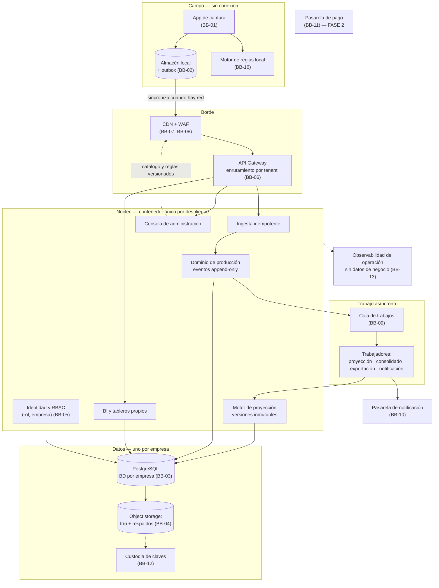
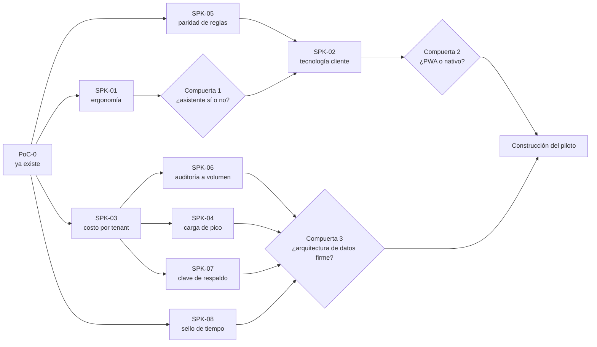

# FlorLogic — Alternativa de solución, ADR y cobertura de escenarios de calidad

**Versión 1.0 · 2-sep-2026 · Juan Pablo Avendaño y Jerónimo Montoya**

Documento de arquitectura. Propone **una** alternativa de solución, la justifica con **decisiones de
arquitectura registradas (ADR)**, declara los **bloques de construcción** que la sostienen, documenta
**escenario por escenario** por qué se cumple o no se cumple, y define el **PoC y los spikes** que
deben ejecutarse antes de construir.

---

## 0. Cómo leer este documento

### 0.1 Fuentes

Este documento **no inventa dominio**. Todo lo que afirma sobre el negocio viene de:

Los cuatro artefactos de drivers y el documento que los explica están reunidos en
`Documentacion/Drivers-Arquitectonicos/`. El resto del material está en `Documentacion/Archivo/`.

| Fuente | Qué aporta |
|---|---|
| `Documentacion/Drivers-Arquitectonicos/DRIVERS_ARQUITECTONICOS.md` | **La entrada única a todo lo de abajo**, explicado y con su trazabilidad |
| `Documentacion/Drivers-Arquitectonicos/EscenariosCalidad.xlsx` | Los 65 escenarios priorizados (`ESC-01`…`ESC-65`), el ranking de atributos y la caracterización |
| `Documentacion/Drivers-Arquitectonicos/FuncionalidadesSignificativas.xlsx` | El catálogo vigente de funcionalidades significativas (`RF-001`…`FR-024`), por `DEC-04` |
| `Documentacion/Drivers-Arquitectonicos/RestriccionesTecnicas.xlsx` | Restricciones técnicas impuestas y adoptadas (`CN-10`…`CN-38`) |
| `Documentacion/Drivers-Arquitectonicos/RestriccionesNegocio.xlsx` | Restricciones de negocio (tiempo, presupuesto, legal, proceso, humano) |
| `Documentacion/Archivo/Recopilacion/3_DECISIONES_DE_NEGOCIO_Y_CONTRADICCIONES.md` | Decisiones cerradas `DEC-01`…`DEC-16` y las rondas que las movieron |
| `Documentacion/Archivo/Recopilacion/1_VOZ_DEL_CLIENTE.md` | Hechos del dominio `H-01`…`H-49` y brechas `BR-nn`, con la cita que respalda cada uno |
| `app-captura/` | El prototipo desechable ya construido |

### 0.2 Identificadores nuevos que introduce este documento

| Prefijo | Qué es | Cuántos |
|---|---|---|
| `ALT-n` | Alternativa de solución evaluada | 4 |
| `ADR-nnn` | Decisión de arquitectura registrada | 19 |
| `BB-nn` | Bloque de construcción (*building block*) | 17 |
| `SPK-nn` | Spike o PoC con criterio de muerte explícito | 8 |

Los IDs son estables y no se reutilizan. Si una decisión se revierte, se marca `REVERTIDA` y se
conserva la fila, igual que en `DECISIONES.md`.

### 0.3 Marcas

- `[!]` — inconsistencia declarada, contradicción abierta o supuesto no verificado. **No se rellena
  con un supuesto plausible.**
- **CUMPLE** / **PARCIAL** / **NO CUMPLE (F1)** / **EN CONFLICTO** — veredicto de cobertura de un
  escenario. Su significado exacto está en §7.1.

### 0.4 Regla de honestidad que rige el documento

Un escenario se marca **CUMPLE** solo si existe un mecanismo arquitectónico concreto que lo produce
**y** la medida es alcanzable sin una medición pendiente. Si la medida depende de un número que
todavía no existe (tiempo de captura, costo por tenant, volumen real), el veredicto es **PARCIAL** y
queda amarrado a un spike. **Declarar cumplido lo que no se ha medido es exactamente el desperdicio
que este documento existe para evitar.**

---

## 1. Los drivers de arquitectura

### 1.1 Ranking de atributos de calidad

Del Mini QAW, hoja `1. Trade-Off-QA`, columna **«Atributos Promediados entre usuario y Arquitectos»**:

| # | Atributo | Peso en el diseño |
|---:|---|---|
| 1 | **Confiabilidad** | Manda sobre todo. 26 de los 65 escenarios son suyos |
| 2 | **Capacidad para ser Auditado** | Es lo que sostiene la meta de llevar el 2% de error a 0% (`H-33`) |
| 3 | **Rendimiento** | Latencia percibida en campo y latencia de negocio (8 días → 1 hora) |
| 4 | **Seguridad** | Secreto empresarial (`CN-03`) entre fincas competidoras |
| 5 | **Experiencia de Usuario** | La adopción de 3 supervisores decide el éxito del piloto |
| 6 | **Disponibilidad** | Mitigada estructuralmente por offline-first (`CN-13`) |
| 7 | **Escalabilidad** | Alta de fincas y de empresas sin reinstalar |
| 8 | **Capacidad para ser Administrado** | Cero solicitudes al desarrollador es una medida repetida en 9 escenarios |
| 9 | **Portabilidad** | Android de gama de entrada; nube o sitio |
| 10 | **Capacidad** | 5 años en línea, crecimiento absorbido |
| 11 | **Capacidad para ser Soportado** | Soporte remoto, finca a horas de distancia |
| 12 | **Interoperatividad** | Bajada a propósito por `DEC-06` / `CN-14` |
| 13 | **Accesibilidad** | Puesto 13, y ahí está el problema — ver `[!]` abajo |

> `[!]` **Tres rankings que no coinciden, y hay que decirlo.** La hoja `2. Priorización-QA` (suma de
> los tres actores) da un orden distinto: Disponibilidad **2ª** y Capacidad **5ª**, contra 6ª y 10ª en
> el promediado. El bloque «propuestos por usuario» de la hoja 1 pone Auditado **11º**, y el
> promediado lo sube a **2º**, que no es el promedio de ninguna de las dos listas de origen. **El
> promediado no es reproducible desde las listas que lo alimentan.**
>
> **Por qué no bloquea este documento:** los escenarios del Top-65 se ordenaron por el puntaje de los
> actores, no por el ranking de atributos, y los cinco primeros (`ESC-01`…`ESC-05`) son los mismos
> bajo cualquiera de los tres órdenes. La arquitectura que sigue no cambia. **Sí hay que reconciliar
> los tres rankings antes de usarlos para negociar un trade-off con el cliente.**

> `[!]` **Accesibilidad en el puesto 13 sigue siendo `BR-24`.** El cliente definió accesibilidad como
> *«capacidad de ser interpretado por personas con falta de digitalización o analfabetismo»*, que es
> exactamente la premisa del asistente de captura (`DEC-16`, `CN-31`). Ponerla última y a la vez
> repetir *«que sea fácil»* es incoherente. **Este documento no usa el puesto 13 para justificar
> recortes de accesibilidad**, y trata la ergonomía de captura como parte de UX (#5), que sí está
> alto.

### 1.2 Restricciones que cierran el espacio de diseño

Estas cinco no se negocian y **eliminan alternativas por sí solas**:

| ID | Restricción | Qué elimina |
|---|---|---|
| `CN-13` | Offline-first obligatorio: captura, validación, autenticación y sello de tiempo funcionan íntegros en el dispositivo | Elimina cualquier arquitectura donde el servidor esté en el camino crítico de la captura |
| `CN-16` / `DEC-11` | Una base de datos independiente por empresa, esquema común | Elimina tabla compartida con discriminador. Fallback aceptable: esquema por empresa |
| `CN-35` | Costo operativo por empresa acotado; se evitan licencias que escalen por tenant o por usuario | Elimina IdP y BaaS con precio por usuario activo |
| `CN-02` + equipo | ~20.000 USD de construcción, **2 personas**, entrega mayo 2027 | Elimina microservicios, service mesh, data mesh y cualquier cosa que exija equipo de plataforma |
| `CN-03` | Secreto empresarial (art. 260, Decisión 486 CAN) entre fincas competidoras | Obliga a que el aislamiento sea demostrable, no declarativo |

### 1.3 Las funcionalidades significativas y dónde viven

`DEC-04`: el catálogo vigente es `FuncionalidadesSignificativas.xlsx`. Mapeo a los componentes que
la alternativa propone (los componentes se definen en §3):

| RF | Qué | Componente que lo realiza | Escenarios que lo prueban |
|---|---|---|---|
| `RF-001` | Registrar siembra sin conexión | App de captura + almacén local + motor de reglas local | `ESC-04`, `ESC-26`, `ESC-36`, `ESC-55` |
| `RF-002` | Registrar corte sin conexión, varios por cama | Ídem | `ESC-04`, `ESC-33`, `ESC-55` |
| `RF-003` | Sincronizar sin perder ni duplicar | Outbox del dispositivo + servicio de ingesta idempotente | `ESC-01`, `ESC-34`, `ESC-38` |
| `RF-004` | Impedir evento imposible en el ciclo, offline, explicando | Motor de reglas versionado (mismo motor en ambos lados) | `ESC-02`, `ESC-56`, `ESC-57` |
| `RF-005` | Rechazar tallos > plantas sembradas | Ídem, regla dura del catálogo | `ESC-02` |
| `RF-006` | Calcular tallos proyectados | Motor de proyección | `ESC-05`, `ESC-09` |
| `RF-008` | Regenerar proyección semanal conservando la versión anterior | Motor de proyección + almacén de versiones inmutables | `ESC-05`, `ESC-09`, `ESC-45` |
| `RF-009` | Erradicación / baja parcial con recálculo | Motor de proyección + catálogo de motivos | `ESC-63`, `ESC-10` |
| `RF-011` | Desviación real contra proyectado | Motor de proyección + módulo de BI | `ESC-10`, `ESC-11` |
| `RF-012` | Aislamiento entre empresas por todos los canales | Enrutamiento por tenant + BD por empresa + RBAC (rol, empresa) | `ESC-29`, `ESC-50`, `ESC-64` |
| `RF-013` | Parametrización por empresa sin desarrollo | Catálogo de parámetros y reglas versionado + consola | `ESC-07`, `ESC-23`, `ESC-24`, `ESC-44`, `ESC-48` |
| `RF-014` | Autenticar y aplicar permisos offline | Credencial offline + RBAC evaluado en el dispositivo | `ESC-49`, `ESC-28`, `ESC-22` |
| `RF-016` | Conservar empresa, autor, dispositivo, sellos y valor anterior | Registro de eventos append-only | `ESC-08`, `ESC-40`, `ESC-58` |
| `RF-017` | Solo el administrador de la empresa modifica lo sincronizado, con aprobación | Separación de deberes (`ADR-019`) + eventos de corrección | `ESC-06`, `ESC-58` |
| `RF-018` | Proyectado y real agregados por día, semana y mes | Modelo de lectura del BI | `ESC-39`, `ESC-60` |
| `RF-019` | Exportar a Excel y PDF con las restricciones de pantalla | Servicio de exportación asíncrono | `ESC-51`, `ESC-29` |
| `RF-020` | Exigir descarga de la parametrización vigente | Distribución de catálogo versionado | `ESC-65`, `ESC-07` |
| `RF-021` | Marca de tiempo inmutable, bloqueo si el reloj se altera | Sello de tiempo confiable (`ADR-014`) | `ESC-17` |
| `RF-022` | Resolver conflictos por orden cronológico con bitácora | Servicio de ingesta + bitácora | `ESC-34` |
| `FR-023` | Foto estática de parámetros de cálculo | Versionado inmutable de parámetros | `ESC-09`, `ESC-24`, `ESC-45` |
| `FR-024` | Informar la causa de una caída en la proyección | Catálogo de motivos + BI | `ESC-63`, `ESC-10` |

> `[!]` **`RF-001` y `RF-002` siguen redactados sobre «cantidad de esquejes por cama»**, modelo que
> `DEC-14` invalidó (la sección de cama es donde vive el dato, y nada se cuenta por esqueje). La
> arquitectura de este documento asume el modelo de `DEC-14`. **Hay que reescribir los dos requisitos
> antes de construir**; es parte de `BR-N6`.

---

## 2. Alternativas de solución evaluadas

Cuatro alternativas. Se evalúan contra los cinco drivers de §1.2 y contra el ranking de §1.1.

### `ALT-1` · Monolito modular en contenedor, una BD por empresa, cliente offline-first pesado

Un solo despliegue con módulos internos de frontera explícita (captura/ingesta, dominio de
producción, motor de proyección, BI, administración), una base de datos PostgreSQL por empresa, un
proceso trabajador para el trabajo asíncrono, y un cliente móvil que es el sistema de registro
temporal de la captura.

### `ALT-2` · Microservicios con broker, API gateway y orquestador

Servicios separados por capacidad (ingesta, dominio, proyección, BI, identidad), comunicación por
message broker, despliegue orquestado.

### `ALT-3` · Backend-as-a-Service gestionado (Firebase / Supabase u equivalente)

Se compra la sincronización, la identidad y la base de datos. Un proyecto gestionado por empresa.

### `ALT-4` · A medida por finca, instalado en la infraestructura del cliente

Sin multi-tenant. Un despliegue por cliente, mantenido por separado.

### 2.1 Evaluación

| Criterio | `ALT-1` | `ALT-2` | `ALT-3` | `ALT-4` |
|---|:---:|:---:|:---:|:---:|
| Cabe en 2 personas y ~20.000 USD (`CN-02`) | **Sí** | No | Sí | No |
| Entregable para mayo 2027 (`CN-01`) | **Sí** | No | Sí | Dudoso |
| Aislamiento demostrable por empresa (`CN-03`, `CN-16`) | **Sí** | Sí | Parcial | Sí |
| Costo por tenant acotado (`CN-35`) | **Sí** | No | **No** — precio por usuario activo | No |
| Offline-first íntegro en el dispositivo (`CN-13`) | **Sí** | Sí | Parcial — la sync del BaaS asume su modelo de datos | Sí |
| Migración a N bases automatizable (`CN-29`) | Sí | Sí | Difícil | No aplica |
| Portabilidad nube ↔ sitio (`ESC-16`) | **Sí** | Sí | **No** | Sí |
| Custodia de la clave de respaldo decidible por nosotros (`CN-28`) | **Sí** | Sí | **No** | Sí |
| Riesgo de sobre-ingeniería con arquitectos sin experiencia (restricción humana de negocio) | Bajo | **Alto** | Bajo | Medio |

### 2.2 Alternativa elegida y por qué

**Se elige `ALT-1`.**

`ALT-2` se descarta por una razón que está escrita en las restricciones de negocio: *«decisiones de
arquitectura tomadas por arquitectos sin experiencia medible dentro del sector»*. Microservicios con
dos personas y sin experiencia de operación es la forma más rápida conocida de gastar el presupuesto
en infraestructura en vez de en el dominio. Además `CN-35` prohíbe precisamente el tipo de costo fijo
por servicio que esa opción multiplica.

`ALT-3` es la más tentadora y la que más hay que argumentar, porque **compra gratis buena parte de
`ESC-01`, `ESC-04` y `ESC-38`**. Se descarta por tres cosas concretas, no por prejuicio:

1. **`CN-35`.** El ingreso previsto es ~10 USD/usuario/mes y los usuarios por finca son ~12 activos
   más ~20 que solo consultan (`H-30`). Un BaaS que cobra por usuario activo mensual come el margen
   justo cuando el negocio crece.
2. **`ESC-16` y `CN-28`.** «Se instala en la infraestructura indicada» y «la clave de respaldo la
   custodiamos nosotros o el cliente» dejan de ser decisiones nuestras.
3. **El modelo de sincronización del BaaS no es el nuestro.** `CN-24` exige idempotencia y orden
   cronológico estricto con bitácora consultable, y `ESC-34` exige conservar **ambas** versiones de un
   duplicado. La resolución «último que escribe gana» de la mayoría de los BaaS es lo contrario.

   > `[!]` **No se descarta del todo.** El costo real por tenant y el tiempo de aprovisionamiento son
   > justamente lo que mide `SPK-03`. Si `SPK-03` muestra que un Postgres gestionado por empresa sale
   > más barato y más rápido que aprovisionarlo nosotros, **la parte de base de datos de `ALT-3`
   > vuelve a la mesa** — la de sincronización e identidad, no.

`ALT-4` contradice `DEC-01` (SaaS multi-tenant), que está cerrada.

---

## 3. La alternativa de solución, en detalle

### 3.1 Idea rectora

> **El dispositivo es el sistema de registro mientras hay jornada; el servidor es el sistema de
> registro cuando hay red.** Todo lo demás se deriva de ahí.

Esa frase es la traducción de `CN-13` a arquitectura, y es lo que hace que `ESC-59` (caída del
servicio en la nube durante la jornada) se resuelva **sin alta disponibilidad cara**: una caída se
convierte en retraso, no en parada. Es también el motivo por el que la Disponibilidad puede estar en
el puesto 6 sin que eso sea negligencia.

### 3.2 Vista de contenedores

### 3.3 Los cinco mecanismos que hacen el trabajo pesado

Casi toda la cobertura de escenarios sale de cinco mecanismos. Vale la pena nombrarlos antes de la
tabla, porque en §7 se repiten sesenta y cinco veces.

**M1 · Outbox idempotente con identificador generado en el dispositivo.**
Cada captura nace con un UUID v7 generado localmente y entra a una cola persistente. El servidor
aplica por identificador: reenviar es gratis, perder no ocurre porque nada se borra del outbox hasta
que el servidor confirma. Resuelve la familia `ESC-01`, `ESC-04`, `ESC-11`, `ESC-18`, `ESC-34`,
`ESC-38`, `ESC-59`.

**M2 · Registro de eventos append-only con corrección como evento nuevo.**
Nada se sobrescribe. Una corrección es un evento que referencia al anterior y carga autor, motivo y
autorización. La bitácora no es una tabla de auditoría paralela: **es el modelo de datos**. Resuelve
la familia `ESC-08`, `ESC-12`, `ESC-39`, `ESC-40`, `ESC-58`, `ESC-62`, y es lo que hace posible la
meta de `H-33` (2% → 0%).

**M3 · Catálogo de reglas y parámetros versionado, interpretado en runtime.**
Rangos, ciclos, densidades, grados, motivos, nomenclatura y reglas duras viven en un artefacto
versionado (`reglas.vN.json`, `catalogo.vN.json`), no en el código. El mismo artefacto lo interpreta
el dispositivo y el servidor. Resuelve la familia «cero despliegues»: `ESC-07`, `ESC-23`, `ESC-24`,
`ESC-44`, `ESC-48`, `ESC-56`, `ESC-57`, `ESC-65`.

**M4 · Proyecciones inmutables con foto de parámetros.**
Una proyección publicada guarda con qué corte de datos y qué versión de parámetros se calculó, y no
se recalcula sola. La desviación siempre se mide contra la versión vigente en su momento. Resuelve
`ESC-05`, `ESC-09`, `ESC-10`, `ESC-24`, `ESC-45`.

**M5 · Aislamiento por empresa en tres capas.**
Enrutamiento por tenant en el gateway, *connection factory* que solo abre la base de esa empresa, y
RBAC evaluado contra el par (rol, empresa) — nunca contra el rol solo. Ninguna de las tres capas es
suficiente sola; las tres juntas hacen el aislamiento demostrable, que es lo que pide `CN-03`.
Resuelve `ESC-29`, `ESC-50`, `ESC-64`, y es el control de `RF-012`.

---

## 4. Bloques de construcción

Lo que sigue es el catálogo de *building blocks*: piezas de soporte que la solución consume y no
construye. La columna **Fase 1** es lo que se usa en el piloto; **Fase 2** es a dónde migra cuando el
SaaS se lance. La última columna es la parte que más importa: **por qué no algo más grande**.

| ID | Bloque | Fase 1 (piloto) | Fase 2 (SaaS) | Escenarios que sostiene | Por qué no más |
|---|---|---|---|---|---|
| `BB-01` | **Cliente de captura** | PWA offline-first (ya existe en `app-captura/`) | Decidido por `SPK-02`: PWA, Flutter o Kotlin | `ESC-04`, `ESC-15`, `ESC-25`, `ESC-26`, `ESC-27`, `ESC-32`, `ESC-37`, `ESC-47` | Comprometer el stack del producto hoy es adivinar. `ADR-008` fija los disparadores |
| `BB-02` | **Almacén local en dispositivo** | IndexedDB vía Dexie | SQLite (+ SQLCipher si `SPK-02` obliga) | `ESC-01`, `ESC-11`, `ESC-18`, `ESC-35`, `ESC-36`, `ESC-55` | Un almacén cifrado demostrable no cabe en web (`§4.3` de `PLAN_DEMO_CAPTURA.md`) |
| `BB-03` | **Base de datos** | PostgreSQL, **una base por empresa**, esquema común | Ídem, aprovisionada por automatización | `ESC-21`, `ESC-41`, `ESC-50`, `ESC-52`, `ESC-64` | `CN-16` prohíbe tabla compartida con discriminador. Fallback aceptable: esquema por empresa |
| `BB-04` | **Blob / object storage** | Bucket con clases de acceso y ciclo de vida | Ídem, por empresa | `ESC-03`, `ESC-19`, `ESC-42`, `ESC-43` | Es lo que hace sublineal el costo del histórico (`ESC-43`) sin borrar nada |
| `BB-05` | **Proveedor de identidad** | **Propio**: usuarios y roles en la BD de la empresa + credencial offline | Reevaluar IdP autohospedado (Keycloak) si crece el número de tenants | `ESC-13`, `ESC-22`, `ESC-28`, `ESC-49` | `CN-35`: un IdP gestionado que cobra por usuario activo rompe el margen. `CN-23` exige evaluación offline, que un IdP externo no da |
| `BB-06` | **API Gateway** | Proxy inverso con TLS, límite de tasa y **enrutamiento por tenant** | Ídem, gestionado | `ESC-29`, `ESC-38`, `ESC-50`, `ESC-61` | No hace falta un gateway de producto: es una función, no una plataforma |
| `BB-07` | **CDN** | Entrega de la PWA y de los artefactos de catálogo | Ídem | `ESC-25`, `ESC-32`, `ESC-65` | Barato y necesario: `ESC-25` exige actualizar sin recoger dispositivos |
| `BB-08` | **WAF** | Reglas gestionadas del proveedor de CDN | Ídem + reglas propias | `ESC-50`, `ESC-61` | Con superficie pública mínima (`CN-33` sin API pública), un WAF gestionado basta |
| `BB-09` | **Message broker / cola** | **Cola sobre PostgreSQL** (`SELECT … FOR UPDATE SKIP LOCK`) | Broker dedicado **solo si `SPK-04` lo exige** | `ESC-05`, `ESC-33`, `ESC-38`, `ESC-51`, `ESC-60`, `ESC-61` | Con 3 dispositivos y una jornada de registros, un broker es infraestructura que hay que operar sin carga que lo justifique |
| `BB-10` | **Pasarela de notificación** | Correo transaccional + notificación push | Ídem + canal que el cliente prefiera | `ESC-20`, `ESC-35`, `ESC-46`, `ESC-53` | Ningún escenario pide multicanal ni plantillas |
| `BB-11` | **Pasarela de pago** | **No se construye** | PayU / equivalente | *Ninguno de los 65* | `CN-11` está `EN DUDA` y bloqueada por `CN-05`. **Ningún escenario del Top-65 la exige** → fuera del piloto sin discusión |
| `BB-12` | **Custodia de claves (KMS)** | Necesario desde el día 1 para los respaldos | Ídem | `ESC-03`, `ESC-19`, `ESC-50` | `CN-28` sigue `EN DUDA`: clave del operador contra clave por empresa. Ver `ADR-012` |
| `BB-13` | **Observabilidad** | Registro de operación, telemetría de sincronización y estado de dispositivos | Ídem + alertas | `ESC-20`, `ESC-30`, `ESC-31`, `ESC-53` | **Restricción de diseño: la telemetría no puede contener datos de negocio** (`ESC-30`, `CN-34`) |
| `BB-14` | **Contenedores** | Imagen única + Compose | Misma imagen, orquestación mínima | `ESC-16`, `ESC-52`, `ESC-59` | Kubernetes con dos personas es costo de operación sin beneficio medible |
| `BB-15` | **Migraciones de esquema** | Herramienta de migración + orquestador sobre las N bases, **desde el andamiaje inicial** | Ídem, con verificación por base | `ESC-21`, `ESC-52`, `ESC-16` | `CN-29` lo dice literal: sin esto desde el día 1, «esquema común» deja de ser cierto |
| `BB-16` | **Distribución de reglas y catálogo** | Artefacto versionado servido por CDN, con verificación de integridad | Ídem, firmado | `ESC-07`, `ESC-23`, `ESC-24`, `ESC-44`, `ESC-57`, `ESC-65` | Es lo que convierte «cero despliegues» de aspiración en mecanismo |
| `BB-17` | **Data mesh / data warehouse** | **NO SE ADOPTA** | Reevaluar solo si aparecen equipos de dominio separados | — | Data mesh es una respuesta organizacional a muchos dominios y muchos equipos. Aquí hay **un** dominio y **dos** personas. Adoptarlo sería el desperdicio arquetípico que este documento evita |

> **Sobre `BB-17`, que es la respuesta a una pregunta del enunciado.** Data mesh, service mesh, event
> streaming y almacén analítico separado se evaluaron y **se descartan explícitamente para la fase 1**.
> El BI de `DEC-06` se construye sobre **modelos de lectura en la misma base de la empresa**
> (`ADR-010`), porque el volumen de una finca —~1.525 camas, 3 capturadores, registros diarios— cabe
> holgadamente en PostgreSQL con índices y vistas materializadas, y porque un almacén separado
> duplicaría el problema de aislamiento de `RF-012` en un segundo lugar.

---

## 5. Registro de decisiones de arquitectura (ADR)

Formato corto y uniforme: **contexto → decisión → alternativas → consecuencias → escenarios**. Cada
ADR declara su estado. `PROPUESTA` significa que la toma el equipo en este documento y todavía no se
ha validado contra medición o contra el cliente.

---

### `ADR-001` · Monolito modular en contenedor, no microservicios

**Estado:** PROPUESTA · **Deriva de:** `CN-02`, `CN-35`, restricción humana de negocio

**Contexto.** Dos personas, ~20.000 USD, entrega en mayo 2027, y una restricción de negocio que dice
en voz alta que los arquitectos no tienen experiencia medible en el sector.

**Decisión.** Un despliegue único con módulos de frontera explícita (ingesta, dominio, proyección,
BI, administración, identidad), más un proceso trabajador para lo asíncrono. Las fronteras se
respetan en el código —módulos que solo se hablan por interfaces declaradas— para que partirlos más
adelante sea posible sin reescribir.

**Alternativas.** `ALT-2` microservicios: descartada por costo de operación y por riesgo de
sobre-ingeniería. Monolito sin módulos: descartado porque el BI y la proyección tienen ciclos de
cambio distintos del dominio.

**Consecuencias.** Un solo artefacto que desplegar, migrar y respaldar → `ESC-16` y `ESC-52` salen
casi gratis. A cambio, **escalar es escalar todo junto**: si `SPK-04` muestra que el pico apila
carga por encima de lo que aguanta un proceso, hay que separar primero el trabajador de proyección.
Eso ya está previsto y no exige rediseño.

**Escenarios:** `ESC-16`, `ESC-52`, `ESC-59`, `ESC-61`, `ESC-64`

---

### `ADR-002` · El dispositivo es el sistema de registro durante la jornada; outbox idempotente con UUID v7

**Estado:** PROPUESTA · **Deriva de:** `CN-13`, `CN-17`, `CN-24`, `DEC-12`

**Contexto.** No hay conectividad en el área de cultivo y la tolerancia de pérdida de información es
**cero**, sin excepción.

**Decisión.** Cada captura se confirma **localmente** y nace con un identificador UUID v7 generado en
el dispositivo. Entra a un outbox persistente y no se borra hasta que el servidor confirma su
aplicación. El servidor aplica por identificador: recibir dos veces el mismo evento es una operación
sin efecto. La sincronización es un detalle de transporte, nunca una precondición de la captura.

**Alternativas.** Identificador asignado por el servidor: descartado, obliga a red para crear un
registro. Sincronización con «último que escribe gana»: descartado, contradice `ESC-34` y `CN-24`.

**Consecuencias.** `ESC-01`, `ESC-04`, `ESC-11`, `ESC-18` y `ESC-59` se resuelven con el mismo
mecanismo. El costo es que el dispositivo tiene estado valioso: **si se pierde el dispositivo antes de
sincronizar, se pierden datos** — que es exactamente el residuo honesto de `ESC-54` (ver §7.4).

**Escenarios:** `ESC-01`, `ESC-04`, `ESC-11`, `ESC-18`, `ESC-34`, `ESC-36`, `ESC-38`, `ESC-54`, `ESC-59`

---

### `ADR-003` · Aislamiento por empresa en tres capas

**Estado:** PROPUESTA · **Deriva de:** `CN-03`, `CN-16`, `CN-12`, `DEC-11`, `RF-012`

**Contexto.** Los clientes son fincas que compiten entre sí y la ley trata la información como
secreto empresarial. `RF-012` dice «por ningún canal».

**Decisión.** Tres capas, todas obligatorias: (1) enrutamiento por tenant en el gateway; (2)
*connection factory* que abre **únicamente** la base de datos de esa empresa —no hay conexión capaz
de ver dos empresas—; (3) RBAC evaluado contra el par (rol, empresa). La frontera de empresa es la
única frontera de visibilidad del sistema (`DEC-07` quitó los precios, así que dentro de una empresa
no hay dato restringido por rol).

**Alternativas.** Filtro por columna `empresa_id` en consultas: descartado por `CN-16` — una consulta
mal escrita rompe la promesa y no hay forma de demostrar que no ocurre. Esquema por empresa: aceptado
solo como fallback si `SPK-03` muestra que la base por empresa no es viable en costo o tiempo.

**Consecuencias.** Restaurar un cliente sin tocar a los demás es trivial (`ESC-50`, `RFP-08`). El
costo es `CN-29`: cada migración se multiplica por N bases, lo que hace de `BB-15` una pieza del
andamiaje inicial, no una tarea posterior.

> `[!]` **Alcance que se olvida fácil:** el aislamiento aplica también a la IA analítica, a sus
> prompts y a cualquier índice o caché construido sobre los datos (`DEC-16`). Es el punto más fácil de
> romper sin darse cuenta.

**Escenarios:** `ESC-29`, `ESC-50`, `ESC-52`, `ESC-64`

---

### `ADR-004` · Registro de eventos append-only; la corrección es un evento nuevo

**Estado:** PROPUESTA · **Deriva de:** `RF-016`, `RF-017`, `H-33`, atributo #2 (Auditabilidad)

**Contexto.** Auditabilidad es el segundo atributo del ranking y la meta declarada es llevar el 2% de
error de captura a 0%. Ese 2% hoy **no está visualizado en ninguna parte** (`H-33`).

**Decisión.** Los hechos de producción —siembra, corte, baja, erradicación, corrección— se guardan
como **eventos inmutables** con empresa, autor, dispositivo, sello de captura, sello de
sincronización y versión de reglas. Corregir no actualiza: emite un evento de corrección que
referencia al original y carga motivo y autorización. El estado consultable es un **modelo de
lectura** derivado de los eventos.

**Alternativas.** Tabla mutable + tabla de auditoría paralela: descartada porque la auditoría deja de
ser verdad en cuanto alguien escribe directo en la tabla principal — y `ESC-40` exige que **ni el
operador de la plataforma** pueda alterar la bitácora.

**Consecuencias.** `ESC-08`, `ESC-12`, `ESC-39`, `ESC-58` y `ESC-62` salen del mismo mecanismo. El
costo es que las consultas de tablero no se hacen sobre los eventos sino sobre modelos de lectura, lo
que añade una pieza (ver `ADR-010`) y un modo de fallo nuevo: el modelo de lectura puede quedar
atrasado. `ESC-60` acota ese atraso a 1 hora.

**Escenarios:** `ESC-08`, `ESC-12`, `ESC-16`, `ESC-33`, `ESC-39`, `ESC-40`, `ESC-58`, `ESC-62`, `ESC-63`

---

### `ADR-005` · Proyecciones y parámetros versionados de forma inmutable

**Estado:** PROPUESTA · **Deriva de:** `CN-27`, `FR-023`, `RF-008`, `DEC-12`

**Contexto.** La proyección se regenera semanalmente y la desviación real-contra-proyectado es la
métrica con la que el sistema demuestra que sirve (`RF-011`). Si los parámetros cambian bajo una
proyección ya emitida, la desviación deja de significar algo.

**Decisión.** Cada proyección publicada guarda: corte de datos, versión de parámetros, versión del
motor y fecha de cálculo. Nunca se recalcula sobre sí misma. Un cambio de parámetro crea una versión
nueva que aplica **solo hacia adelante**. La desviación se calcula siempre contra la versión que
estaba vigente en el momento del cierre del ciclo.

**Consecuencias.** El almacenamiento crece de forma lineal y predecible (regeneración semanal × N
camas). Hay que fijar **política de retención de versiones**, que hoy no existe.

> `[!]` **Pendiente concreto:** cuántas versiones se conservan y por cuánto tiempo. `CN-27` lo dejó
> abierto. Propuesta del equipo, sujeta a confirmación: **todas las versiones publicadas durante 5
> años en línea** (coherente con `ESC-41`), y las intermedias no publicadas se descartan a los 90 días.

**Escenarios:** `ESC-05`, `ESC-09`, `ESC-10`, `ESC-24`, `ESC-45`

---

### `ADR-006` · Motor de reglas dirigido por datos, con la misma especificación en cliente y servidor

**Estado:** PROPUESTA · **Deriva de:** `CN-22`, `CN-26`, `RF-004`, `RF-005`, `RF-013`, `RF-020`

**Contexto.** `ESC-07` exige cambiar una regla **sin publicar una versión de la aplicación**.
`ESC-57` exige que el servidor **no vuelva a rechazar** lo que el dispositivo aceptó con la misma
versión de reglas. `ESC-56` exige que el motivo del rechazo esté en lenguaje de negocio.

**Decisión.** Las reglas duras y blandas viven en un artefacto versionado (`reglas.vN.json`) que
incluye **el mensaje de negocio de cada rechazo**, no un código de error. El artefacto se distribuye
por `BB-16`. Cliente y servidor interpretan la **misma especificación**.

**El punto delicado, dicho ahora:** dos motores que interpretan el mismo JSON pueden divergir. La
respuesta no es confiar: es una **suite de casos dorados** —entrada, versión de reglas, veredicto
esperado— que corre en integración continua contra **ambas** implementaciones y falla la construcción
si difieren en un solo caso. Sin esa suite, `ESC-57` es una promesa, no un mecanismo. Eso es lo que
mide `SPK-05`.

**Alternativas.** Reglas en el código: descartada, viola `ESC-07` y `ESC-23`. Validar solo en el
servidor: descartada, convierte un error de 10 segundos en un error de 8 días (`CN-22`).

**Escenarios:** `ESC-02`, `ESC-07`, `ESC-23`, `ESC-24`, `ESC-44`, `ESC-48`, `ESC-56`, `ESC-57`, `ESC-63`, `ESC-65`

---

### `ADR-007` · Identidad propia con credencial offline de vigencia acotada

**Estado:** PROPUESTA · **Deriva de:** `CN-23`, `CN-12`, `CN-35`, `RF-014`, `BR-N5`

**Contexto.** `CN-23` exige autenticar y evaluar permisos **en el dispositivo, sin conexión, durante
toda la jornada**. `ESC-49` exige identidad individual en dispositivos compartidos. `ESC-28` exige
cierre de sesión a los 15 minutos de inactividad. `CN-35` prohíbe pagar por usuario activo.

**Decisión.** Identidad propia. Al sincronizar, el dispositivo recibe una **credencial firmada** con
el usuario, sus permisos (rol, empresa) y una vigencia acotada. Offline, el dispositivo verifica la
firma y evalúa permisos localmente. Dentro de la credencial vigente, el desbloqueo del usuario
individual se hace con un factor local corto (PIN o biometría), de modo que **cerrar por inactividad
no exige red** — reabrir es volver a desbloquear, no volver a autenticarse contra el servidor.

**Alternativas.** IdP gestionado (Auth0, Cognito): descartado por `CN-35` y porque no evalúa
permisos offline. Sesión offline sin caducidad: descartado, `ESC-28` no se cumpliría.

> `[!]` **`BR-N5` sigue sin preguntarse al cliente:** cuánto dura la ventana de sesión offline y qué
> pasa si se pierde el dispositivo. La vigencia de la credencial es exactamente ese número.
> **Propuesta del equipo, sujeta a confirmación: vigencia de 24 horas**, coherente con `ESC-04`
> (jornada de 8 h o más) y con el margen de una jornada que pide `ESC-35`.

**Escenarios:** `ESC-13`, `ESC-22`, `ESC-28`, `ESC-49`

---

### `ADR-008` · La tecnología del cliente móvil se decide con `SPK-02`, no ahora

**Estado:** PROPUESTA · **Deriva de:** `CN-18`, `CN-21`, `CN-28`, `PLAN_DEMO_CAPTURA.md §4.4`

**Contexto.** Ya existe una PWA funcionando en `app-captura/`. La PWA tiene tres límites conocidos y
documentados: iOS desaloja IndexedDB tras ~7 días sin abrir, no hay sincronización en segundo plano
en iOS, y el cifrado en reposo no es **demostrable** ante el cliente. Y hay una brecha abierta:
`CN-21` dice que **no se sabe qué celulares tienen los 3 capturadores**.

**Decisión.** **Aplazar deliberadamente.** El PoC usa la PWA que ya existe. El producto deja de poder
ser PWA si se cumple **cualquiera** de estos tres disparadores, que `SPK-02` mide:

1. La ventana offline real es de **una jornada o más** sin abrir la app (`CN-17` sugiere que sí).
2. El cifrado en reposo debe ser **demostrable documentalmente** ante el cliente (`ESC-50`, `CN-28`).
3. **iOS es real** y no una respuesta de cortesía.

Si se dispara alguno → Flutter, o Kotlin + Room si iOS se cae. **Lo que sobrevive en cualquier caso:
el modelo de datos, el catálogo de reglas y el contrato de sincronización.** Solo se bota la piel.

**Por qué esto no es indecisión.** Decidir hoy sería adivinar sobre tres datos que no tenemos, y el
error caro no es elegir mal: es elegir temprano y descubrirlo en marzo de 2027.

**Escenarios:** `ESC-04`, `ESC-25`, `ESC-28`, `ESC-32`, `ESC-46`, `ESC-54`

---

### `ADR-009` · Cola sobre la base de datos antes que message broker

**Estado:** PROPUESTA · **Deriva de:** `CN-35`, `CN-02`, `H-29`, `H-41`

**Contexto.** Hay trabajo asíncrono real: recálculo de proyección (`ESC-05`), consolidado de jornada
(`ESC-33`), exportación (`ESC-51`), notificaciones (`ESC-20`). Pero la carga es de **3 dispositivos**
capturando una jornada, con pico de +60%.

**Decisión.** Cola de trabajos **en PostgreSQL**, con toma de trabajo por bloqueo con salto de filas
bloqueadas. Un broker dedicado se adopta **solo si `SPK-04` demuestra** que la cola sobre base de
datos no sostiene el pico simultáneo de todos los tenants (`CN-30`).

**Por qué.** Un broker es una pieza más que operar, respaldar, monitorear y aislar por tenant, para
un volumen que hoy nadie ha medido y que la aritmética disponible sugiere pequeño. `CN-30` advierte
que el pico de floricultura es de calendario y **se apila** entre tenants: por eso el disparador
existe y está medido, en vez de descartado.

**Escenarios:** `ESC-05`, `ESC-33`, `ESC-38`, `ESC-51`, `ESC-60`, `ESC-61`

---

### `ADR-010` · BI propio sobre modelos de lectura en la misma base de la empresa

**Estado:** PROPUESTA · **Deriva de:** `DEC-06`, `DEC-10`, `CN-14`, `RF-018`

**Contexto.** `DEC-06` decidió BI propio y cerrado, con los seis reportes que la finca ya consume como
línea base. `ADR-004` puso los hechos en eventos, que no se consultan bien desde un tablero.

**Decisión.** Modelos de lectura (tablas y vistas materializadas) derivados de los eventos, **dentro
de la misma base de datos de la empresa**. Se refrescan por el trabajador tras cada sincronización.
Sin almacén analítico separado, sin `BB-17`.

**Por qué no un almacén separado.** Duplicaría el problema de aislamiento de `RF-012` en un segundo
lugar, y el volumen de una finca no lo justifica. Cuando lo justifique, el mecanismo de refresco ya
existe y apuntarlo a otro destino es un cambio local.

> `[!]` **El alcance del BI sigue sin acotar** (`DEC-06`, `CN-14`). «Lo que el negocio considere
> importante» no es una lista. La línea base son los seis reportes de `DEC-10` y **nada más** entra a
> fase 1 sin negociarlo.

**Escenarios:** `ESC-12`, `ESC-39`, `ESC-41`, `ESC-51`, `ESC-60`, `ESC-62`

---

### `ADR-011` · Retención por niveles: 5 años en línea, el resto en almacenamiento frío

**Estado:** PROPUESTA · **Deriva de:** `ESC-41`, `ESC-42`, `ESC-43`, `CN-02`

**Contexto.** `ESC-41` pide 5 años consultables en línea en ≤10 s. `ESC-42` acepta que lo anterior
tarde hasta 1 día. `ESC-43` exige que el costo por finca crezca **de forma sublineal** frente al
crecimiento de datos, y que **no se elimine nada**.

**Decisión.** Los eventos y modelos de lectura de los últimos 5 años viven en `BB-03`. Un proceso
automático mueve lo más antiguo a `BB-04` con clase de acceso de menor costo. Una consulta al rango
frío se acepta, avisa al usuario que tardará y entrega el resultado cuando esté disponible.

**Consecuencias.** `ESC-41`, `ESC-42` y `ESC-43` se resuelven juntos. La medida «costo sublineal» de
`ESC-43` **no es verificable sin `SPK-03`**: hoy nadie sabe qué cuesta un tenant al mes.

**Escenarios:** `ESC-41`, `ESC-42`, `ESC-43`, `ESC-21`

---

### `ADR-012` · Cifrado en reposo y en tránsito; **la custodia de la clave de respaldo queda abierta**

**Estado:** **ABIERTA — requiere decisión antes de construir** · **Deriva de:** `CN-28`, `DEC-09`, `DEC-11`, `CN-03`

**Contexto.** `DEC-09` promete que el operador de la plataforma tiene acceso de infraestructura, no
funcional. Pero **un respaldo contiene los datos del tenant**: la promesa solo es real si la clave del
respaldo no la puede usar el operador para leer contenido de negocio.

**Lo que sí se decide.** Cifrado en tránsito y en reposo, respaldos cifrados siempre, y **toda**
operación excepcional sobre datos de una empresa registrada y autorizada.

**Lo que no se decide aquí, porque no hay opción gratis:**

| Opción | Gana | Pierde |
|---|---|---|
| **Clave única del operador** | Restauración instantánea y sin fricción; soporte simple | «No accedemos a sus datos» queda como promesa organizativa, no como propiedad demostrable → `ESC-50` se degrada a PARCIAL permanentemente |
| **Clave por empresa** | Aislamiento demostrable; `ESC-50` cumple de verdad | El cliente participa en cada restauración → `ESC-03` y `ESC-19` se vuelven dependientes de su disponibilidad, y `DEC-12` promete restaurar en ≤1 día |

**Recomendación del equipo, sujeta a decisión:** **clave por empresa custodiada en `BB-12` con doble
control**, y una cláusula contractual que autoriza al operador a usarla **solo** para restauración,
con notificación automática al administrador de la empresa. Es la única opción que hace de `ESC-50`
un hecho y no una promesa, y `CN-03` pide precisamente eso.

**Esta decisión va también al contrato, no solo al código.** `SPK-07` la mide en dos días.

**Escenarios:** `ESC-03`, `ESC-19`, `ESC-50`

---

### `ADR-013` · Interoperabilidad por exportación; sin API pública en fase 1

**Estado:** PROPUESTA · **Deriva de:** `CN-33`, `CN-14`, `DEC-06`, `RF-019`

**Contexto.** Interoperatividad es el atributo #12, bajada a propósito por `DEC-06`. `ESC-29` pide
conectar una herramienta de análisis externa; `ESC-51` pide exportar reportes.

**Decisión.** Exportación autenticada a Excel y PDF, generada de forma asíncrona, con **las mismas
restricciones de rol que rigen en pantalla y respetando la frontera de empresa también en el
archivo**. Sin API pública, sin acceso directo a la base de datos.

**Consecuencia honesta.** `ESC-29` pide «un formato consumible, autenticado y limitado a su ámbito»
y **eso sí se cumple**; pero también dice «exportación **o servicio de consulta**», y el servicio de
consulta no existe en fase 1. Ver §7.4.

**Escenarios:** `ESC-29`, `ESC-51`

---

### `ADR-014` · Sello de tiempo confiable: marcar y exigir confirmación, **no bloquear**

**Estado:** PROPUESTA · **Deriva de:** `CN-25`, `RF-021`, `ESC-17`

**Contexto.** Los ciclos fenológicos son sensibles a desfases de fecha, y un reloj corrido contamina
la proyección sin dejar rastro.

> `[!]` **Contradicción en las fuentes, y hay que resolverla.** `CN-25` y `RF-021` dicen que el
> sistema **bloquea el registro** si detecta alteración manual del reloj. `ESC-17` —que es el
> escenario de calidad acordado— dice que el sistema **marca el registro y exige confirmación o
> corrección antes de aceptarlo**. No es lo mismo. El propio `CN-25` ya advertía en su plan de acción
> que *«un bloqueo sin salida es peor que el desfase»*.

**Decisión.** Se sigue el escenario, no el requisito: **detectar, marcar, exigir confirmación
explícita, sincronizar el registro con la marca de sospecha y con ambos sellos** (el del dispositivo y
el del servidor al ingresar). El servidor no descarta nunca en silencio. Un bloqueo duro en pleno
campo, sin nadie a quien preguntar, es una parada de jornada — y la jornada es lo que `CN-13` protege.

**Consecuencia.** Hay que **reescribir `RF-021` y `CN-25`** para que digan «marca y exige
confirmación», no «bloquea». Mientras no se reescriban, el escenario está `EN CONFLICTO` con el
catálogo.

**Escenarios:** `ESC-17`

---

### `ADR-015` · Actualización de la aplicación y del catálogo, sin recoger dispositivos

**Estado:** PROPUESTA · **Deriva de:** `ESC-25`, `ESC-65`, `CN-26`, `RF-020`

**Contexto.** `ESC-25` exige actualizar el 100% de los dispositivos en una jornada tras reconectar,
**sin perder registros pendientes** y **sin recoger ningún dispositivo físicamente**.

**Decisión.** Dos canales separados y con reglas distintas:

- **Catálogo y reglas** (`BB-16`): se descargan y verifican antes de permitir la captura (`RF-020`).
  Si falta algo, **aviso bloqueante antes de salir al cultivo**, nunca en medio del campo (`ESC-65`).
- **Aplicación** (`BB-07`): se actualiza al reconectar. La actualización **nunca** toca el outbox: si
  hay pendientes, se sincronizan primero y se migra el almacén local con la versión nueva.

**Por qué importa para `ADR-008`.** La PWA cumple `ESC-25` de forma natural. Una app nativa exige
tienda o gestión de dispositivos, que añade una pieza y un costo. **Es un argumento a favor de la PWA
que hay que poner en la balanza de `SPK-02`, no ignorarlo.**

**Escenarios:** `ESC-07`, `ESC-25`, `ESC-65`

---

### `ADR-016` · Despliegue portable: la misma imagen en nube o en sitio

**Estado:** PROPUESTA · **Deriva de:** `ESC-16`, `CN-07`, `DEC-01`

**Contexto.** `ESC-16` pide instalar en la infraestructura que el cliente indique **sin cambios de
código**, con puesta en marcha en ≤7 días.

**Decisión.** Un artefacto de contenedor y una definición de infraestructura declarativa. Todo lo
específico del entorno vive en configuración, nunca en el código. El mismo artefacto que corre en
nuestra nube corre en un servidor del cliente.

> `[!]` **Tensión de alcance, declarada.** `DEC-01` cerró que FlorLogic es **SaaS multi-tenant** y
> «descarta on-premise». `ESC-16` pide explícitamente instalación en infraestructura del cliente.
> `ADR-016` da la **capacidad técnica** (0 cambios de código), pero **no compromete la operación,
> el soporte ni el modelo comercial de un despliegue en sitio en fase 1**. Ver §7.4.

**Escenarios:** `ESC-16`, `ESC-52`

---

### `ADR-017` · Lo que deliberadamente no se construye

**Estado:** PROPUESTA · **Deriva de:** `CN-02`, `CN-35`, `CN-33`, `DEC-02`

Una decisión de arquitectura también es lo que se decide **no** hacer. Cada línea tiene su disparador
de reapertura:

| No se construye en fase 1 | Se reabre cuando |
|---|---|
| Microservicios, service mesh | Haya más de un equipo de dominio |
| Data mesh, almacén analítico separado (`BB-17`) | El BI de un tenant no quepa en su base con índices |
| Message broker dedicado (`BB-09` fase 2) | `SPK-04` muestre que la cola sobre BD no sostiene el pico |
| API pública / integración con terceros | Fase 2, como requisito nuevo — no como deuda (`CN-10`) |
| Pasarela de pago (`BB-11`) | Se cierre `CN-05` (modelo de suscripción) y arranque el multi-tenant |
| Alta disponibilidad activo-activo | La tolerancia de fallo baje de la hora que fijó `DEC-12` |
| Plantillas de captura configurables (`RFP-07`) | Después del piloto — `DEC-16` ya lo dejó fuera |
| Reemplazo o integración de la app de plagas | Fase 2 — `DEC-13`, `CN-19` |
| IA analítica en la nube | Se acote su alcance; hoy «proponer estrategias» no es estimable (`CN-32`) |

---

### `ADR-018` · El asistente de captura no se compromete hasta medirlo

**Estado:** PROPUESTA · **Deriva de:** `DEC-16`, `CN-31`, `BR-N1`, `BR-24`, `PR-01`

**Contexto.** `DEC-16` reintrodujo un asistente de captura offline. Su confianza está **en disputa**:
la sesión 3 registró que la IA embebida es decisión de desarrolladores, no requisito del cliente, y no
hay cita textual que la pida. A la vez, `ESC-26` pide ≤10 toques y ≤60 s por cama, y `ESC-27` pide
identificar la cama en ≤3 s. Y son **solo 3 personas** capturando registros muy repetitivos (`H-29`).

**Decisión.** El asistente **no entra al alcance comprometido**. Se construyen dos variantes de
formulario en el PoC —rejilla igual al papel y una-cama-a-la-vez con escaneo— y se **cronometran con
una persona real de campo** (`SPK-01`). El asistente solo se compromete si el formulario optimizado
**no alcanza** las medidas de `ESC-26` y `ESC-27`.

Rige `PR-01` sin excepción: **el asistente propone, el sistema valida, el usuario confirma. Nunca
escritura silenciosa.**

**Por qué es la decisión de menor desperdicio del documento.** Si el formulario alcanza las medidas,
se ahorra la pieza más cara y más riesgosa del sistema —reconocimiento restringido offline en gama de
entrada, contra un vocabulario técnico que ya destrozó la transcripción de las propias reuniones— y
se ahorra sin discusión, con un número sobre la mesa.

**Escenarios:** `ESC-26`, `ESC-27`, `ESC-15`, `ESC-37`

---

### `ADR-019` · Separación de deberes: administrar el sistema ≠ autorizar correcciones de producción

**Estado:** PROPUESTA · **Deriva de:** `ESC-06`, `RF-017`, `CN-12`, `DEC-01`

> `[!]` **Contradicción real entre el escenario y el catálogo, y esta ADR existe para resolverla.**
> `ESC-06` (rank 6, puntaje máximo del actor Administrador) dice: *«un administrador de la empresa —el
> ingeniero de sistemas de la finca— intenta modificar un registro de siembra, corte o baja ya
> capturado → el sistema **rechaza** la modificación»*, con medida *«separación de deberes verificable
> en la matriz de permisos»*. `RF-017` dice lo contrario: que el registro sincronizado **solo** lo
> modifica el administrador de la empresa.

**Decisión.** El «administrador de la empresa» se parte en dos capacidades que **nunca coinciden en el
mismo usuario**:

| Capacidad | Quién | Qué puede |
|---|---|---|
| **Administración técnica** | Ingeniero de sistemas de la finca | Usuarios, permisos, parámetros, catálogo, estado del sistema. **No puede tocar un registro de producción** |
| **Autorización de correcciones** | Administrador de producción | Autoriza la corrección de un registro sincronizado. La corrección se aplica como evento nuevo (`ADR-004`), nunca como sobrescritura |

Un intento de modificación por la capacidad técnica **se rechaza y se registra** — el intento también
queda en la bitácora, que es lo que `ESC-06` mide.

**Consecuencias.** Resuelve `ESC-06` y `ESC-58` juntos, y hace de la matriz de permisos un artefacto
verificable en vez de una declaración. **Obliga a reescribir `RF-017`** para que diga «administrador
de producción» donde hoy dice «administrador de la empresa».

**Escenarios:** `ESC-06`, `ESC-58`, `ESC-13`, `ESC-22`

---

## 6. Prueba de concepto y spikes

### 6.1 El principio: fallar rápido, fallar barato

El proyecto tiene un presupuesto de ~20.000 USD, dos personas y una fecha. **El desperdicio caro no
es construir mal: es construir bien lo que no había que construir.** Cada spike de esta sección
existe para matar una hipótesis antes de que cueste, y cada uno tiene:

- una **pregunta** que responde,
- un **plazo tope** en días-persona,
- un **criterio de muerte** explícito — qué resultado nos hace abandonar el camino,
- los **escenarios que desbloquea**,
- y qué **sobrevive** aunque el spike falle.

### 6.2 `PoC-0` — el prototipo que ya existe

**No se construye de nuevo.** `app-captura/` ya es una PWA offline-first funcionando, con almacén
local, motor de reglas leyendo `reglas.v1.json`, escaneo, outbox y semilla con los bloques y camas
reales. `PLAN_DEMO_CAPTURA.md` ya lo declaró **desechable a propósito**: lo que sobrevive es el modelo
de datos, el catálogo de reglas, el contrato de sincronización y **los números que mida**.

Los ocho spikes que siguen **se montan encima de `PoC-0`**, no al lado. Eso es lo que los hace
baratos.

### 6.3 Los ocho spikes

| ID | Pregunta que responde | Días | Criterio de muerte (qué nos hace cambiar de camino) | Desbloquea |
|---|---|---:|---|---|
| **`SPK-01`** | ¿Un formulario optimizado alcanza ≤10 toques y ≤60 s por cama, o hace falta el asistente? | 3 | **Si el formulario alcanza las medidas → el asistente de captura se cancela.** Si queda >30% por encima → se justifica el asistente y entra al alcance con costo declarado | `ESC-26`, `ESC-27`, `ESC-15`, `ESC-37`; cierra `BR-N1`, `BR-24`, `ADR-018` |
| **`SPK-02`** | ¿La ventana offline real es de una jornada o más? ¿El cifrado debe ser demostrable? ¿iOS es real? | 5 | **Si se dispara cualquiera de los tres → el cliente deja de ser PWA** y se reconstruye la piel en Flutter/Kotlin conservando modelo, reglas y contrato de sync | `ESC-04`, `ESC-25`, `ESC-28`, `ESC-32`, `ESC-46`, `ESC-54`; cierra `CN-21`, `ADR-008` |
| **`SPK-03`** | ¿Cuánto cuesta y cuánto tarda aprovisionar y migrar **una base de datos por empresa**? | 3 | **Si el costo por tenant/mes supera el 25% del ingreso previsto, o aprovisionar tarda >1 día → se cae a esquema por empresa** (fallback aceptado por `CN-16`) | `ESC-16`, `ESC-21`, `ESC-43`, `ESC-52`; cierra `CN-16`, `CN-29`, `CN-35`, `ADR-003` |
| **`SPK-04`** | ¿La cola sobre PostgreSQL sostiene el pico de temporada apilado entre tenants? | 3 | **Si la sincronización de jornada supera 30 min o la proyección supera 1 h bajo carga sintética de +60% → entra `BB-09` como broker dedicado** | `ESC-05`, `ESC-38`, `ESC-60`, `ESC-61`; cierra `CN-30`, `ADR-009` |
| **`SPK-05`** | ¿Dos motores de reglas sobre la misma especificación dan el mismo veredicto siempre? | 2 | **Si aparece una sola divergencia sin causa identificada → un único motor** (validación de servidor replicada por el mismo binario, o WebAssembly compartido) | `ESC-02`, `ESC-07`, `ESC-56`, `ESC-57`; cierra `ADR-006` |
| **`SPK-06`** | ¿Un registro append-only con 5 años sintéticos responde la historia de una cama en ≤5 s y de un lote en ≤10 s? | 3 | **Si no responde en tiempo con volumen realista → los modelos de lectura pasan a materializados y particionados** antes de construir el BI, no después | `ESC-12`, `ESC-39`, `ESC-40`, `ESC-41`, `ESC-62`; cierra `ADR-004`, `ADR-010` |
| **`SPK-07`** | Clave de respaldo: ¿del operador o por empresa? ¿Cuánto cuesta cada una en tiempo de restauración? | 2 | **Decisión forzada al terminar.** No hay resultado que permita seguir sin decidir: `ESC-50` depende de esto y la cláusula contractual también | `ESC-03`, `ESC-19`, `ESC-50`; cierra `CN-28`, `ADR-012` |
| **`SPK-08`** | ¿Se detecta una desviación de reloj >5 min sin bloquear al usuario en pleno campo? | 2 | **Si la detección tiene falsos positivos que bloquean captura legítima → se degrada a marca informativa** y `ESC-17` se renegocia con el cliente | `ESC-17`; cierra `CN-25`, `ADR-014` |
| | **Total** | **23** | ≈ 3 semanas con dos personas trabajando en paralelo | |

### 6.4 Orden y compuertas de decisión

**Compuerta 1 — al terminar `SPK-01`.** Decide si el asistente de captura entra o se cancela. Es la
decisión que más presupuesto mueve del documento.

**Compuerta 2 — al terminar `SPK-02`.** Decide el stack del cliente. Antes de esta compuerta **no se
escribe una línea de código de producto para móvil**.

**Compuerta 3 — al terminar `SPK-03`, `SPK-04`, `SPK-06`, `SPK-07`, `SPK-08`.** Congela la
arquitectura de datos: aislamiento, cola, retención, cifrado y sello de tiempo. Después de esta
compuerta, cambiar cualquiera de las cinco cuesta reescribir.

### 6.5 Qué **no** se construye durante los spikes

Repetido aquí a propósito, porque es donde se fuga el presupuesto: autenticación real y RBAC completo,
multi-tenant operativo, backend definitivo, migraciones a N bases, motor de proyección (faltan **los
dos números** de `BR-23`), BI y los seis reportes, IA analítica, vista geométrica. Todo eso depende de
respuestas que hoy no existen.

> `[!]` **El motor de proyección no se puede construir todavía y hay que decirlo alto.** Faltan el
> porcentaje de productividad esperada por variedad y la curva de reparto de tallos sobre los ~7 días
> de corte (`BR-23`). Sin esos dos números, `RF-006`, `RF-008` y `RF-011` no son implementables, y con
> ellos `ESC-05`, `ESC-09` y `ESC-10` solo se pueden verificar en su **mecánica** (versionado,
> latencia, inmutabilidad), no en su **resultado**.

---

## 7. Cobertura de los 65 escenarios de calidad

### 7.1 Qué significa cada veredicto

| Veredicto | Significa |
|---|---|
| **CUMPLE** | Existe un mecanismo concreto que lo produce y la medida es alcanzable sin una medición pendiente |
| **PARCIAL** | El mecanismo existe, pero la medida depende de un número que todavía no se ha medido, o el cumplimiento es incompleto por una razón declarada |
| **NO CUMPLE (F1)** | La arquitectura de fase 1 no lo satisface. Se dice, con la razón y con cuándo se reabre |
| **EN CONFLICTO** | El escenario contradice una decisión o un requisito vigente. Requiere resolución antes de construir |

### 7.2 Resumen

| Veredicto | Cantidad | % |
|---|---:|---:|
| **CUMPLE** | 23 | 35% |
| **PARCIAL** | 39 | 60% |
| **EN CONFLICTO** | 3 | 5% |
| **NO CUMPLE (F1)** | 0 | 0% |
| **Total** | **65** | 100% |

**Cómo leer ese 60% de PARCIAL, que es la cifra que salta a la vista.** No es que la arquitectura
cubra mal los escenarios: es que **este documento se negó a llamar CUMPLE a lo que nadie ha medido**.
De los 39 PARCIAL, **30 tienen el mecanismo completo y les falta únicamente un número** —segundos por
cama, costo por tenant, volumen real, latencia bajo carga— que los ocho spikes de §6 producen en tres
semanas. Los otros nueve se desglosan así:

| Sub-caso | Escenarios | Qué es realmente |
|---|---|---|
| Depende de una pregunta al cliente, no de trabajo técnico | `ESC-28`, `ESC-34`, `ESC-65` | `BR-N5`, `BR-N4`, `BR-22` sin preguntar |
| Depende de una decisión que `ADR-012` deja abierta | `ESC-03`, `ESC-19`, `ESC-50` | Custodia de la clave de respaldo (`CN-28`) |
| Depende de los dos números que faltan del motor | `ESC-05`, `ESC-10` | `BR-23` — bloqueante y fuera del alcance del equipo |
| Residuo estructural: la parte principal cumple, una parte no se puede cumplir | `ESC-13`, `ESC-22`, `ESC-29`, `ESC-54` | Ver §7.4 |

Y **ningún escenario queda sin mecanismo**: no hay un solo `NO CUMPLE` completo. Los tres
**EN CONFLICTO** son el hallazgo más valioso del ejercicio: contradicciones entre el catálogo de
requisitos y los escenarios acordados que estaban ahí desde hace semanas y que nadie había cruzado.

### 7.3 Tabla completa

| ESC | Atributo | Medida comprometida | Mecanismo | Veredicto | Por qué |
|---|---|---|---|---|---|
| `ESC-01` | Confiabilidad | 0 perdidos · 0 duplicados · 100% recuperable tras reinicio | M1 · `ADR-002` · `BB-02` | **CUMPLE** | El registro se confirma localmente y no sale del outbox hasta que el servidor confirma; el UUID v7 del dispositivo hace que reenviar sea inocuo. Es el escenario que define la arquitectura |
| `ESC-02` | Confiabilidad | 100% fuera de rango rechazado en el dispositivo · <1 s · 0 al servidor | M3 · `ADR-006` · `BB-16` | **CUMPLE** | La regla `tallos ≤ plantas sembradas` es una regla dura del catálogo, evaluada localmente sin red. `<1 s` es holgado para una evaluación en memoria |
| `ESC-03` | Confiabilidad | 100% respaldos en ventana · pérdida 0 · restauración ≤1 día | `BB-04` · `BB-12` · `ADR-012` | **PARCIAL** | El respaldo automático, cifrado y verificado es mecánica resuelta. **Lo que falta es de quién es la clave** (`CN-28` abierta): con clave por empresa, «restauración ≤1 día» pasa a depender de la disponibilidad del cliente. `SPK-07` |
| `ESC-04` | Disponibilidad | 100% funciones sin red · 0 perdidos · jornada ≥8 h | `ADR-002` · `BB-01` · `BB-02` | **PARCIAL** | Sin red, todo funciona: es `CN-13`. Lo que no está verificado es que el almacén local **sobreviva una jornada completa y el cierre de la app en el dispositivo real de la finca** — `CN-21` dice que no sabemos qué celulares son. `SPK-02` |
| `ESC-05` | Rendimiento | Proyección ≤1 h · degradación ≤20% en pico · 0 versiones sobrescritas | M4 · `ADR-005` · `ADR-009` | **PARCIAL** | «0 versiones sobrescritas» **CUMPLE** por `ADR-005`. «≤1 h» y «≤20%» no se pueden afirmar sin medir la cola bajo carga (`SPK-04`) — y el motor todavía no existe por `BR-23` |
| `ESC-06` | Administrado | 100% intentos rechazados y registrados · 0 registros modificados por ese rol · separación de deberes | `ADR-019` · `ADR-004` | **EN CONFLICTO** | El escenario exige que el administrador técnico **no pueda** modificar producción; `RF-017` dice que el administrador de la empresa **sí puede**. `ADR-019` propone la separación que lo resuelve, pero **hay que reescribir `RF-017`** antes de construir |
| `ESC-07` | Confiabilidad | 0 despliegues · vigente en <1 ciclo de sync · 0% rechazos por conflicto · 0 proyecciones alteradas · 0 solicitudes al dev | M3 · `ADR-006` · `ADR-015` · `BB-16` | **CUMPLE** | Las reglas son datos versionados, no código. Cambiar una es publicar una versión del catálogo, que se propaga a conectados y queda en cola para desconectados. «0 proyecciones alteradas» lo garantiza `ADR-005` |
| `ESC-08` | Confiabilidad | ≤3 toques · 100% con valor anterior y autor · 0 sin trazabilidad | M2 · `ADR-004` | **PARCIAL** | La trazabilidad **CUMPLE** por construcción: la corrección es un evento nuevo. «≤3 toques» es una medida de interfaz que solo se verifica cronometrando (`SPK-01`) |
| `ESC-09` | Confiabilidad | 100% proyecciones con versión · recálculo idéntico · ≤3 clics | M4 · `ADR-005` | **CUMPLE** | La foto de parámetros y el corte de datos se guardan con cada proyección publicada; recalcular sobre la misma versión es determinista. «≤3 clics» es alcance de interfaz, no de arquitectura |
| `ESC-10` | Confiabilidad | Desviación ≤1 día tras cierre · 100% de ciclos · 0 comparaciones contra versiones recalculadas | M4 · `ADR-005` · `ADR-009` | **PARCIAL** | «0 comparaciones contra recalculadas» **CUMPLE**: la inmutabilidad lo hace imposible. «≤1 día» depende del motor, que espera los dos números de `BR-23` |
| `ESC-11` | Confiabilidad | 0 perdidos · ≤1 campo por rehacer · restauración automática | `ADR-002` · `BB-02` | **PARCIAL** | La persistencia por campo confirmado da «0 perdidos». «≤1 campo por rehacer» depende del diseño del formulario y se verifica en `SPK-01` con corte de batería real |
| `ESC-12` | Auditado | 100% eventos ordenados · ≤5 s para 5 años · 0 solicitudes a desarrollo | M2 · `ADR-004` · `ADR-010` | **PARCIAL** | El registro append-only da la secuencia completa por construcción. «≤5 s sobre 5 años» exige modelo de lectura indexado y **no está medido con volumen realista**: `SPK-06` |
| `ESC-13` | Administrado | Alta/baja ≤5 min · 0 solicitudes al dev · baja efectiva ≤1 min | `ADR-007` · `ADR-019` | **PARCIAL** | Alta y baja por consola **CUMPLEN**. «Baja efectiva ≤1 min» solo aplica a sesiones conectadas: en el dispositivo offline la credencial firmada sigue vigente hasta la siguiente sincronización, que es lo que `ESC-22` acepta explícitamente y este escenario no matiza |
| `ESC-14` | Administrado | 100% tareas por consola · 0 SQL · 0 instalación | `BB-06` · consola web | **CUMPLE** | La consola web cubre parametrización, permisos y estado. Es alcance de construcción, no un problema arquitectónico. **El costo está en el esfuerzo**, no en el diseño |
| `ESC-15` | UX | Contraste ≥4.5:1 · objetivos ≥48 dp · 100% de tareas a sol directo | `BB-01` · `ADR-018` | **PARCIAL** | Contraste y tamaño de objetivo son decisiones de diseño que se cumplen por construcción. «100% de las tareas completadas por los 3 supervisores a sol directo sin asistencia» **es una prueba de campo**, y está en `SPK-01` |
| `ESC-16` | Portabilidad | 0 cambios de código nube/sitio · puesta en marcha ≤7 días · 100% de funciones | `ADR-016` · `BB-14` · `BB-15` | **EN CONFLICTO** | `ADR-016` da la capacidad técnica: mismo contenedor, configuración externa, 0 cambios de código. Pero **`DEC-01` cerró que el producto es SaaS y descarta on-premise**. La capacidad existe; el compromiso comercial y de soporte, no. Ver §7.4 |
| `ESC-17` | Confiabilidad | Desviación >5 min detectada 100% · 0 sincronizados sin marca · aviso inmediato | `ADR-014` | **EN CONFLICTO** | El escenario dice **marcar y exigir confirmación**; `CN-25` y `RF-021` dicen **bloquear el registro**. `ADR-014` elige el escenario y explica por qué, pero exige **reescribir `RF-021` y `CN-25`**. La detección se prueba en `SPK-08` |
| `ESC-18` | Confiabilidad | 0 confirmados perdidos · restauración ≤5 s · ≤1 campo por rehacer | `ADR-002` · `BB-02` | **CUMPLE** | Cada campo confirmado es una escritura transaccional local. Restaurar es leer el estado de captura en curso al reabrir |
| `ESC-19` | Confiabilidad | 1 prueba de restauración/mes/empresa · 100% registrada · ≤1 día | `BB-04` · `BB-12` · `ADR-012` | **PARCIAL** | La prueba automatizada de restauración en entorno aislado es mecánica resuelta. **Depende de `CN-28`** igual que `ESC-03`: con clave por empresa, una prueba mensual por tenant exige participación del cliente. `SPK-07` |
| `ESC-20` | Disponibilidad | Detección ≤1 h · 100% notificados · 0 falsos negativos | `BB-13` · `BB-10` | **CUMPLE** | El estado de sincronización por dispositivo es telemetría de operación; un umbral y una notificación son piezas simples. «0 falsos negativos» sale de que la ausencia de reporte **es** la señal |
| `ESC-21` | Capacidad | Degradación ≤20%/año · 0 migraciones en 5 años · sin detener servicio | `ADR-011` · `BB-03` · `BB-15` | **PARCIAL** | La retención por niveles acota lo caliente a 5 años, que es lo que hace plausible el ≤20%. **No verificado con volumen sintético**: `SPK-06`. «0 migraciones de plataforma» lo sostiene `ADR-016` |
| `ESC-22` | Administrado | Efecto ≤1 min conectados · primera sync en desconectados · 0 acciones con permiso retirado | `ADR-007` · `ADR-003` | **PARCIAL** | Conectados: **CUMPLE**, el permiso se evalúa por acción contra el servidor. Desconectados: el escenario acepta «en la primera sincronización», pero «0 acciones aceptadas con el permiso ya retirado» **no se puede garantizar offline** — la credencial firmada sigue vigente hasta caducar. Es el trade-off de `CN-23` y hay que decirlo |
| `ESC-23` | Administrado | 0 código y 0 despliegues · disponible ≤1 ciclo de sync · 0 proyecciones históricas alteradas | M3 · `ADR-006` · `ADR-005` | **CUMPLE** | Una variedad nueva es una entrada del catálogo versionado. Se distribuye por `BB-16`, y `ADR-005` impide que toque proyecciones ya emitidas |
| `ESC-24` | Administrado | 0 despliegues · 0 proyecciones alteradas · versión de parámetros en 100% de los cálculos | M4 · `ADR-005` · `ADR-006` | **CUMPLE** | Es exactamente el mecanismo de `CN-27`: los parámetros son datos versionados y cada cálculo registra con qué versión se hizo |
| `ESC-25` | Administrado | 100% actualizados ≤1 jornada tras reconectar · 0 pendientes perdidos · 0 dispositivos recogidos | `ADR-015` · `BB-07` | **PARCIAL** | Con PWA **CUMPLE** de forma natural. Con cliente nativo exige tienda o gestión de dispositivos, que hoy no está prevista. **El veredicto depende de `SPK-02`** — y este escenario es un argumento a favor de la PWA que hay que pesar en esa decisión |
| `ESC-26` | UX | ≤10 toques/cama · ≤60 s/cama · ≤15 min/día (contra 1 h hoy) | `ADR-018` · `SPK-01` | **PARCIAL** | **Este es el escenario que más presupuesto mueve y el único número que hoy no existe** (`BR-N1`). Los valores por defecto y la memoria del último valor son mecanismo suficiente **si el cronómetro lo confirma**. `SPK-01` decide si hace falta el asistente |
| `ESC-27` | UX | Identificación ≤3 s · 0% de error (contra 2% actual) · 100% sin conexión | `BB-01` · `SPK-01` | **PARCIAL** | El escaneo contra el catálogo local da identificación sin red y sin error de digitación. **Límite conocido: en web, la cámara exige HTTPS**, y en el celular de la finca no está probado. `SPK-01`/`SPK-02` |
| `ESC-28` | Seguridad | Cierre ≤15 min de inactividad · 0 capturas perdidas · 100% de sesiones, también sin conexión | `ADR-007` | **PARCIAL** | El cierre local por inactividad y el desbloqueo con factor corto **CUMPLEN** sin red, y la captura en curso queda pendiente. Lo que no está decidido es **cuánto dura la credencial** que sostiene la jornada: `BR-N5` sigue sin preguntarse al cliente |
| `ESC-29` | Interoperatividad | 0 accesos directos a BD · 100% limitado a la empresa · 1 año en ≤10 min | `ADR-013` · `ADR-003` | **PARCIAL** | «0 accesos directos» y «limitado a su empresa» **CUMPLEN** por `ADR-003`. La extracción de un año en ≤10 min la da la exportación asíncrona. **Lo que no existe es el «servicio de consulta»** que el escenario menciona como alternativa: `CN-33` lo dejó fuera de fase 1 |
| `ESC-30` | Soportado | Causa ≤4 h en 80% · 0 desplazamientos · 0 accesos a datos de negocio | `BB-13` · `CN-34` | **PARCIAL** | «0 accesos a datos de negocio» es una **restricción de diseño de la telemetría**, y se cumple si se respeta. «≤4 h en el 80%» es una medida de proceso de soporte que no se puede afirmar antes de operar |
| `ESC-31` | Soportado | 100% de dispositivos con estado · antigüedad siempre visible · ≤5 s | `BB-13` | **CUMPLE** | El último estado conocido con su antigüedad es un registro que el servidor ya tiene tras cada sincronización. No requiere que el dispositivo esté conectado, que es justo el punto |
| `ESC-32` | Portabilidad | Versión mínima de Android declarada · 100% de funciones en el equipo de menor gama · 0 dispositivos nuevos | `BB-01` · `SPK-02` | **PARCIAL** | «0 dispositivos nuevos» es la restricción que importa y `CN-21` dice que **no sabemos qué celulares hay** — ni modelo, ni versión, ni almacenamiento libre. No se puede declarar un piso mínimo sin ese dato. `SPK-02` |
| `ESC-33` | Confiabilidad | Consolidado ≤1 h · 100% de camas contrastadas · 0 inconsistencias sin marcar | `ADR-004` · `ADR-009` · `ADR-010` | **PARCIAL** | El contraste camas esperadas contra capturadas sale del catálogo más los eventos. «≤1 h» depende de la cola bajo carga: `SPK-04` |
| `ESC-34` | Confiabilidad | 100% de duplicados detectados · 0 descartados automáticamente · conflicto notificado ≤1 h | `ADR-002` · `DEC-05` | **PARCIAL** | Detectar y **conservar ambas** versiones es exactamente la mediación opcional de `DEC-05`, y hay que dejarla activada por defecto para este caso. `[!]` **`BR-N4` sigue sin preguntarse:** si dos personas nunca capturan la misma cama el mismo día, la mitad de esta complejidad sobra |
| `ESC-35` | Confiabilidad | Aviso con ≥1 jornada de margen · 0 perdidos por espacio · aviso repetido | `BB-02` | **CUMPLE** | El umbral de espacio libre se conoce localmente y el tamaño medio de una jornada es medible desde el propio outbox. Proteger la cola antes que cualquier otro dato local es una regla de prioridad simple |
| `ESC-36` | Rendimiento | ≤200 ms p95 · ≤1 s p99 · sin degradación con la cola de una jornada | `BB-02` · `ADR-002` | **PARCIAL** | Una escritura local transaccional está muy por debajo de 200 ms. Lo que no está probado es **«sin degradación con la cola acumulada»** en el dispositivo real de gama de entrada: `SPK-02` |
| `ESC-37` | Rendimiento | ≤300 ms p95 en transiciones · 0 llamadas de red · comportamiento idéntico con y sin conexión | `BB-01` · `ADR-002` | **CUMPLE** | «0 llamadas de red en el flujo de captura» es una propiedad de diseño verificable de forma automática, no una aspiración: el flujo de captura no tiene ninguna dependencia de red |
| `ESC-38` | Rendimiento | 0 rechazados o perdidos · sincronización de jornada ≤30 min · degradación ≤20% | `ADR-002` · `ADR-009` | **PARCIAL** | «0 rechazados ni perdidos» **CUMPLE** por idempotencia. «≤30 min en temporada alta» es carga y **no está medida**: `SPK-04`, con el agravante de `CN-30` (el pico se apila entre tenants) |
| `ESC-39` | Auditado | ≤3 niveles de navegación · 100% de cifras descomponibles · desglose ≤5 s | `ADR-004` · `ADR-010` | **PARCIAL** | «100% descomponibles» **CUMPLE**: toda cifra del tablero es una agregación de eventos con identidad. «≤5 s» exige modelo de lectura con volumen probado: `SPK-06` |
| `ESC-40` | Auditado | 0 entradas modificadas o borradas · 100% de intentos registrados · integridad verificable en cada respaldo | `ADR-004` · `BB-12` | **PARCIAL** | Append-only más encadenamiento por resumen criptográfico hace la alteración **detectable**. Honestamente: **no impide** que quien tiene acceso a la infraestructura escriba en la base — lo hace evidente. Para que sea imposible haría falta anclar el resumen fuera del alcance del operador, y eso hoy no está previsto |
| `ESC-41` | Capacidad | 5 años consultables en línea · 0 restauraciones · ≤10 s | `ADR-011` · `ADR-010` | **PARCIAL** | La retención caliente de 5 años es exactamente `ADR-011`. «≤10 s» con cinco años de datos **no está medido**: `SPK-06` |
| `ESC-42` | Capacidad | Entrega ≤1 día · 0 datos perdidos por antigüedad · usuario informado del tiempo estimado | `ADR-011` · `BB-04` | **CUMPLE** | La consulta al rango frío se acepta como trabajo asíncrono, avisa y entrega. `ADR-011` no elimina nada, solo lo mueve de clase de almacenamiento |
| `ESC-43` | Capacidad | Costo por finca sublineal · 0 datos eliminados · movimiento automático | `ADR-011` · `BB-04` | **PARCIAL** | «0 eliminados» y «movimiento automático» **CUMPLEN**. «Costo sublineal» es una afirmación económica y **hoy nadie sabe qué cuesta un tenant al mes** — `CN-35` lo pide y `SPK-03` lo mide |
| `ESC-44` | Administrado | 0 despliegues · disponible ≤1 ciclo de sync · 100% de históricos conservan su versión de grado | M3 · `ADR-006` · `ADR-004` | **CUMPLE** | El grado es catálogo versionado, y el evento histórico guarda la versión de catálogo con la que se capturó. Redefinir un grado no reescribe el pasado |
| `ESC-45` | Administrado | 0 proyecciones publicadas modificadas · 100% con su versión · comparación siempre contra la vigente | M4 · `ADR-005` | **CUMPLE** | Es la definición literal de `ADR-005` / `CN-27` |
| `ESC-46` | Administrado | Orden ejecutada ≤5 min desde que hay conexión · 100% de pendientes entregados · 0 desplazamientos | `BB-10` · `ADR-002` | **PARCIAL** | «100% de pendientes entregados» **CUMPLE** por el outbox. «≤5 min desde que hay conexión» exige despertar la app en segundo plano, y **eso no existe en iOS y es limitado en Android web**. Depende de `SPK-02` |
| `ESC-47` | UX | Estado visible en ≤1 toque · 100% con estado correcto · 0 falsos «sincronizado» | `ADR-002` | **CUMPLE** | El estado por registro es el estado del outbox, que es la verdad local. Un registro solo pasa a «sincronizado» con confirmación del servidor: no hay forma de mostrar un falso positivo |
| `ESC-48` | UX | 100% de términos del glosario de la finca · 0 términos técnicos visibles · configurable sin desarrollo | M3 · `ADR-006` | **CUMPLE** | La nomenclatura es parte del catálogo por empresa (`RF-013`). El glosario de `0_CONTEXTO_v3.md §11` es la línea base de validación |
| `ESC-49` | Seguridad | 0 usuarios compartidos activos · 100% de registros con autor · autenticación posible sin conexión | `ADR-007` · `ADR-004` | **CUMPLE** | Cada evento carga su autor, y el desbloqueo individual sobre la credencial firmada permite identidad por persona en un dispositivo compartido, sin red |
| `ESC-50` | Seguridad | 0 accesos a datos de negocio en operación normal · 100% de accesos excepcionales registrados y autorizados · respaldos cifrados 100% | `ADR-003` · `ADR-012` · `CN-34` | **PARCIAL** | El aislamiento y el cifrado son mecanismo. Pero **con clave única del operador, «0 accesos a datos de negocio» es una promesa organizativa, no una propiedad demostrable**. Solo la clave por empresa lo convierte en hecho. `ADR-012` está abierta y `SPK-07` la fuerza |
| `ESC-51` | Interoperatividad | Exportación en 100% de los reportes · ≤30 s para un año · 0 diferencias con la pantalla | `ADR-013` · `ADR-010` | **CUMPLE** | La exportación se genera desde el mismo modelo de lectura que alimenta la pantalla: «0 diferencias» sale de que la fuente es una sola, no de una verificación posterior |
| `ESC-52` | Escalabilidad | Alta completa ≤1 día · 0 reinstalaciones · 0 min de interrupción a las fincas existentes | `ADR-003` · `ADR-001` · `BB-15` | **PARCIAL** | Una finca nueva es estructura dentro de la base de la empresa: no toca a las demás. «≤1 día» depende del tiempo de aprovisionamiento, que `SPK-03` mide |
| `ESC-53` | Soportado | ≥80% de incidentes resueltos dentro de la finca · ≤1 h · escalamiento solo en el 20% | `BB-13` · consola web | **PARCIAL** | La consola cubre los casos que el escenario nombra (usuario bloqueado, dispositivo sin sincronizar, parámetro mal cargado). **El 80% es una medida de proceso y documentación, no de arquitectura**, y no se puede afirmar antes de operar |
| `ESC-54` | Portabilidad | 0 perdidos si el anterior es accesible · reposición ≤1 h · 100% de lo no recuperable reportado explícitamente | `ADR-002` · `ADR-007` | **PARCIAL** | Si el dispositivo anterior es accesible, el outbox se drena y no se pierde nada. **Si no lo es, los pendientes no sincronizados se pierden** — es el residuo de poner el sistema de registro en el dispositivo. El escenario lo previó: exige **reportarlo explícitamente**, y eso sí se cumple, porque el servidor sabe cuántos registros esperaba de ese dispositivo |
| `ESC-55` | Confiabilidad | 0 pendientes alimentando la proyección · 100% visibles a supervisor y administrador · retomable en ≤2 toques | `ADR-004` · `ADR-005` | **CUMPLE** | El estado `pendiente` es parte del evento y el motor de proyección solo consume eventos confirmados. La visibilidad del pendiente es la misma pantalla de estado de `ESC-47` |
| `ESC-56` | Confiabilidad | 100% de rechazos con motivo en lenguaje de negocio · 0 códigos técnicos · corrección sin ayuda en ≥90% | M3 · `ADR-006` | **PARCIAL** | El mensaje de negocio viaja **dentro** del catálogo de reglas, así que no hay código técnico que mostrar. «≥90% corrige sin ayuda» es una medida de prueba con usuarios: `SPK-01` |
| `ESC-57` | Confiabilidad | 0% de divergencias local/servidor con la misma versión de reglas · 100% con versión registrada · discrepancias siempre reportadas | `ADR-006` · `SPK-05` | **PARCIAL** | Este es el escenario **más fácil de declarar cumplido en falso**. Dos motores sobre la misma especificación pueden divergir. Solo la suite de casos dorados en integración continua lo convierte en garantía, y esa suite es `SPK-05` |
| `ESC-58` | Confiabilidad | 0 valores sobrescritos sin historia · 100% con autor, motivo y autorización · proyecciones afectadas identificadas ≤1 h | M2 · `ADR-004` · `ADR-019` | **CUMPLE** | La corrección es evento nuevo con autorización, y `ADR-005` permite saber qué proyecciones consumieron el valor anterior porque cada una guarda su corte de datos |
| `ESC-59` | Disponibilidad | 100% de captura durante la caída · 0 perdidos · recuperación ≤1 h · puesta al día ≤1 jornada | `ADR-002` · `ADR-001` · `BB-14` | **PARCIAL** | «100% de captura durante la caída» y «0 perdidos» **CUMPLEN**: es el mitigante de `CN-13` sobre `DEC-12`. **«Recuperación del servicio en ≤1 h» exige un procedimiento de restauración probado**, no solo un diseño — y con despliegue único hay que demostrar que se rehace en menos de una hora |
| `ESC-60` | Rendimiento | ≤1 h entre sincronización y visibilidad en el 95% (contra 8 días) · degradación ≤20% en pico | `ADR-010` · `ADR-009` | **PARCIAL** | El refresco del modelo de lectura tras cada sincronización es el mecanismo. Los 8 días de hoy (`H-26`) dan un margen enorme, pero **el número comprometido es 1 h y no está medido**: `SPK-04` |
| `ESC-61` | Rendimiento | Degradación ≤20% · 0 operaciones rechazadas por carga · sin intervención manual para escalar | `ADR-001` · `ADR-009` | **PARCIAL** | «Sin intervención manual» exige elasticidad, y con despliegue único la elasticidad es limitada. `CN-30` advierte que el pico se **apila** entre tenants. Es el escenario que más probablemente obligue a separar el trabajador de proyección: `SPK-04` |
| `ESC-62` | Auditado | 100% de camas y secciones del lote · consulta ≤10 s · 0 eventos huérfanos | `ADR-004` · `ADR-010` · `DEC-14` | **PARCIAL** | La relación lote–cama–sección existe desde `DEC-14`. «0 eventos huérfanos» sale de que todo evento nace ligado a una sección del catálogo. «≤10 s» sobre 5 años: `SPK-06` |
| `ESC-63` | Auditado | 100% de disminuciones con motivo · 0 bajas sin motivo · motivo disponible en el análisis de desviación | M3 · `ADR-006` · `ADR-004` | **CUMPLE** | El motivo es un campo obligatorio validado contra el catálogo de motivos —que incluye enfermedad por `DEC-13`— y viaja con el evento hasta el análisis de desviación |
| `ESC-64` | Capacidad | 1 sola instalación por empresa · 100% de reportes consolidados y por finca · sin degradación al agregar fincas | `ADR-003` · `ADR-010` | **CUMPLE** | La jerarquía Empresa → Fincas → Bloques → Naves → Camas → Secciones vive dentro de **una** base por empresa: consolidar es agregar, no federar |
| `ESC-65` | Capacidad | Descarga ≤5 min · 100% del catálogo de la finca en local · aviso bloqueante si falta algo | `ADR-015` · `BB-16` · `RF-020` | **PARCIAL** | El aviso bloqueante antes de salir al cultivo **CUMPLE** y es la parte importante. «≤5 min» depende del **tamaño del catálogo**, y ese tamaño depende de `BR-22`: **¿9 variedades o ~300?** El orden de magnitud cambia la estrategia de descarga |

### 7.4 Los escenarios que no se cumplen, en detalle

Tres escenarios se marcan **EN CONFLICTO** y ninguno es un problema técnico: los tres son
contradicciones entre documentos que estaban ahí y este cruce sacó a la luz. Se resuelven con una
decisión, no con código.

**`ESC-06` — quién puede tocar un registro de producción.**
El escenario y `RF-017` dicen cosas opuestas sobre el mismo rol. `ADR-019` propone partir la
capacidad: administración técnica (usuarios, parámetros, catálogo) separada de autorización de
correcciones (administrador de producción). **Acción: reescribir `RF-017`.** Sin eso, la matriz de
permisos no puede construirse porque no se sabe qué debe decir.

**`ESC-16` — instalación en la infraestructura del cliente.**
El escenario pide instalación en sitio; `DEC-01` cerró que el producto es SaaS y descarta on-premise.
`ADR-016` entrega la **capacidad** —misma imagen, cero cambios de código— porque es barata y
disciplina el diseño. Lo que **no** se compromete en fase 1 es la operación, el soporte y el modelo
comercial de un despliegue en sitio. **Acción: llevarlo al cliente como pregunta explícita.** Si
alguna finca exige datos en su propia infraestructura como condición de compra, `DEC-01` se reabre —
y es mejor saberlo ahora que en mayo de 2027.

**`ESC-17` — reloj alterado: bloquear o marcar.**
El escenario dice marcar y exigir confirmación; `CN-25` y `RF-021` dicen bloquear. `ADR-014` elige el
escenario: un bloqueo sin salida en pleno campo es peor que el desfase, y el propio `CN-25` ya lo
advertía. **Acción: reescribir `RF-021` y `CN-25`.**

Y cuatro escenarios tienen un **residuo estructural**: su parte principal cumple, pero hay una parte
que la fase 1 **no puede cumplir** y que ninguna medición va a arreglar. Están marcados PARCIAL en la
tabla, y se listan aparte para que nadie los dé por cerrados:

| Escenario | Qué parte no se cumple | Por qué | Cuándo se reabre |
|---|---|---|---|
| `ESC-13` | «Baja efectiva en ≤1 min», **en dispositivos desconectados** | Mismo motivo que `ESC-22`: la credencial offline sigue vigente. `ESC-22` lo acepta explícitamente; `ESC-13` no lo matiza | Junto con `ESC-22` |
| `ESC-22` | «0 acciones aceptadas con el permiso ya retirado», **en dispositivos desconectados** | La credencial offline es lo que permite trabajar sin red (`CN-23`). Mientras esté vigente, el permiso retirado no ha llegado. Es un trade-off inherente a `CN-13`, no un defecto | Si el cliente exige revocación inmediata offline, hay que acortar la ventana de credencial y aceptar más fricción de sincronización |
| `ESC-29` | El «servicio de consulta» como alternativa a la exportación | `CN-33` dejó fuera de fase 1 toda API pública. La exportación cubre la necesidad declarada; el servicio de consulta no existe | Fase 2, como requisito nuevo — nunca como deuda (`CN-10`) |
| `ESC-54` | «0 registros perdidos» cuando el dispositivo anterior es **inaccesible** | Los registros que nunca salieron del dispositivo no existen en ningún otro lugar. Es el costo directo de `ADR-002` | Se mitiga —no se elimina— con sincronización oportunista cada vez que aparezca red, aunque sea un instante |

### 7.5 Los escenarios ordenados por lo que le falta a cada uno

Otra lectura de la misma tabla, útil para planear: **qué hace falta** para cerrar los 21 PARCIAL.

| Lo que falta | Escenarios | Cómo se consigue |
|---|---|---|
| **Medir la ergonomía de captura** | `ESC-08`, `ESC-11`, `ESC-15`, `ESC-26`, `ESC-27`, `ESC-56` | `SPK-01` — 3 días |
| **Decidir la tecnología del cliente** | `ESC-04`, `ESC-25`, `ESC-32`, `ESC-36`, `ESC-46` | `SPK-02` — 5 días |
| **Medir costo y tiempo por tenant** | `ESC-43`, `ESC-52` | `SPK-03` — 3 días |
| **Medir la carga de pico** | `ESC-05`, `ESC-33`, `ESC-38`, `ESC-60`, `ESC-61` | `SPK-04` — 3 días |
| **Probar la paridad de reglas** | `ESC-57` | `SPK-05` — 2 días |
| **Probar la auditoría a volumen** | `ESC-12`, `ESC-21`, `ESC-39`, `ESC-40`, `ESC-41`, `ESC-62` | `SPK-06` — 3 días |
| **Decidir la custodia de la clave** | `ESC-03`, `ESC-19`, `ESC-50` | `SPK-07` — 2 días |
| **Preguntar al cliente** | `ESC-28` (`BR-N5`), `ESC-34` (`BR-N4`), `ESC-65` (`BR-22`) | Sesión con el cliente — no es trabajo técnico |
| **Nada: es residuo estructural** | `ESC-13`, `ESC-22`, `ESC-29`, `ESC-54` | No se cierra midiendo. Se renegocia con el cliente o se acepta — ver §7.4 |
| **Los dos números del motor** | `ESC-05`, `ESC-10` | `BR-23` — bloqueante y sin fecha |
| **Probar un procedimiento de operación** | `ESC-30`, `ESC-53`, `ESC-59` | Ensayo de restauración y runbook, después de la compuerta 3 |

---

## 8. Riesgos de la alternativa propuesta

Los que esta arquitectura **crea o agrava**, no los del proyecto en general.

| Riesgo | Consecuencia si ocurre | Mitigación prevista |
|---|---|---|
| **El dispositivo concentra valor no replicado** | Pérdida de datos si se pierde el equipo antes de sincronizar (`ESC-54`) | Sincronización oportunista ante cualquier ventana de red; reporte explícito de lo no recuperable |
| **Dos motores de reglas divergen** | `ESC-57` se rompe en silencio, que es la peor forma de romperse | Suite de casos dorados en integración continua (`SPK-05`). Si diverge, un solo motor |
| **La base por empresa multiplica las migraciones** | Los esquemas divergen y «esquema común» deja de ser cierto (`CN-29`) | `BB-15` en el andamiaje inicial, con verificación por base. **No es tarea posterior** |
| **El pico apilado entre tenants** | `ESC-38` y `ESC-61` fallan justo en marzo–abril, que es cuando más duele | `SPK-04` mide antes de comprometer. Separar el trabajador de proyección está previsto y no exige rediseño |
| **El alcance del BI crece sin límite** | Se come el presupuesto de construcción (`CN-14`, `DEC-06`) | Los seis reportes de `DEC-10` son la línea base y **nada más entra sin renegociar** |
| **La clave de respaldo sin decidir** | `ESC-50` queda degradado permanentemente y la cláusula contractual se escribe tarde | `ADR-012` fuerza la decisión en `SPK-07`, con recomendación sobre la mesa |
| **El motor de proyección no es implementable** | `RF-006`, `RF-008` y `RF-011` no se pueden construir | `BR-23`. **Es la brecha más grave que sigue abierta y no depende del equipo** |

---

## 9. Lo que hay que hacer con este documento

En orden, y con dueño:

1. **Reescribir tres artefactos que ahora se sabe que están mal**, y sin lo cual no se puede
   construir: `RF-017` (`ADR-019`), `RF-021` y `CN-25` (`ADR-014`), y `RF-001`/`RF-002` sobre el
   modelo de secciones de `DEC-14`. — *Equipo.*
2. **Ejecutar `SPK-01` y `SPK-05`** sobre el prototipo que ya existe. Son cinco días entre los dos y
   desbloquean siete escenarios. — *Equipo.*
3. **Llevar al cliente cuatro preguntas** que ninguna cantidad de trabajo técnico contesta:
   `BR-N4` (¿dos personas capturan la misma cama el mismo día?), `BR-N5` (ventana de sesión offline),
   `BR-22` (9 variedades o 300) y `ESC-16` (¿alguien exige instalación en su propia infraestructura?).
   — *Cliente.*
4. **Perseguir `BR-23`** —el porcentaje de productividad y la curva de reparto— que sigue siendo el
   único bloqueo sin el cual el producto no proyecta. — *Cliente / ingeniero agrónomo.*
5. **Ejecutar `SPK-02`, `SPK-03`, `SPK-04`, `SPK-06`, `SPK-07` y `SPK-08`**, y pasar las tres
   compuertas de §6.4. — *Equipo.*
6. **Reconciliar los tres rankings de atributos** antes de usarlos para negociar cualquier trade-off
   con el cliente (`§1.1`). — *Equipo.*

**Nada de la lista de §6.5 se construye antes de la compuerta 3.**

---

## Anexo — Trazabilidad ADR ↔ decisiones y restricciones existentes

| ADR | Deriva de | Escenarios que resuelve |
|---|---|---|
| `ADR-001` | `CN-02`, `CN-35` | `ESC-16`, `ESC-52`, `ESC-59`, `ESC-61`, `ESC-64` |
| `ADR-002` | `CN-13`, `CN-17`, `CN-24`, `DEC-12` | `ESC-01`, `ESC-04`, `ESC-11`, `ESC-18`, `ESC-34`, `ESC-36`, `ESC-38`, `ESC-54`, `ESC-59` |
| `ADR-003` | `CN-03`, `CN-12`, `CN-16`, `DEC-11`, `RF-012` | `ESC-29`, `ESC-50`, `ESC-52`, `ESC-64` |
| `ADR-004` | `RF-016`, `RF-017`, `H-33` | `ESC-08`, `ESC-12`, `ESC-33`, `ESC-39`, `ESC-40`, `ESC-58`, `ESC-62`, `ESC-63` |
| `ADR-005` | `CN-27`, `FR-023`, `RF-008` | `ESC-05`, `ESC-09`, `ESC-10`, `ESC-24`, `ESC-45` |
| `ADR-006` | `CN-22`, `CN-26`, `RF-004`, `RF-005`, `RF-013` | `ESC-02`, `ESC-07`, `ESC-23`, `ESC-24`, `ESC-44`, `ESC-48`, `ESC-56`, `ESC-57`, `ESC-63`, `ESC-65` |
| `ADR-007` | `CN-23`, `CN-35`, `RF-014`, `BR-N5` | `ESC-13`, `ESC-22`, `ESC-28`, `ESC-49` |
| `ADR-008` | `CN-18`, `CN-21`, `CN-28` | `ESC-04`, `ESC-25`, `ESC-28`, `ESC-32`, `ESC-46`, `ESC-54` |
| `ADR-009` | `CN-30`, `CN-35` | `ESC-05`, `ESC-33`, `ESC-38`, `ESC-51`, `ESC-60`, `ESC-61` |
| `ADR-010` | `DEC-06`, `DEC-10`, `CN-14`, `RF-018` | `ESC-12`, `ESC-39`, `ESC-41`, `ESC-51`, `ESC-60`, `ESC-62` |
| `ADR-011` | `ESC-41`, `ESC-42`, `ESC-43` | `ESC-21`, `ESC-41`, `ESC-42`, `ESC-43` |
| `ADR-012` | `CN-28`, `DEC-09`, `CN-03` | `ESC-03`, `ESC-19`, `ESC-50` |
| `ADR-013` | `CN-33`, `CN-14`, `RF-019` | `ESC-29`, `ESC-51` |
| `ADR-014` | `CN-25`, `RF-021` | `ESC-17` |
| `ADR-015` | `CN-26`, `RF-020` | `ESC-07`, `ESC-25`, `ESC-65` |
| `ADR-016` | `CN-07`, `DEC-01` | `ESC-16`, `ESC-52` |
| `ADR-017` | `CN-02`, `CN-33`, `CN-35`, `DEC-02` | *(decisión de no construir)* |
| `ADR-018` | `DEC-16`, `CN-31`, `BR-N1`, `BR-24` | `ESC-15`, `ESC-26`, `ESC-27`, `ESC-37` |
| `ADR-019` | `CN-12`, `RF-017`, `DEC-01` | `ESC-06`, `ESC-13`, `ESC-22`, `ESC-58` |
